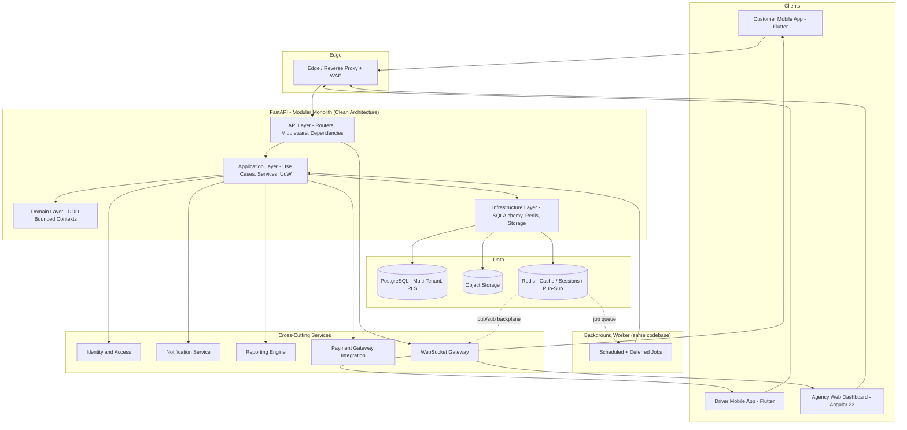
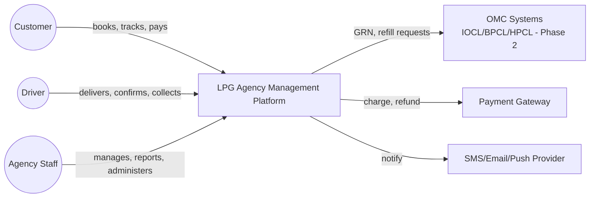
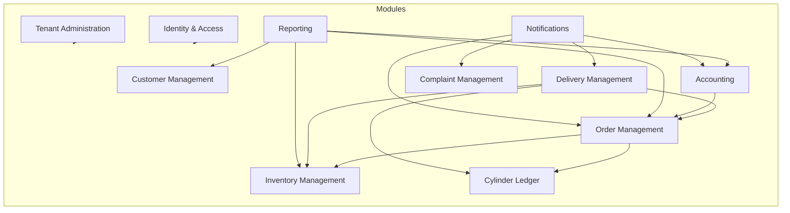
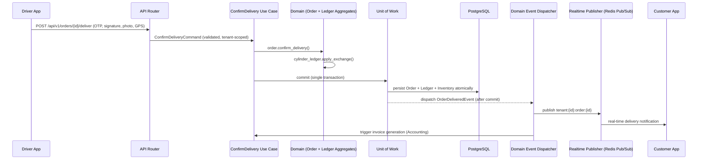
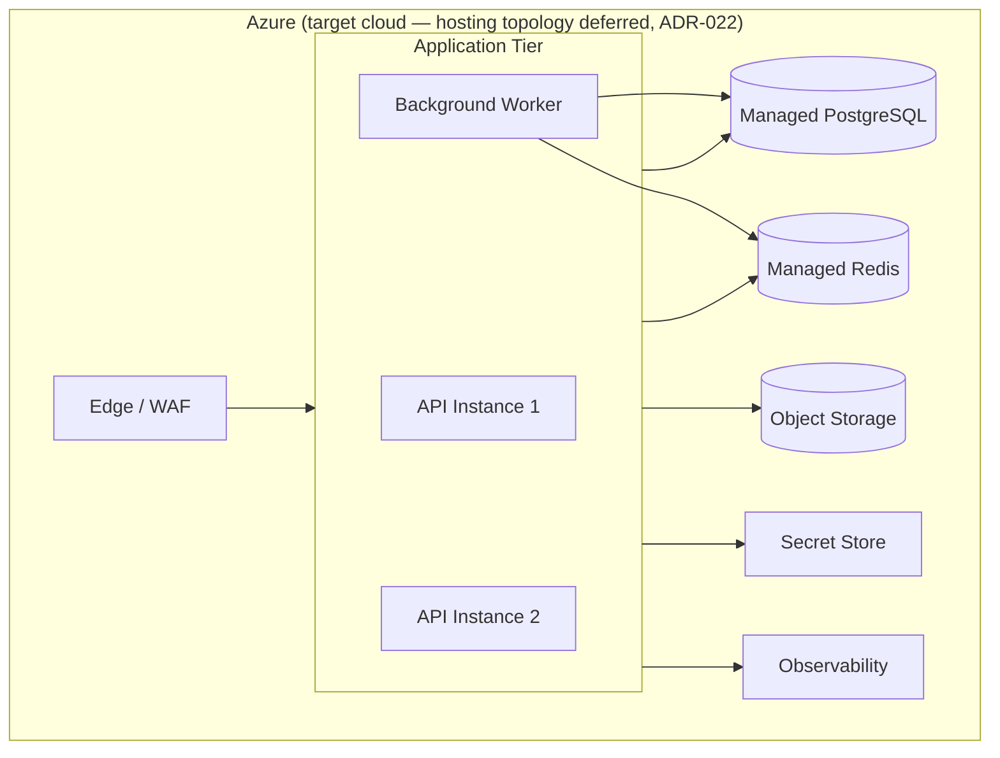

# 01 — System Architecture

## Purpose
Defines the high-level technical architecture for the LPG Agency Management Platform: how the three client applications, the backend, data stores, and cloud infrastructure fit together, and the principles governing every subsequent architecture document in this folder.

## Scope
Covers system context, major components, cross-cutting data flow, deployment direction, technology choices, and the foundational design principles and architecture decisions (ADR summaries; full ADRs in `15-architecture-decision-records.md`). Does not cover implementation code or detailed schema (see `06-database-architecture.md` and `docs/data/03-database-schema.md`).

## Source of Truth
This document — and the entire `docs/architecture/` folder — is derived from the approved SRS (`docs/business/`, `docs/srs/`, `docs/business/decisions.md`). Where a technical decision is driven by a specific SRS/decision item, it is cited inline (e.g., "per D-01").

> **Stack note.** This document was rewritten in Phase 0 (2026-08-09) for the confirmed **Python 3.13 / FastAPI / PostgreSQL** stack, superseding an earlier ASP.NET Core version preserved at [`superseded/01-system-architecture-dotnet.md`](./superseded/01-system-architecture-dotnet.md). See ADR-012.

## 1. High-Level Architecture

The platform is a **multi-tenant, cloud-native SaaS system** (per D-01) built on Clean Architecture and Domain-Driven Design, exposing a single set of versioned REST APIs consumed by three independent front-ends, plus a WebSocket channel for real-time updates.

## 2. System Context Diagram

## 3. Component Diagram (Bounded-Context View)

Each box corresponds to a bounded context from `02-domain-driven-design.md`, implemented as a module within the modular monolith (see ADR-002).

Module isolation is enforced mechanically by `import-linter` contracts in CI, not by convention (ADR-024).

## 4. Data Flow (Example: Delivery Confirmation)

Two properties of this flow are load-bearing and should not be varied per feature:

- **One transaction per command.** Order, Ledger, and Inventory changes commit together or not at all (BR-29).
- **Events dispatch after commit.** A subscriber never observes state that a rollback then erases.

## 5. Deployment Overview

The backend is a **containerized ASGI application**, deployable to any container host and identical under Docker locally.

The specific Azure hosting products and the IaC tool are **deliberately not fixed** at this stage. See `13-deployment.md` and ADR-022.

## 6. Technology Choices

| Layer | Technology | Rationale |
|---|---|---|
| Backend API | Python 3.13+, FastAPI | Per `AGENTS.md`; async-first, Pydantic-driven validation and OpenAPI generation, and the AI/ML ecosystem the Phase 2 roadmap needs in the same runtime (ADR-012) |
| Architecture Pattern | Clean Architecture + DDD; CQRS as an in-process pattern via explicit application services | Testability, separation of concerns, maintainability over a 10-year horizon (ADR-014) |
| ORM / Migrations | SQLAlchemy 2.x (async), Alembic | Repository/Unit-of-Work implementation, versioned schema history |
| Validation | Pydantic v2 | Request/response models; also the source of the generated OpenAPI contract |
| Database | PostgreSQL | Relational integrity critical for ledger/inventory invariants (BR-01–BR-15, BR-29); RLS, JSONB, native full-text search, offline-safe UUID generation (ADR-013) |
| Web Dashboard | Angular 22, Nx workspace, Tailwind CSS v4, PrimeNG (primary), Angular Material + CDK (selective/primitives), AG Grid Community (default; Enterprise optional) | Per `AGENTS.md`; Nx enforces feature-library boundaries (ADR-018, ADR-020, ADR-028) |
| Mobile Apps | Flutter, Riverpod, Drift SQLite | Single codebase for Customer + Driver apps across Android/iOS (ADR-006) |
| Caching | Redis | Sessions, reference-data cache, rate limiting, job queue, real-time backplane |
| Real-Time | FastAPI WebSockets + Redis Pub/Sub | Order/delivery/assignment/dispatcher/dashboard push to all three clients (ADR-015) |
| File Storage | Object storage (Azure Blob Storage) | KYC docs, delivery photos/signatures, invoices, per D-40 |
| Identity | JWT access + refresh tokens, RBAC | Per D-37, D-38 |
| Background Jobs | Separate worker process, Redis-backed queue | Reminders, reconciliation batches, scheduled reports (D-26, D-28, D-31); library deferred (ADR-023) |
| CI/CD | GitHub Actions | Per `knowledge/02-tech-stack.md` |
| Observability | Structured logging, metrics, distributed tracing | See `12-observability.md` |

## 7. Design Principles

1. **Domain-first**: business invariants (cylinder ledger balance, inventory non-negativity) live in the Domain layer, never in UI or database constraints alone. Database constraints are a backstop, not the specification.
2. **Tenant isolation by default**: every query executes inside a tenant context enforced at the database by PostgreSQL RLS, not left to individual developers to remember (`06-database-architecture.md` §2, ADR-017).
3. **API as the only integration point**: all three clients call the same versioned REST API; no client talks to the database or storage directly.
4. **Configuration over code**: GST rates, cylinder caps, credit limits, cancellation policy, reminder intervals are tenant-scoped configuration (BR-31, D-42), not hardcoded or requiring redeployment.
5. **Auditability by construction**: ledger and inventory transactions are append-only; audit logging is a cross-cutting concern applied in the Unit of Work commit path, not bolted on per feature.
6. **Offline-tolerant where required**: the Driver App is offline-first (D-24); the backend must support idempotent, timestamp-ordered sync operations with client-generated UUIDs.
7. **Design for horizontal scale**: stateless API instances; session state in Redis; real-time fan-out through a Redis Pub/Sub backplane so no client is bound to a specific instance.
8. **Everything testable**: Clean Architecture layering exists specifically so Domain and Application logic can be unit-tested without a database or HTTP context.
9. **Boundaries are enforced, not encouraged**: the dependency rule and module isolation are CI-blocking checks (ADR-024). A principle that depends on vigilance is a principle that erodes.

## 8. Key Architecture Decisions (Summary — full rationale in the ADR document)

| Decision | Summary | ADR |
|---|---|---|
| Modular monolith over microservices for Phase 1 | Lower operational complexity while bounded contexts stabilize; enables future extraction | ADR-002 |
| Shared database, tenant-discriminator multi-tenancy | Simpler ops than DB-per-tenant, still satisfies isolation (BR-30) at current scale | ADR-003 |
| Python 3.13 + FastAPI backend | Confirmed stack; async-first, Pydantic/OpenAPI, AI ecosystem alignment | ADR-012 |
| PostgreSQL as primary store | Strong relational consistency for ledger/inventory; RLS, JSONB, FTS | ADR-013 |
| CQRS via explicit application services | Read/write separation without a dispatch abstraction; legible control flow | ADR-014 |
| FastAPI WebSockets + Redis Pub/Sub | Real-time across horizontally-scaled instances without a new managed service | ADR-015 |
| PostgreSQL RLS + repository scoping | Defense-in-depth tenant isolation that survives raw SQL and BI connections | ADR-017 |
| Flutter for both mobile apps | Single codebase, strong offline/local-storage ecosystem | ADR-006 |

## 9. Risks

- **Modular monolith discipline risk**: without enforced module boundaries, the monolith degrades into a big ball of mud, foreclosing the extraction path. Mitigated by `import-linter` contracts and `mypy --strict` as merge-blocking CI checks (`03-backend-architecture.md`, ADR-024).
- **Shared-database multi-tenancy risk**: a missed tenant filter is a data-leak risk. Mitigated by PostgreSQL RLS as a database-level backstop that holds even when application code is wrong, plus cross-tenant isolation tests in CI (`06-database-architecture.md`).
- **Offline-sync conflict risk**: the Driver App's offline-first design introduces conflict-resolution complexity (`05-mobile-architecture.md`), mitigated by optimistic concurrency (`version` column) and idempotency keys on every sync operation.
- **Dynamic-typing risk**: Python provides no compile-time guarantee that layer contracts hold. `mypy --strict` in CI is therefore load-bearing infrastructure, not a style preference.
- **Async correctness risk**: an accidental blocking call inside an async handler stalls the event loop and silently degrades every concurrent request. Mitigated by async-only I/O libraries and latency alerting (`10-performance-strategy.md`).

## 10. Alternatives Considered

- **Microservices from day one** — rejected for Phase 1: premature given team size and unstabilized bounded contexts; revisit once specific modules (Reporting, Notifications) show independent scaling needs.
- **Database-per-tenant** — rejected for Phase 1 due to higher operational overhead at expected initial tenant counts; documented as a future migration path (`06-database-architecture.md`).
- **Event sourcing for the Cylinder Ledger** — considered given the ledger's natural append-only structure, but deferred for Phase 1 in favour of a conventional transactional table plus projections. The door is left open; the ledger's design already resembles an event log (`02-domain-driven-design.md`).
- **ASP.NET Core backend** — the original direction, superseded by ADR-012 and preserved under `superseded/`.

## 11. Future Improvements

- Extract high-traffic or independently-scaling modules (Reporting, Notifications) into separate services once real usage data justifies it. The module boundaries enforced today are what make this possible later.
- Evaluate database-per-tenant or logical sharding once tenant count/scale exceeds shared-database capacity.
- Introduce a durable message broker if cross-module messaging needs delivery guarantees beyond in-process dispatch; the domain-event dispatcher has a documented transactional-outbox seam for exactly this (`03-backend-architecture.md`).
- Promote read models to a dedicated reporting store if Reporting query load materially competes with transactional workload.
