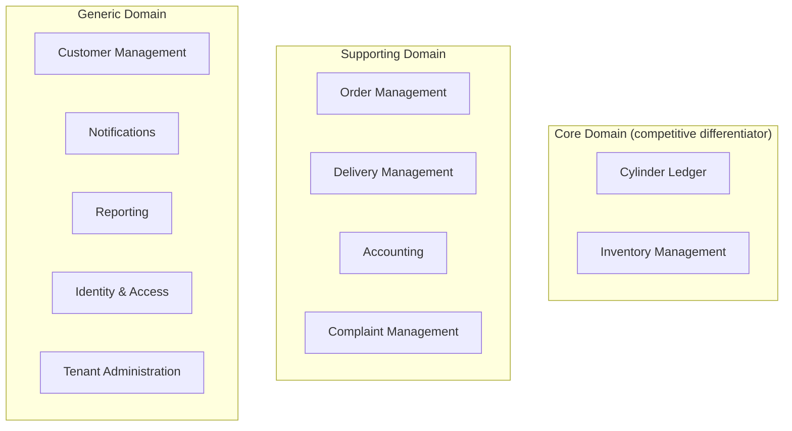
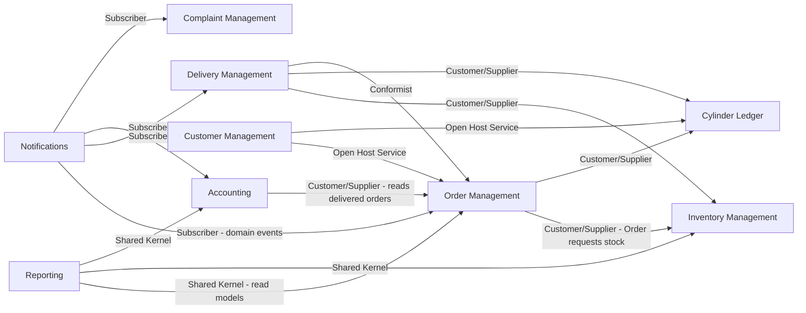
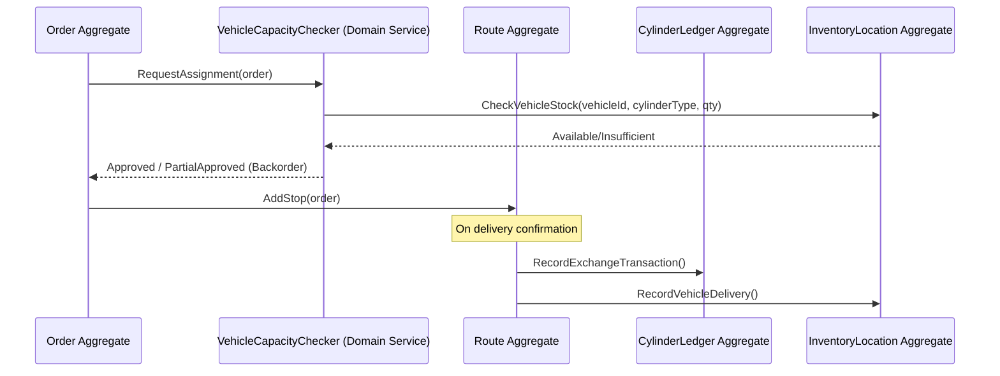

# 02 — Domain-Driven Design

## Purpose
Defines the strategic and tactical DDD model underpinning the platform: bounded contexts, aggregates, entities, value objects, domain services, domain events, and the ubiquitous language shared between business and engineering.

## Scope
Applies to the Domain layer of the backend (`03-backend-architecture.md` §1). Does not cover persistence mapping (see `06-database-architecture.md`) or API contracts (see `07-api-architecture.md`).

## 1. Ubiquitous Language

Sourced directly from `docs/business/glossary.md` to keep code, conversation, and documentation aligned. Key terms carried into the code as first-class type/class names:

| Term | Code Representation |
|---|---|
| Cylinder Ledger | `CylinderLedger` aggregate |
| Filled / Empty / Damaged / Leakage / Quarantine / Scrap / Repair | `CylinderStatus` enum (value object) |
| Consumer Number | `ConsumerNumber` value object |
| Exchange, New Purchase, Additional Cylinder, Deposit Return | `LedgerTransactionType` enum |
| GRN (Goods Receipt Note) | `GoodsReceiptNote` entity |
| Route / Route Stop | `Route`, `RouteStop` entities |
| Proof of Delivery | `ProofOfDelivery` value object |
| Tenant | `Tenant` aggregate root (Tenant Administration context) |

Developers, product, and QA must use these exact terms in code, tickets, and conversation — a deliberate DDD practice to eliminate translation loss between business and technical language.

## 2. Bounded Contexts

Each bounded context maps 1:1 to a backend module (`03-backend-architecture.md` §14), a PostgreSQL schema (`docs/data/03-database-schema.md`), and a component in `01-system-architecture.md` §3. Per-context implementation scope is summarized in `docs/implementation/module-implementation-plan.md` §3.

> **Note:** earlier drafts referenced a `docs/modules/` folder of per-module specifications. That folder was never created in this repository — module-level detail lives in `docs/business/`, `docs/srs/functional.md`, `docs/engineering/*.md` (workflows), and `docs/data/`. See `docs/README.md` for the full path map.

**Core Domain classification rationale**: per the SRS, the Cylinder Ledger is explicitly "the most important module," and Inventory Management directly implements the business's core differentiator (real-time three-level stock visibility). These receive the most design/engineering investment and the strictest domain-purity rules (no framework dependencies inside the Domain layer).

### Context Map

- **Order Management ↔ Inventory/Ledger**: Customer/Supplier relationship — Order Management depends on stock availability and ledger validity but does not own their logic.
- **Delivery ↔ Order Management**: Conformist — Delivery adapts to Order Management's model rather than maintaining a translation layer, since they are tightly coupled by design (a Route is fundamentally a grouping of Orders).
- **Reporting**: Shared Kernel-like read access via dedicated read models/projections (CQRS query side), never writing back to other contexts.
- **Notifications**: pure subscriber to domain events — no other context depends on Notifications, keeping it easily replaceable.

## 3. Aggregates, Entities, and Value Objects (by Bounded Context)

### 3.1 Cylinder Ledger (Core Domain)
- **Aggregate Root**: `CylinderLedger` (one per Customer per Tenant)
  - **Entities**: `LedgerTransaction` (append-only, immutable once created — BR-06)
  - **Value Objects**: `CylinderBalance` (filled/empty/damaged/etc. counts per `CylinderType`), `LedgerTransactionType`, `CylinderType`
  - **Invariants enforced inside the aggregate**: balances never negative (BR-01–BR-06); a transaction must validate against current balance before being appended.

### 3.2 Inventory Management (Core Domain)
- **Aggregate Root**: `InventoryLocation` (Warehouse, Vehicle — Customer inventory is owned by `CylinderLedger` instead, to avoid duplicate sources of truth)
  - **Entities**: `InventoryTransaction`, `GoodsReceiptNote`, `ReconciliationRecord`
  - **Value Objects**: `CylinderStatus` (7-state, D-14), `Quantity` (non-negative, type-safe wrapper preventing raw `int` mistakes)

### 3.3 Order Management (Supporting Domain)
- **Aggregate Root**: `Order`
  - **Entities**: `OrderLine`, `OrderStatusHistory`, `FailedDeliveryRecord`, `CancellationRecord`
  - **Value Objects**: `OrderStatus` (10-state, D-07), `BookingSource`, `DeliveryAddress`

### 3.4 Delivery Management (Supporting Domain)
- **Aggregate Root**: `Route`
  - **Entities**: `RouteStop`, `VehicleLoadEvent`, `VehicleShiftReconciliation`
  - **Value Objects**: `ProofOfDelivery` (OTP result, signature ref, photo ref, GPS coordinates — all four required together, enforced as one value object rather than four nullable fields)

### 3.5 Accounting (Supporting Domain)
- **Aggregate Root**: `Invoice`
  - **Entities**: `Payment`, `CreditNote`, `CashHandover`
  - **Value Objects**: `Money` (amount + currency, prevents raw decimal arithmetic errors), `TaxBreakdown`

### 3.6 Complaint Management (Supporting Domain)
- **Aggregate Root**: `Complaint`
  - **Entities**: `ComplaintAssignment`, `ComplaintResolution`, `ComplaintFeedback`
  - **Value Objects**: `SlaTarget`, `ComplaintCategory`

### 3.7 Customer Management (Generic Domain)
- **Aggregate Root**: `Customer`
  - **Entities**: `CustomerAddress`, `KycDocument`
  - **Value Objects**: `ConsumerNumber`, `CustomerType` (Domestic/Commercial/Industrial/Government, D-03)

### 3.8 Tenant Administration (Generic Domain)
- **Aggregate Root**: `Tenant`
  - **Entities**: `Branch`, `Warehouse`, `TenantConfiguration` (GST rates, cylinder caps, credit limits, cancellation policy, reminder intervals — BR-31)

## 4. Domain Services

Used when an operation doesn't naturally belong to a single aggregate:

- `CreditLimitEvaluator` — evaluates a customer's outstanding balance + credit limit (BR-19) against a prospective new order; spans Customer and Accounting data.
- `CylinderCapPolicy` — evaluates a customer's current ledger balance against the tenant/customer-type-configured cap (BR-04) before allowing a booking; spans Order and Cylinder Ledger contexts.
- `VehicleCapacityChecker` — validates a route assignment against vehicle stock (BR-09); spans Delivery and Inventory contexts.
- `ReconciliationService` — computes expected vs. actual stock/cash variance at shift end (BR-14, D-31).

## 5. Domain Events

Domain events are the backbone of cross-context communication, dispatched by an **in-process domain-event dispatcher** invoked by the Unit of Work **after a successful commit** (Phase 1), with a documented seam to move to a transactional outbox and a durable broker later (see `03-backend-architecture.md` §6 and `01-system-architecture.md` §11). Aggregates *record* events; they never publish directly.

| Event | Published By | Consumed By |
|---|---|---|
| `OrderBookedEvent` | Order Management | Notifications |
| `OrderConfirmedEvent` | Order Management | Delivery, Notifications |
| `DriverAssignedEvent` | Delivery Management | Notifications |
| `VehicleLoadedEvent` | Delivery Management | Inventory |
| `DeliveryConfirmedEvent` | Delivery Management | Cylinder Ledger, Inventory, Accounting, Notifications |
| `DeliveryFailedEvent` | Delivery Management | Order Management, Notifications |
| `InvoiceGeneratedEvent` | Accounting | Notifications, Reporting |
| `PaymentReceivedEvent` | Accounting | Order Management, Reporting |
| `CashShortfallDeclaredEvent` | Accounting | Notifications (staff alert) |
| `LedgerTransactionRecordedEvent` | Cylinder Ledger | Reporting |
| `InventoryVarianceDetectedEvent` | Inventory Management | Notifications (staff alert), Reporting |
| `ComplaintRaisedEvent` | Complaint Management | Notifications |
| `ComplaintSlaBreachedEvent` | Complaint Management | Notifications (escalation) |
| `ConnectionClosedEvent` | Customer Management | Cylinder Ledger, Accounting |

## 6. Diagram — Order-to-Delivery Aggregate Interaction

## 7. Best Practices Applied

- Aggregates are kept small; `CylinderLedger` and `Order` do not directly reference each other's internals — they communicate via domain events and IDs only.
- All aggregate mutations happen through explicit methods (e.g., `Order.ConfirmDelivery(...)`), never through public property setters — enforces invariants at the domain layer, not the application layer.
- Value Objects are immutable and equality-by-value (e.g., two `Money(100, "INR")` instances are equal).
- Repository interfaces are defined per aggregate root only — no repositories for entities within an aggregate (e.g., no standalone `LedgerTransactionRepository`).

## 8. Risks

- **Aggregate boundary drift**: as features are added, there's a risk of reaching across aggregate boundaries directly (e.g., Order code touching Ledger internals) instead of going through domain events/services — mitigated by architecture tests and code review checklists referencing this document.
- **Anemic domain model risk**: without discipline, aggregates can degrade into plain data classes with logic leaking into Application handlers — mitigated by the "explicit methods only" practice above.

## 9. Alternatives Considered

- **Single "Inventory" aggregate spanning Warehouse, Vehicle, and Customer** — rejected; Customer-level stock is already owned by `CylinderLedger` (the "most important module") and duplicating that state in a second aggregate risks divergence. Kept `InventoryLocation` scoped to Warehouse/Vehicle only.
- **Event Sourcing for Cylinder Ledger** — considered, given its natural append-only shape; deferred to a future iteration (see `01-system-architecture.md` §10) to reduce Phase 1 complexity while keeping the aggregate design compatible with a later migration.

## 10. Future Improvements
- Formalize `CylinderLedger` as an event-sourced aggregate once the team has operational experience with the simpler transactional model.
- Introduce a dedicated Anti-Corruption Layer when the Phase 2 OMC (IOCL/BPCL/HPCL) integration is built, to avoid leaking third-party data shapes into the domain model.
