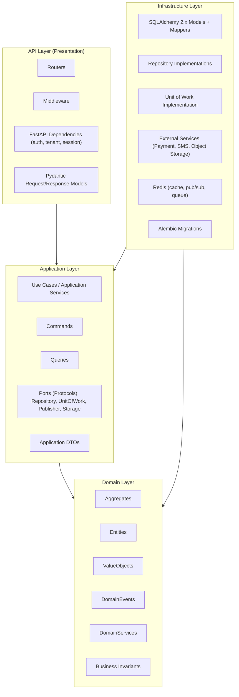
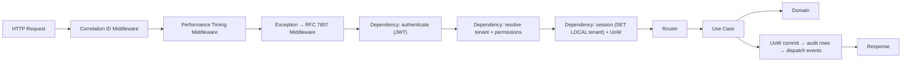

# 03 — Backend Architecture

## Purpose
Defines the internal architecture of the FastAPI backend: layering, CQRS usage, cross-cutting concerns, repository and Unit-of-Work patterns, dependency injection, domain events, background jobs, real-time integration, validation, logging, error handling, API versioning, testing, and the enforced folder structure.

## Scope
Applies to the single backend application (modular monolith, per ADR-002). Does not cover frontend or mobile internals (see `04-frontend-architecture.md`, `05-mobile-architecture.md`), database schema (see `06-database-architecture.md` and `docs/data/03-database-schema.md`), or real-time transport detail (see `16-realtime-architecture.md`).

> **Stack note.** This document was written in Phase 0 (2026-08-09) for the confirmed **Python 3.13 / FastAPI / SQLAlchemy 2.x / PostgreSQL** stack. It replaces an ASP.NET Core version preserved at [`superseded/03-backend-architecture-dotnet.md`](./superseded/03-backend-architecture-dotnet.md). The five cross-cutting behaviors that document specified encode binding business rules (BR-28, BR-30) and are re-expressed here in §3 rather than dropped. See ADR-012 and ADR-014.

> **Code in this document is illustrative pseudocode**, showing shape and intent only. It is not implementation and is not to be copied verbatim. No backend source code exists yet; see `planning/current_phase.md`.

## 1. Clean Architecture Layers



**Dependency rule:** dependencies point inward only.

- **Domain** imports nothing from Application, Infrastructure, or API. No SQLAlchemy, no FastAPI, no Pydantic-for-persistence. Domain objects are plain Python — dataclasses and classes expressing business concepts.
- **Application** imports Domain only. It defines **ports** (typing `Protocol` classes) that Infrastructure implements — dependency inversion.
- **Infrastructure** implements Application's ports and maps Domain objects to SQLAlchemy models. The persistence model is deliberately distinct from the domain model, as already established in `docs/data/03-database-schema.md`.
- **API** depends on Application; it never touches Infrastructure or the ORM directly.

This is **enforced in CI by `import-linter` contracts and `mypy --strict`** (§12, ADR-024), not by convention. The superseded .NET design made the same point about architecture tests, and the point survives the language change: a dependency rule nobody checks is a dependency rule that erodes.

## 2. CQRS as an In-Process Pattern

Retained from ADR-004, re-expressed per ADR-014.

- **Commands** mutate state (`ConfirmDeliveryCommand`, `RecordPaymentCommand`). They load full aggregates through repositories, invoke domain behaviour, and return minimal results — an ID or a small result object, never a full read model.
- **Queries** read state (`GetCustomerLedgerQuery`). They bypass aggregate loading and read through optimized read paths (SQLAlchemy Core selects, database views, projections), because queries have no invariants to protect and paying aggregate-hydration cost for them is waste.
- **Same database for both sides.** No event sourcing, no physically separate read store in Phase 1. The seam for revisiting this on the Cylinder Ledger remains documented (`02-domain-driven-design.md`).

There is **no mediator library**. A router calls a named use case, which calls named collaborators. Control flow is readable top to bottom — which directly addresses the "pipeline overuse obscures control flow" risk the superseded design flagged against itself.

```
POST /api/v1/orders/{id}/deliver
  → router (thin: HTTP ↔ Pydantic ↔ command)
    → ConfirmDeliveryUseCase.execute(command)
      → OrderRepository.get(order_id)      # aggregate
      → order.confirm_delivery(...)        # domain behaviour, invariants enforced here
      → uow.commit()                       # single transaction + audit + event dispatch
```

## 3. Cross-Cutting Concerns — the FastAPI Equivalent of the MediatR Pipeline

The superseded design delivered five concerns through MediatR `IPipelineBehavior` implementations. Two of them encode binding business rules: **BR-30** (tenant scoping) and **BR-28** (audit logging). Dropping them with the library was never an option. Each is re-expressed below.

| # | Original behavior | Replacement mechanism | Where it lives |
|---|---|---|---|
| 1 | `ValidationBehavior` | Pydantic v2 request models for shape/format/range; domain invariants enforced inside aggregates | API layer + Domain layer |
| 2 | `TenantScopingBehavior` | Request-scoped FastAPI dependency resolving tenant from the verified JWT, issuing `SET LOCAL app.current_tenant_id`; PostgreSQL RLS enforces it | API dependency + database |
| 3 | `AuditLoggingBehavior` | SQLAlchemy session event hooks capturing before/after state; audit rows written in the Unit of Work commit path | Infrastructure (UoW) |
| 4 | `TransactionBehavior` | Unit of Work as a request-scoped async context manager; exactly one transaction per command | Infrastructure (UoW) |
| 5 | `PerformanceLoggingBehavior` | ASGI middleware timing every request; per-use-case timing decorator | API middleware |



### 3.1 Why dependencies rather than decorators

Decorators can be forgotten. The two concerns that must **never** be bypassed — tenant scoping and transaction management — are therefore made structurally unavoidable:

- A database session is obtainable **only** through the session dependency, and that dependency refuses to yield a session without a resolved tenant context.
- Repositories are constructed with that session; there is no constructor that takes a raw engine.

The result is that "forgot to scope by tenant" is not a mistake a developer can make in the normal flow — the same guarantee the MediatR pipeline provided, achieved by construction rather than by registration.

### 3.2 Illustrative shape

```python
# API layer — dependency chain (illustrative)
async def get_tenant_context(claims: Claims = Depends(verify_jwt)) -> TenantContext:
    return TenantContext(tenant_id=claims.tenant_id, user_id=claims.sub, ...)

async def get_uow(ctx: TenantContext = Depends(get_tenant_context)) -> AsyncIterator[UnitOfWork]:
    async with session_factory() as session:
        # RLS predicate reads this for the life of the transaction
        await session.execute(text("SET LOCAL app.current_tenant_id = :tid"), {"tid": ctx.tenant_id})
        async with UnitOfWork(session, ctx) as uow:
            yield uow          # commits on clean exit, rolls back on exception
```

## 4. Repository Pattern & Unit of Work

- **One repository per Aggregate Root only** (per `02-domain-driven-design.md`) — `OrderRepository`, `CylinderLedgerRepository`, `InventoryLocationRepository`. Not one per table.
- Repositories **accept and return full domain aggregates**, never partial DTOs and never SQLAlchemy models. Mapping between the domain model and the persistence model happens inside the repository — this is the whole reason the two models are allowed to differ.
- Repository **ports are `Protocol` classes defined in the Application layer**; implementations live in Infrastructure. Application code depends on the protocol, which is what makes use cases unit-testable with in-memory fakes and no database.
- **`UnitOfWork` owns the transaction boundary.** It is entered once per command, exposes the repositories, and on commit performs three steps in order:
  1. flush domain changes,
  2. write audit rows from captured before/after state (BR-28),
  3. commit, then dispatch domain events (§6).
- **BR-29 is guaranteed here**: a delivery confirmation updates Order, Cylinder Ledger, and Inventory in one transaction, or none of them.
- **Queries bypass repositories.** The read side selects directly through SQLAlchemy Core or database views, because it has no invariants to protect and aggregate hydration would be pure overhead.

```python
# Application layer — port (illustrative)
class OrderRepository(Protocol):
    async def get(self, order_id: UUID) -> Order | None: ...
    async def add(self, order: Order) -> None: ...
```

## 5. Dependency Injection

- **FastAPI's native dependency system** is the DI container. No third-party container.
- Composition happens at the API layer's application factory, which binds Infrastructure implementations to Application ports.
- Dependencies are **request-scoped** by default: tenant context, database session, Unit of Work, and the current-user principal all live and die with the request.
- Application-layer code never calls `Depends()`. Use cases receive their collaborators as constructor arguments, keeping them framework-free and directly instantiable in tests.
- Configuration is a Pydantic `BaseSettings` object loaded from environment variables — never read via `os.environ` scattered through the codebase.

## 6. Domain Events

- Aggregates **record** events as they mutate (`order.events.append(OrderDeliveredEvent(...))`). They never publish directly — an aggregate that knows about a message bus is no longer framework-independent.
- The Unit of Work **collects** events from all touched aggregates and dispatches them **after a successful commit**. This ordering is deliberate: a subscriber must never observe state that a rollback then erases.
- Dispatch is **in-process and synchronous within the request** for Phase 1, matching the modular-monolith decision (ADR-002). Handlers subscribe by event type.
- Handlers that perform I/O (notifications, real-time publication) enqueue work rather than blocking the response path.
- The canonical event list is in `02-domain-driven-design.md` and `docs/data/09-domain-events.md`.

**Documented seam:** if cross-module messaging later needs delivery guarantees (durability, retry, ordering across process restarts), the dispatcher is replaced with a **transactional outbox** — events written to an outbox table inside the same transaction, relayed by the background worker. This is the extraction path ADR-002 anticipated, and nothing in the domain or application layers changes when it is taken.

## 7. Background Jobs

Architecture per ADR-023; **library selection deliberately deferred** to Phase 2 (Backend Foundation), pending a spike over ARQ, Dramatiq, and Celery.

- Jobs are **application-layer use cases**, invoked by a worker. The same use case is callable from an HTTP request, a test, or the job runner. Nothing business-meaningful lives only inside a scheduler.
- The **worker is a separate process** sharing the same codebase, so batch work never competes with request latency.
- **Redis** is the queue substrate, consistent with the portability goal in ADR-022.
- Every job runs **inside a tenant context**. A job that iterates tenants sets the context per tenant; nothing runs unscoped.
- Jobs are **idempotent** and safe to retry; scheduled jobs tolerate double-firing.

| Job | Trigger | Purpose |
|---|---|---|
| Refill Reminder | Daily | Evaluate consumption patterns, send reminders (D-26) |
| Scheduled Report | Daily / Weekly / Monthly | Generate and deliver reports (D-28) |
| SLA Breach Scanner | Every 15 min | Detect complaint SLA breaches, raise escalation events (D-20) |
| Low Stock Alert Scanner | Hourly | Warehouse low-stock alerting (FR-IM-04) |
| Reconciliation Reminder | Daily (end of shift window) | Prompt mandatory daily vehicle reconciliation (D-31) |
| Notification Retry | Every 5 min | Retry failed notification sends |

A scheduled job failing **silently** is itself an incident — the SLA Breach Scanner protects a customer-facing guarantee. Job success/failure rate, duration, and queue depth are first-class metrics (`12-observability.md`).

FastAPI's built-in `BackgroundTasks` is suitable only for trivial post-response side effects, never for the workload above.

## 8. Real-Time

Summarized here; full detail in `16-realtime-architecture.md`.

- **FastAPI WebSockets** for client connections, **Redis Pub/Sub** as the cross-instance backplane (ADR-015).
- The application layer publishes through a transport-agnostic `RealtimePublisher` port. Domain and application code never import WebSocket or Redis types.
- Channels are namespaced `tenant:{tenant_id}:...`; subscription is authorized per connection against the same RBAC permissions as the equivalent REST endpoint.
- Real-time is an **enhancement, never the source of truth** — every client can reconstruct correct state from the REST API.

## 9. Validation

Three distinct layers, each with a different job:

1. **Pydantic v2 request models** (API layer) — shape, type, format, length, range. Failures return `400` with field-level detail in the RFC 7807 `errors` extension, before any domain logic executes.
2. **Application-layer checks** — cross-entity preconditions requiring a lookup (does this customer exist in this tenant, is this driver assigned to this route).
3. **Domain invariants** (Domain layer) — enforced **inside aggregates, unconditionally**. Inventory never negative, ledger balanced, order state transitions legal (`docs/data/08-state-machines.md`).

Layers 1 and 2 are a fast-fail UX convenience. **Layer 3 is the guarantee.** An aggregate must be impossible to place in an invalid state even if it is invoked from a code path that skipped the first two — that is precisely why domain invariants are not implemented as request validators.

## 10. Logging

- **Structured JSON logging** via `structlog`, bound with a context processor.
- Every log entry carries: timestamp, level, `correlation_id`, `tenant_id`, `user_id` (when authenticated), and the logger name.
- The **correlation ID** is accepted from an inbound header or generated at the edge, propagated through the request, into enqueued jobs, and onto real-time messages, so a single business transaction is traceable end-to-end across its fan-out (`12-observability.md`).
- **Never logged:** passwords, tokens, OTPs, KYC document contents, full payment instrument details. Redaction is implemented as a `structlog` processor — a central mechanism, not a rule developers must remember at each call site.

## 11. Error Handling

- A **global exception handler** translates exceptions into **RFC 7807 Problem Details** responses with `Content-Type: application/problem+json`, extended with `error_code` (ADR-021). The catalogue is `docs/data/18-error-catalog.md`.
- **Domain exceptions** (`InsufficientLedgerBalanceError`, `NegativeInventoryError`) map to `409`/`422` with a business-meaningful `error_code`.
- **Application exceptions** (`NotFoundError`, `PermissionDeniedError`, `ConcurrencyConflictError`) map to `404`/`403`/`409`.
- **Unexpected exceptions** map to `500` with a generic message; full detail goes to logs with the correlation ID, never to the client.
- Exceptions are never silently swallowed. A caught exception is either handled meaningfully or re-raised.

## 12. Testing & Architecture-Boundary Enforcement

### 12.1 Test layers

| Layer | Scope | Characteristics |
|---|---|---|
| **Domain unit tests** | Aggregates, value objects, invariants, state machines | No database, no HTTP, no async I/O. Fast. The densest tests in the codebase, because this is where business rules live. |
| **Application unit tests** | Use cases with in-memory fake repositories and a fake UoW | No database. Verifies orchestration, not persistence. |
| **Infrastructure integration tests** | Repositories, mappers, migrations against a **real PostgreSQL** | Real database, never a mock or SQLite — RLS and PostgreSQL-specific types must be exercised. Each test runs in a transaction that is rolled back. |
| **API integration tests** | Full HTTP pipeline: middleware, dependencies, routers, database | Verifies auth, tenant scoping, RFC 7807 error shapes, and the OpenAPI contract. |
| **Tenant isolation tests** | Cross-tenant access attempts | Two seeded tenants; every attempt to read across the boundary must return nothing. A dedicated suite because BR-30 is the highest-severity failure mode in the system. |
| **Boundary/contract tests** | Architecture rules | See §12.2. |

### 12.2 Boundary enforcement (the NetArchTest replacement)

Per ADR-024, enforced in CI and merge-blocking:

| Rule | Mechanism |
|---|---|
| Domain imports nothing from application / infrastructure / api | `import-linter` layered contract |
| Application imports domain only | `import-linter` layered contract |
| Bounded-context modules do not import each other's internals | `import-linter` independence contract |
| No SQLAlchemy import outside infrastructure | `import-linter` forbidden contract |
| No FastAPI import outside the api layer | `import-linter` forbidden contract |
| Every tenant-scoped model declares `tenant_id` | Test over the SQLAlchemy model registry |
| Committed OpenAPI spec matches generated spec | CI diff check (ADR-026) |
| Type coverage at layer boundaries | `mypy --strict` |

### 12.3 Test data

Fixtures build **valid aggregates through domain constructors**, not by inserting rows. A test fixture that bypasses domain construction can create states the domain forbids, and tests built on impossible states prove nothing.

Full strategy in `docs/implementation/testing-strategy.md`.

## 13. API Versioning

URL-segment versioning (`/api/v1/...`) via a versioned router prefix, per ADR-009. Detail in `07-api-architecture.md` §3.

## 14. Folder Structure (`backend/`)

Feature-based within each layer, mirroring the bounded contexts of `02-domain-driven-design.md` and the PostgreSQL schema names in `docs/data/03-database-schema.md`.

```
backend/
  src/
    lpg/
      domain/                  # zero outward dependencies
        common/                # AggregateRoot, Entity, ValueObject, DomainEvent, errors
        identity/
        customer/
        orders/
        delivery/
        inventory/
        ledger/
        accounting/
        complaints/
        notifications/
      application/             # depends on domain only
        common/                # ports (Protocols), UoW protocol, result types, base use case
        identity/              # use_cases/, commands.py, queries.py, dto.py
        customer/
        orders/
        delivery/
        inventory/
        ledger/
        accounting/
        complaints/
        notifications/
        reporting/
      infrastructure/          # implements application ports
        persistence/
          models/              # SQLAlchemy 2.x ORM models
          mappers/             # domain ↔ ORM translation
          repositories/
          unit_of_work.py
          session.py
        realtime/              # Redis pub/sub publisher
        storage/               # object storage adapter
        external/              # payment gateway, SMS, email providers
        jobs/                  # worker entry points, schedules
        audit/
      api/                     # depends on application only
        v1/
          routers/             # one module per bounded context
          schemas/             # Pydantic request/response models
          dependencies/        # auth, tenant, session, permissions
        middleware/            # correlation id, timing, exception → RFC 7807
        websockets/
        app.py                 # application factory / composition root
      config/                  # Pydantic BaseSettings
  migrations/                  # Alembic
  tests/
    domain/
    application/
    infrastructure/
    api/
    tenant_isolation/
    architecture/              # import-linter contract verification
  openapi/                     # generated openapi.json, committed (ADR-026)
  pyproject.toml
```

Note the deliberate ordering: `domain/` first, `api/` last, matching the direction of dependency. A module's position in this tree tells you what it is allowed to import.

## 15. Best Practices

- **No business logic in routers.** Routers translate HTTP to a command/query and back. If a router contains an `if` statement about business state, it is in the wrong place.
- **No SQLAlchemy outside `infrastructure/`.** Enforced by import-linter, not review.
- **Async all the way.** No blocking I/O inside an async path — a single synchronous database or HTTP call stalls the event loop for every concurrent request. Use `asyncpg` via SQLAlchemy's async engine and an async HTTP client for outbound calls.
- **Idempotency keys** on mutating endpoints the offline-first Driver App may retry (D-24, `05-mobile-architecture.md`).
- **Optimistic concurrency** via the `version` column on updatable aggregates; conflicts surface as `409` with a documented `error_code`.
- **Type hints everywhere**, `mypy --strict` in CI.
- **Enums over magic strings**, constants over magic numbers.
- Tenant configuration (BR-31, D-42) is read from tenant config, never hardcoded.

## 16. Risks

- **Cross-cutting concerns are no longer guaranteed by a single registration.** The superseded MediatR pipeline applied all five behaviors to every handler by construction. Mitigated by making the two critical ones structurally unavoidable (§3.1) and by boundary tests — but this is the genuine cost of ADR-014 and is stated plainly.
- **Modular monolith boundary erosion** — mitigated by import-linter contracts (§12.2). This is the same risk ADR-002 named; only the tool changed.
- **Blocking-call regression** — a single sync call in an async path degrades throughput invisibly under load. Mitigated by async-only libraries and p95/p99 latency alerting.
- **Domain/persistence mapping overhead** — maintaining a mapping layer between domain aggregates and ORM models costs real effort. Accepted deliberately: it is what keeps the domain layer framework-free and unit-testable without a database, and `docs/data/03-database-schema.md` already assumes the split.
- **Dynamic typing** — no compiler enforces layer contracts. `mypy --strict` is infrastructure, not style.

## 17. Alternatives Considered

- **A Python mediator library** — rejected (ADR-014); it would reproduce MediatR's indirection without its ecosystem, when FastAPI's DI already covers the need.
- **Active Record (ORM models as domain models)** — rejected; it would put SQLAlchemy inside the domain layer, break the dependency rule, and make domain unit tests require a database. The efficiency gain is real but is exactly the trade the architecture exists to refuse.
- **Django + DRF** — rejected; its batteries-included conventions pull against Clean Architecture layering, and its ORM is more tightly bound to the Active Record pattern.
- **Repositories per table rather than per aggregate root** — rejected; it dissolves aggregate boundaries and lets callers mutate an aggregate's internals without going through its root.
- **Synchronous SQLAlchemy** — rejected; the async-first API design and the 500+ concurrent-users-per-tenant target (D-34) both assume non-blocking I/O.

## 18. Future Improvements

- **Transactional outbox** for domain events, when durable cross-module or cross-service messaging is needed (§6).
- **Dedicated read models / projections** for Reporting if query load competes with transactional workload.
- **Module extraction** — Notifications and Reporting are the natural first candidates once independent scaling is demonstrated (`01-system-architecture.md` §11).
- **Event sourcing for the Cylinder Ledger** — deferred, not rejected; the append-only ledger design already resembles an event stream (ADR-004's surviving reasoning, carried into ADR-014).
