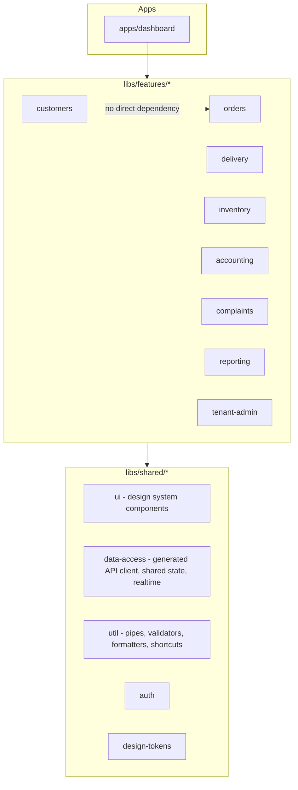
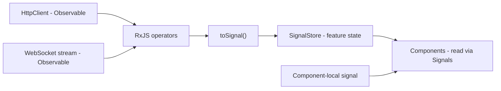

# 04 — Frontend Architecture (Agency Web Dashboard)

## Purpose
Defines the Angular 22 / Nx architecture for the Agency Web Dashboard: workspace organization, state management, routing, component strategy, data-grid strategy, design system integration, real-time integration, and performance practices.

## Scope
Applies to the Dashboard application only. Does not cover the mobile apps (see `05-mobile-architecture.md`).

> **Stack note.** Revised in Phase 0 (2026-08-09): **Angular 20 → Angular 22**; the repository folder is confirmed as **`frontend/`** (not `dashboard/`); **AG Grid Enterprise** replaces the PrimeNG/Material data-grid direction; **WebSocket** replaces SignalR; TanStack Query is resolved as *not adopted*. See ADR-018, ADR-019, ADR-020, ADR-025.

## 1. Nx Workspace Strategy

A single **Nx workspace rooted at `frontend/`** hosts the Dashboard application and all shared Angular libraries, enabling code sharing, enforced module boundaries, and consistent tooling (ADR-018).



**Boundary rule (enforced via the Nx `enforce-module-boundaries` ESLint rule):** feature libraries never depend on each other directly. Cross-feature communication happens through `shared/data-access` or router navigation, never direct imports. This mirrors the bounded-context isolation in `02-domain-driven-design.md`, and is the frontend counterpart of `import-linter` on the backend (ADR-024) — the same principle, enforced the same way, for the same reason.

Nx earns its complexity here specifically through this rule and through affected-project detection, which keeps monorepo CI times bounded (ADR-001 §11 risk).

## 2. Feature Library Structure

Per feature, e.g. `libs/features/orders`:

```
orders/
  src/lib/
    components/   presentational components (pure, signal inputs/outputs)
    containers/   smart components, wired to state
    services/     feature orchestration, thin wrapper over data-access
    state/        feature SignalStore, where §3 rule 2 applies
    models/       feature-local view models, distinct from API DTOs
  orders.routes.ts
```

Feature-local view models are deliberately distinct from API DTOs. The generated client's types change when the API contract changes; view models change when the UI needs change. Conflating them couples every component to the wire format.

## 3. State Management

Per **ADR-019**, a single ordered rule set. Applied in order, the first rule that fits is the answer.

1. **Angular Signals** for local and component state. This is the default and covers most cases — UI state, form state, derived/computed values.
2. **NgRx SignalStore** for complex feature-level or shared application state where centralized reactive state is genuinely justified: a list with server-side filter/sort/pagination, state shared across sibling routes, state that must survive navigation.
3. **No classic NgRx** Store/Actions/Reducers/Effects unless a documented architectural need exists — and that need is recorded as an ADR before the code is written.
4. **RxJS** for HTTP streams, WebSocket streams, debounced search/autocomplete, complex async orchestration, and interop with Observable-emitting libraries. Convert to Signals at the boundary with `toSignal()` so templates stay signal-based throughout.
5. **Never** introduce a state-management library for simple component state.



Rule 2 is a judgement call by design. The guard against sprawl is not a mechanical test — it is that reaching for SignalStore requires stating a reason at review time.

**TanStack Query is not adopted.** The superseded version of this document floated it as optional for Reporting. Adding a fourth state mechanism alongside Signals, SignalStore, and RxJS would defeat the purpose of having one rule set; SignalStore covers the caching and refetch needs at Phase 1 scale.

## 4. Routing

- Top-level routes lazy-loaded per feature (`loadChildren`), matching the Nx feature library boundaries.
- Route guards: `authGuard` (JWT validity), `tenantGuard` (resolves and validates active tenant context), `permissionGuard` (RBAC — reads the required permission from route data and checks it against the authenticated user's permissions, per `08-security-architecture.md`).
- **Guards are a UX affordance, not a security boundary.** Every permission is enforced server-side regardless (`07-api-architecture.md`). A guard that hides a button does not protect the endpoint behind it.
- Standalone components throughout, no NgModules — Angular's default, and it aligns with Nx's per-feature lazy chunks.

## 5. Component Strategy

- **Presentational vs. container split** within each feature library. Containers own state and data fetching; presentational components are pure, use signal-based `input()`/`output()`, and are reusable.
- All cross-feature-reusable UI lives in `libs/shared/ui`, built from centralized design tokens — never hardcoded colours or spacing.
- Business logic does not live in components. Components render, raise events, and display validation (`knowledge/09-engineering-standards.md`).
- Templates stay declarative: no nested conditions, no long expressions, no business calculations. Use computed signals instead.

## 6. Data Grid — AG Grid Enterprise Behind an Abstraction

Per **ADR-020**. This section is a hard constraint, not a preference.

**AG Grid Enterprise is the standard enterprise data-grid implementation**, meeting the requirements in `docs/srs/non-functional.md` §7 and `docs/ui/14-data-grid-guidelines.md`: sorting, filtering, grouping, column chooser, column resize, sticky headers, bulk actions, saved views, export, and virtualization at scale.

Three binding rules:

1. **AG Grid is encapsulated behind application-level grid components** in `libs/shared/ui`. Feature libraries consume the wrapper.
2. **Feature libraries must not import AG Grid types or call AG Grid APIs directly.** They configure the wrapper through an application-defined column and dataset contract. A wrapper that leaks AG Grid types into feature code is not an abstraction, regardless of intent — so this is enforced by lint rule and code review, not by naming convention.
3. **The commercial licence is a real dependency.** AG Grid Enterprise is a paid product. The licence key is supplied as build-time environment configuration from the secret store (`13-deployment.md` §9) and is never committed.

Consequences worth stating plainly:

- The wrapper will occasionally feel like friction when a feature wants a niche AG Grid capability. That friction is the mechanism working. The escape hatch is to **extend the wrapper's contract**, not to bypass it.
- Accessibility is verified once, in the wrapper, per ADR-011 — not re-verified per feature.
- **Licence procurement is currently unconfirmed** (DW-08). This blocks Phase 4 (Angular Foundation), not Phase 0 or 1.

**PrimeNG is not adopted.** With AG Grid for grids and Angular Material + CDK for interaction primitives, it has no remaining role, and a third component library would fragment the design-token implementation.

## 7. Design System Integration

- `libs/shared/design-tokens` holds primitive, semantic, component, and theme tokens (Light / Dark / High-Contrast) as CSS custom properties, consumed by Tailwind CSS v4's token-based configuration. **No component ever references a raw hex or px value** (`docs/ui/09-design-tokens.md`).
- `libs/shared/ui` wraps **Angular CDK and Angular Material** for base interaction primitives — overlay, focus trap, a11y, dialogs, menus — and the AG Grid wrapper for data grids.
- Per ADR-011, accessibility implementation is concentrated here so feature teams inherit WCAG 2.2 AA compliance (D-35) rather than re-implementing it.

## 8. Real-Time Integration

- The Dashboard connects to the backend's WebSocket endpoint (`16-realtime-architecture.md`) for live order status, delivery status, driver assignment, dispatcher operational updates, and dashboard KPI refresh.
- The connection is owned by a **single service in `libs/shared/data-access`**, not opened per feature. Features subscribe to typed message streams from that service.
- The incoming stream is RxJS at the boundary and converted to Signals for template consumption (§3 rule 4).
- **Real-time is an enhancement, never the source of truth.** On connect, reconnect, and route entry, the Dashboard fetches state via REST and applies live messages on top. A view that only renders correctly while a socket is open is a defect.
- Reconnection uses exponential backoff with jitter; the UI surfaces connection state rather than silently showing stale data.

## 9. API Client

- The typed API client is **generated from the committed OpenAPI specification** (`backend/openapi/openapi.json`, ADR-026) into `libs/shared/data-access`.
- **Never hand-written, never generated from a running server.** Client generation is a build step against a reviewed artifact.
- JSON is `snake_case` on the wire (`docs/data/10-api-design-guidelines.md`); mapping to TypeScript conventions happens once, in the data-access layer, not in components.
- Errors arrive as RFC 7807 Problem Details (ADR-021); a single HTTP interceptor translates them into a typed application error surfaced through the shared notification component.

## 10. Lazy Loading & Performance

- Route-level lazy loading (§4) is the primary code-splitting boundary.
- Deferred loading (`@defer`) for below-the-fold and interaction-triggered content.
- Virtual scrolling on large list views — AG Grid provides this within the grid wrapper; Angular CDK `ScrollingModule` covers non-grid lists.
- `NgOptimizedImage` for KYC thumbnails and delivery photos.
- Full detail in `10-performance-strategy.md`.

## 11. Folder Structure (`frontend/`)

```
frontend/
  apps/
    dashboard/
    dashboard-e2e/          Playwright
  libs/
    features/
      customers/ orders/ delivery/ inventory/
      accounting/ complaints/ reporting/ tenant-admin/
    shared/
      ui/                   design system components + AG Grid wrapper
      data-access/          generated API client, shared state, realtime service
      util/                 pipes, validators, formatters, keyboard shortcuts
      auth/
      design-tokens/
  tools/
  nx.json
  package.json
```

The folder is `frontend/`; the Nx application inside it is named `dashboard` (ADR-025).

## 12. Best Practices

- **Strict TypeScript** (`strict: true`) across the workspace. `any` is not permitted.
- No inline styles; all styling via Tailwind utilities and design tokens.
- **Storybook for every `shared/ui` component**, documenting all states and all three themes.
- Keyboard shortcut handling (Ctrl+K, Ctrl+N, and the rest of `docs/ui/16-keyboard-shortcuts.md`) is centralized in a single `shared/util` service, not scattered per component.
- `inject()` over constructor injection where it reads more clearly.
- Functional route guards and functional interceptors.
- Modern template control flow (`@if`, `@for`, `@switch`).

## 13. Testing

| Level | Tool | Scope |
|---|---|---|
| Unit | Jest | Services, pipes, validators, presentational components |
| Component | Storybook + Testing Library | Shared UI components across all states and themes |
| E2E | Playwright | Critical user journeys (`docs/ui/03-user-journeys.md`) |
| Accessibility | axe-core in CI | Merge-blocking; accessibility defects are functional defects (D-35) |

**Cypress is not used** — Playwright is the confirmed E2E tool (`AGENTS.md`). An earlier reference to Cypress in `docs/implementation/engineering-standards.md` was corrected in Phase 0.

## 14. Risks

- **State management sprawl** — mixing Signals, SignalStore, and RxJS without discipline creates inconsistent patterns across features. Mitigated by the ordered rule set in §3 and by requiring a stated reason for rule 2.
- **Design token drift** — developers reaching for raw values under time pressure. Mitigated by a stylelint rule banning raw hex/px values in component styles.
- **Grid abstraction leakage** — the single most likely way ADR-020's replaceability guarantee is quietly lost. Mitigated by lint rules against direct AG Grid imports outside `shared/ui`, and by treating any such import in review as a defect.
- **Licence dependency** — AG Grid Enterprise procurement is unconfirmed (DW-08); the abstraction is what keeps this recoverable rather than catastrophic.

## 15. Alternatives Considered

- **Plain Angular CLI workspace** — simpler, one less tool. Rejected (ADR-018) because module-boundary enforcement would fall back to code review, and the point of the feature-library structure is that boundaries hold without vigilance.
- **Classic NgRx** (actions/reducers/effects) — rejected in favour of SignalStore: less boilerplate, better alignment with the Signals-first direction, same structured and testable philosophy.
- **Angular Material table + CDK virtual scroll instead of AG Grid** — no licence cost, but grouping, column management, and saved views would all be built by hand; rejected as a larger long-term cost than the licence (ADR-020).
- **Micro-frontends (Module Federation)** — rejected for Phase 1; Nx library modularity already provides strong internal boundaries without independent-deployment complexity. Revisit only if independent team release cadences demand it.

## 16. Future Improvements

- Evaluate Module Federation if the Dashboard ever needs independently deployable feature teams at larger scale.
- A lightweight customer web portal as a second application in the same workspace, if requested.
- Tenant branding (custom primary colours, logos) through the existing token system (`docs/ui/22-theme-system.md`).
