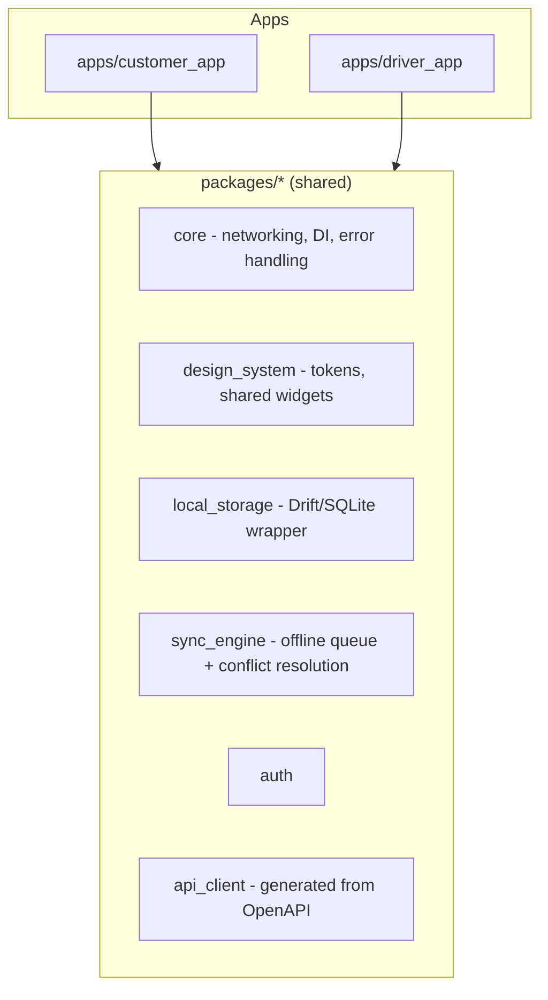
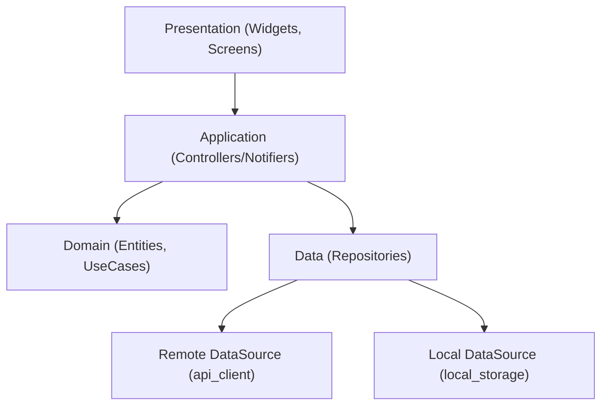
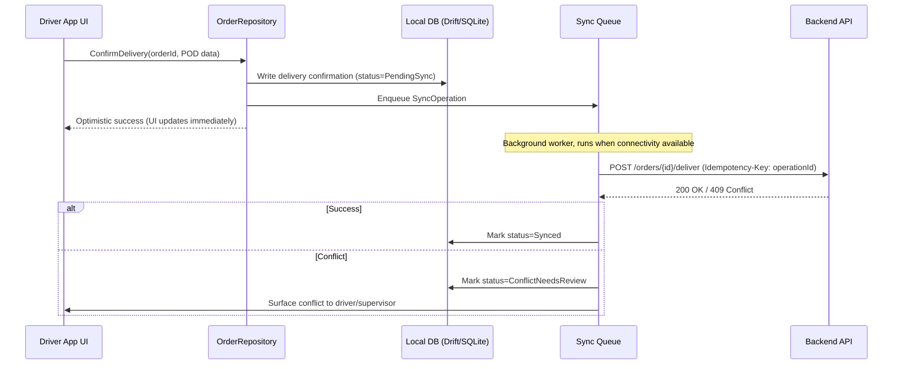

# 05 — Mobile Architecture (Customer App & Driver App)

## Purpose
Defines the Flutter architecture shared by the Customer and Driver mobile apps, with particular emphasis on the Driver App's confirmed **offline-first** requirement (D-24).

## Scope
Covers both mobile apps as a single Flutter codebase strategy with app-specific entry points/feature sets. Does not cover the Dashboard (see `04-frontend-architecture.md`).

## 1. High-Level Architecture

Both apps share a single Flutter monorepo (using Melos or a Flutter workspace) with app-specific targets and a shared core package set — mirroring the Nx approach used on the web side, for consistency across the platform.



## 2. Layered Architecture (per app, Clean Architecture-inspired)



- **Domain layer** mirrors backend DDD concepts at the client level (e.g., a lightweight `Order` entity, `CylinderBalance` value object) — not a full duplicate of backend business logic, but enough to support optimistic UI and offline validation (e.g., client-side check that a driver isn't recording more empties collected than physically loaded, before it ever reaches the server).
- **Repositories** are the only components that decide whether to read/write local or remote — Application/Domain code is unaware of connectivity state.

## 3. Offline-First Strategy (Driver App — Mandatory per D-24)



- **Local Database**: Drift (SQLite) mirrors the subset of server schema relevant to the Driver App (assigned routes/stops, vehicle inventory snapshot, customer ledger snapshot for validation).
- **Sync Queue**: every offline mutation (delivery confirmation, cash collection, POD capture) is recorded as a durable, ordered **SyncOperation** with a client-generated **idempotency key**, so a retried sync never double-applies (critical given BR-06/BR-29's append-only, no-partial-update invariants).
- **Conflict Resolution**: server is authoritative; conflicts (e.g., two devices, or a stale local vehicle-stock snapshot) are resolved via **server timestamp + optimistic concurrency** (a version/ETag per aggregate, per D-24's confirmed approach) — the server rejects a stale-based mutation with `409 Conflict`, and the client surfaces this for manual review rather than silently overwriting.
- **Media (photos, signatures)**: captured and stored locally first, uploaded to Blob Storage asynchronously as part of the same sync queue, with the Order referencing a Blob URL only once upload completes.

## 4. Customer App (Online-First, Offline-Tolerant)

The Customer App is not required to be offline-first (that requirement is Driver-App-specific per D-24), but still caches read data (order history, cylinder balance) locally for a responsive experience and graceful degradation on poor connectivity, using the same `local_storage`/`sync_engine` packages for consistency, with a simpler read-mostly cache-and-refresh pattern rather than the full write-sync-queue used by the Driver App.

## 5. State Management

- **Riverpod** (code-generation flavor) across both apps — chosen for testability, compile-safe DI, and clean separation between UI and Application-layer Notifiers, consistent with the layered architecture in §2.
- Local widget state (e.g., form field state) uses plain `StatefulWidget`/`TextEditingController` where Riverpod would be overkill.

## 6. Navigation
- **go_router**, with route guards mirroring the Dashboard's `authGuard`/`permissionGuard` concept (e.g., a Driver cannot navigate to a route/stop not assigned to them).
- Deep-linking supported for notification taps (e.g., tapping a "delivery completed" push notification opens the specific order/invoice screen).

## 7. Local Storage & Security
- Drift/SQLite database is encrypted at rest (SQLCipher) given it may hold KYC-adjacent and payment-adjacent data offline.
- Auth tokens stored in platform secure storage (Keychain/Keystore via `flutter_secure_storage`), never in plain SharedPreferences.

## 8. Folder Structure

```
/apps
  /customer_app
    /lib
      /presentation (screens, widgets)
      /application (notifiers)
      /domain (entities, use_cases)
      /data (repositories)
  /driver_app
    /lib (same structure)
/packages
  /core
  /design_system
  /local_storage
  /sync_engine
  /auth
  /api_client
/test
  /customer_app
  /driver_app
  /packages
```

## 9. Best Practices
- Every offline mutation must be idempotent server-side (see `03-backend-architecture.md` §12) — this is a hard cross-cutting contract between mobile and backend teams, not a mobile-only concern.
- Media capture (photo/signature) is compressed client-side before queuing for upload, to reduce sync payload size under poor connectivity.
- Widget tests for all Presentation-layer components; unit tests for Application/Domain layers; integration tests (using `patrol` or `integration_test`) for the offline sync flow specifically, given its criticality.

## 10. Risks
- **Sync conflict UX complexity**: surfacing a "conflict needs review" state to a driver mid-route is inherently disruptive — mitigated by minimizing the surface area of conflict-prone operations (e.g., a route/vehicle is only ever actively worked by one driver at a time by business design, per BR-24-adjacent constraints, reducing multi-writer conflicts to edge cases like device replacement mid-shift).
- **Local data staleness**: a Driver App that hasn't synced in a while may show stale vehicle-inventory data — mitigated by clearly surfacing "last synced" timestamps in the UI and blocking delivery confirmation if local vehicle stock would go negative (client-side pre-check mirroring the domain invariant).

## 11. Alternatives Considered
- **Native (Kotlin/Swift) apps** — rejected; Flutter matches the SRS's explicit direction and the single-codebase efficiency it provides across Android/iOS, especially valuable for a 10-person team building three total client apps.
- **Firebase-based offline sync (Firestore)** — considered for its built-in offline-first primitives; rejected to avoid introducing a second cloud provider/data store alongside the Azure-centric backend, and because the ledger/inventory invariants require server-side transactional control that a NoSQL offline-sync store doesn't naturally provide.
- **BLoC instead of Riverpod** — both are valid; Riverpod chosen for lower boilerplate and stronger compile-time safety in code-generation mode.

## 12. Future Improvements
- Evaluate a shared Dart/Flutter web build of a subset of Customer App functionality if a lightweight customer web portal is ever requested (not currently in scope).
- Revisit conflict-resolution UX with real driver usage data after Phase 1 launch.
