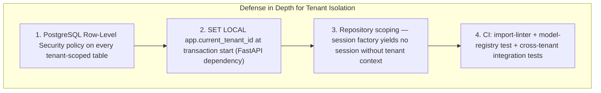
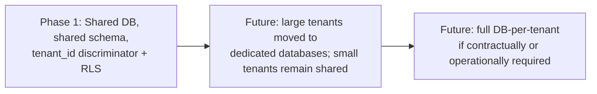

# 06 — Database Architecture

## Purpose
Defines the database strategy: multi-tenancy model, tenant isolation enforcement, schema organization, naming conventions, auditing, soft delete, concurrency, indexing, partitioning, migrations, and backup strategy for PostgreSQL.

## Scope
Applies to the primary relational store (PostgreSQL). Object storage is covered in `13-deployment.md`; caching in `10-performance-strategy.md`.

**The authoritative physical schema — every table, column, type, constraint, and index — is [`docs/data/03-database-schema.md`](../data/03-database-schema.md).** This document defines strategy and mechanism; that document defines the tables. Where the two ever appear to disagree, the data document wins on schema and this one wins on policy.

> **Stack note.** Rewritten in Phase 0 (2026-08-09) for PostgreSQL, superseding an Azure SQL / EF Core version preserved at [`superseded/06-database-architecture-dotnet.md`](./superseded/06-database-architecture-dotnet.md). See ADR-013 and ADR-017.

## 1. Database Strategy

**PostgreSQL, one logical database per environment**, accessed asynchronously through SQLAlchemy 2.x with Alembic migrations.

**Hosted on Supabase** (ADR-027) — as a managed PostgreSQL host and nothing more. Supabase Auth, Storage, Realtime and Edge Functions are not adopted; each would supersede a confirmed decision rather than complement it. Local development continues to use Docker Compose PostgreSQL 17 (`infrastructure/`).

Two constraints follow from that hosting choice and are **not optional**:

> **Alembic is the sole owner of schema.** Supabase ships its own migration system, a SQL editor, and an MCP `apply_migration` tool. None of them may be used to change schema. Two migration systems on one database produce a schema neither can reliably describe, and the damage surfaces as a failed deploy in an environment nobody was watching. Those tools are for reading and diagnosis only, and `supabase/migrations/` must stay absent.

> **`service_role` must never be the application's connection.** Supabase issues a `service_role` key that **bypasses Row-Level Security by design**. §2 makes RLS the backstop that holds when application code is wrong; a connection that bypasses it removes that backstop silently. The application connects as a dedicated `NOSUPERUSER`, `NOBYPASSRLS` role — exactly as local Docker provisions `lpg_app`. `service_role` and the `postgres` superuser are for migrations and administration only.

Chosen over a NoSQL store because the Cylinder Ledger and Inventory domains require strong relational consistency and multi-table transactional guarantees (BR-01–BR-15, BR-29) that a document store would require significant application-level compensation to achieve safely. That reasoning originated in ADR-005 and survived the engine change intact (ADR-013).

PostgreSQL specifically brings four capabilities this design already depends on:

| Capability | Used for |
|---|---|
| **Row-Level Security** | Tenant isolation as a database-level backstop (§2) |
| **`gen_random_uuid()`** | Offline-safe, client-generatable primary keys for the offline-first Driver App (D-24) |
| **`JSONB`** | Audit before/after state, flexible tenant configuration |
| **GIN / `tsvector`** | Native full-text customer search, avoiding a separate search service |

## 2. Multi-Tenancy & Tenant Isolation (per D-01, BR-30)

**Shared database, shared schema, `tenant_id` discriminator column** on every tenant-scoped table (ADR-003), enforced at four layers so that a mistake at any one layer is not a data breach (ADR-017).



### 2.1 How it works

1. A FastAPI dependency verifies the JWT and extracts the tenant claim.
2. At the start of the request transaction it issues `SET LOCAL app.current_tenant_id = '<uuid>'`. `SET LOCAL` scopes the value to the transaction, so it cannot leak across pooled connections.
3. Every tenant-scoped table carries an **RLS policy** predicated on `current_setting('app.current_tenant_id')`.
4. Application repositories additionally scope by tenant — belt as well as braces.

**The ordering matters.** Layer 1 is the backstop that holds even when application code is wrong. That is what makes this defense in depth rather than defense in repetition, and it is a genuine improvement over the superseded ORM-filter approach: because the predicate lives in the database and keys off a session variable, it protects **raw SQL, reporting queries, ad-hoc analysis, and any future BI tool connection** automatically — the exact bypass path the superseded document worried about.

### 2.2 Operational requirements

These are requirements, not conventions:

- The **application's PostgreSQL role must not hold `BYPASSRLS`**, and must not be the table owner (owners bypass RLS by default unless `FORCE ROW LEVEL SECURITY` is set).
- **Migrations and administrative jobs run under a separate role** with the elevated rights the application role lacks.
- **Background jobs set tenant context per tenant.** A job iterating all tenants sets the variable inside each tenant's transaction; nothing runs unscoped.
- The `identity.identity_user` table is the documented exception — `tenant_id` is nullable there, for Super Admin only (`docs/data/03-database-schema.md`).

### 2.3 Why shared-schema over database-per-tenant (Phase 1)

Lower operational overhead — a single set of migrations, backups, and monitoring — at expected initial tenant counts. The migration path to database-per-tenant for large or contractually-isolated tenants is documented in §9 and remains open.

## 3. Schema Organization

PostgreSQL schemas are used as a namespace mechanism mirroring the bounded contexts of `02-domain-driven-design.md`:

```
tenant       (tenant, branch, warehouse, cylinder_type — shared reference data)
customer     (customer, customer_address, kyc_document, lpg_connection)
orders       (order, order_line, order_status_history, failed_delivery_record, cancellation_record)
delivery     (route, route_stop, vehicle_load_event, vehicle_shift_reconciliation, proof_of_delivery)
inventory    (inventory_location, inventory_transaction, goods_receipt_note, reconciliation_record)
ledger       (cylinder_ledger, ledger_transaction)
accounting   (invoice, payment, credit_note, cash_handover)
complaints   (complaint, complaint_assignment, complaint_resolution, complaint_feedback)
identity     (identity_user, role, permission, refresh_token)
audit        (audit_log — append-only; every schema writes here)
```

These schema names are the same names used by the backend's module folders (`03-backend-architecture.md` §14) — the correspondence is intentional and should be preserved.

## 4. Naming Conventions

| Object | Convention | Example |
|---|---|---|
| Schema | `snake_case`, singular | `orders`, `ledger` |
| Table | `snake_case`, singular | `order`, `cylinder_ledger` |
| Column | `snake_case` | `tenant_id`, `created_at` |
| Primary key | `id uuid` default `gen_random_uuid()` | `order.id` |
| Foreign key column | `<referenced_table>_id` | `order.customer_id` |
| Index | `idx_<table>_<columns>` | `idx_order_tenant_status_requested` |
| Unique constraint | `uq_<table>_<columns>` | `uq_customer_tenant_consumer_number` |
| Check constraint | `ck_<table>_<rule>` | `ck_inventory_level_quantity_non_negative` |
| Foreign key constraint | `fk_<table>_<referenced_table>` | `fk_order_line_order` |
| RLS policy | `rls_<table>_tenant_isolation` | `rls_order_tenant_isolation` |

All timestamps are **`timestamptz`**, stored in UTC. PostgreSQL's `timestamptz` normalizes to UTC on write and is unambiguous by construction, so the `...Utc` column-name suffix used by the superseded SQL Server design is unnecessary and is not used.

`snake_case` throughout is deliberate and consistent with the JSON field-naming decision already recorded in `docs/data/10-api-design-guidelines.md` — no case translation anywhere in the stack.

## 5. Standard Columns

Every business table carries the standard column set defined in `docs/data/03-database-schema.md`:

| Column | Type | Purpose |
|---|---|---|
| `id` | `uuid` | Primary key, `gen_random_uuid()` |
| `tenant_id` | `uuid` | Tenant isolation (§2) |
| `created_at` / `created_by` | `timestamptz` / `uuid` | Audit |
| `updated_at` / `updated_by` | `timestamptz` / `uuid` | Audit |
| `is_deleted` | `boolean` | Soft delete (§7) |
| `deleted_at` / `deleted_by` | `timestamptz` / `uuid` | Soft delete audit |
| `version` | `integer` | Optimistic concurrency (§8) |

## 6. Auditing

- **`audit.audit_log`** is append-only and captures `tenant_id`, `entity_name`, `entity_id`, `action`, `performed_by`, `performed_at`, `before_state` (`JSONB`), `after_state` (`JSONB`) — satisfying BR-28 and D-39.
- Rows are written in the **Unit of Work commit path** from state captured by SQLAlchemy session event hooks (`03-backend-architecture.md` §3), so auditing is not something a feature can forget to do.
- **Immutability is enforced by the database**, not by application discipline: `REVOKE UPDATE, DELETE` from the application role on `audit.audit_log`. An audit trail that the application can rewrite is not an audit trail.
- **Domain-critical tables are additionally append-only** at the table level — `ledger.ledger_transaction`, `inventory.inventory_transaction`, `accounting.invoice`, `accounting.payment`. Corrections are new offsetting rows, never edits (BR-06).
- Authentication events (login, logout, failed login, password change) are audited to the same table, per D-39.

## 7. Soft Delete

- Business entities use `is_deleted` + `deleted_at` + `deleted_by`. Repository queries exclude soft-deleted rows by default; retrieving them requires an explicit, deliberate call.
- Per FR-CM-07, **Customer records are never hard-deleted.**
- Append-only tables have no delete path at all — enforced by revoked privileges (§6), not by convention.
- Operational entities that never left `Draft` and have no downstream references may be hard-deleted. This is decided per entity, defaulting to soft delete unless there is a specific documented reason.

## 8. Concurrency

- **Optimistic concurrency** via the `version` integer column, managed by SQLAlchemy's `version_id_col`. PostgreSQL has no native `rowversion`, so this is application-managed by design rather than by omission.
- A conflicting update raises a concurrency error, surfaced as `409` with a documented `error_code` (`docs/data/18-error-catalog.md`).
- This matters most for the offline-first Driver App (D-24), where a stale local copy may attempt to write over a newer server state; the version check is what turns that into a resolvable conflict instead of silent data loss.

## 9. Index Strategy

Detailed per-table indexes are in [`docs/data/04-database-indexing.md`](../data/04-database-indexing.md). The strategic rules:

- **Every tenant-scoped table leads its composite indexes with `tenant_id`**, because virtually every query is tenant-scoped (§2).
- **Partial indexes** (PostgreSQL's equivalent of filtered indexes) for common narrow predicates — e.g. active, non-deleted rows — keeping index size proportional to the queried subset rather than the table.
- **GIN / `tsvector`** for customer search, avoiding the `LIKE '%…%'` performance cliff and the separate search-service dependency it would otherwise force.
- **No `CLUSTER`.** PostgreSQL's heap storage plus well-chosen secondary indexes is sufficient; `CLUSTER` requires an exclusive lock and manual re-running, which is operationally awkward on high-write append-only tables.
- **Avoid premature over-indexing.** Every index slows writes, and `ledger_transaction` / `inventory_transaction` / `audit_log` are the highest-volume write paths in the system. Covering indexes for dashboard list views are added once real query plans exist post-launch.

UUID primary keys carry **no clustered-index fragmentation penalty** on PostgreSQL's heap storage — a cost that would have been real on SQL Server and is not real here.

## 10. Migrations

- **All schema changes go through Alembic migrations.** No manual schema edits in any environment, ever.
- Migrations are code-reviewed like application code and applied through CI/CD as a distinct pipeline step before the new application version takes traffic.
- **Every forward migration has a documented rollback path.**
- Migrations follow the **expand/contract pattern**: add new structures first, deploy code that uses them, remove old structures in a later release. This is what allows a deployment where old and new application versions briefly run concurrently.
- **RLS policies are created and altered in migrations**, alongside the tables they protect — never applied out of band, or they will be missing in one environment.
- Migrations run under the elevated database role (§2.2), not the application role.

## 11. Partitioning

- **Phase 1: no physical table partitioning.** The indexing strategy above is sufficient at expected initial scale (D-34 targets).
- **Documented future path:** declarative range partitioning by month on the append-only high-volume tables — `ledger.ledger_transaction`, `inventory.inventory_transaction`, `audit.audit_log` — once data volume justifies it. These tables grow without bound by design, so this is a matter of when, not whether.

## 12. Multi-Tenancy Scale-Out Path (Future)



The `tenant_id` discriminator on every row is what makes this migration mechanically straightforward when the time comes.

## 13. Backup & Recovery

- **Automated backups** with point-in-time recovery (PITR) via continuous WAL archiving, within a configured retention window.
- **Geo-redundant backup storage** to a paired region, supporting the Disaster Recovery objective in the SRS.
- **Long-term retention** for statutory/GST record-keeping. The exact retention duration is **unconfirmed** — to be settled with finance/legal (recorded as DW-04 in `planning/features/00-documentation-reconciliation/TASKS.md`).
- **Restore procedure must be rehearsed, not assumed.** A backup that has never been restored is a hypothesis.

## 14. Best Practices

- All persistence goes through repositories (`03-backend-architecture.md` §4). No ad-hoc SQL in application or API layers.
- ORM models are never exposed directly through the API — always via Pydantic response models.
- **No cross-schema foreign keys that would couple bounded contexts.** Cross-context references are by ID only (e.g. `orders.order.customer_id` references the customer aggregate root, not its internals), consistent with DDD aggregate boundary rules.
- Check constraints enforce invariants at the database level as a backstop — `ck_inventory_level_quantity_non_negative` and similar. The domain layer remains the specification; the constraint is the safety net.
- Connection pooling is configured deliberately. An async application with many instances can exhaust PostgreSQL connections quickly; server-side pooling is expected at scale — on Supabase this is **Supavisor**. Transaction-mode pooling is compatible with `SET LOCAL` but **not** with session-level state, which is one more reason §2 uses `SET LOCAL`. A decision made for tenant-isolation reasons happens to be the one that also survives pooling.
- **Extensions live in the `extensions` schema on Supabase, not `public`.** Migrations must reference them accordingly. Verified available: `pgcrypto` (pre-installed), `citext`, `pg_trgm` — the three §1 depends on. `gen_random_uuid()` is PostgreSQL core since 13 and needs no extension.

## 15. Risks

- **RLS misconfiguration** — a table created without its RLS policy, or an application role granted `BYPASSRLS`, silently removes the backstop. Mitigated by creating policies in the same migration as the table, and by a CI test asserting every tenant-scoped table has RLS enabled.
- **Append-only table growth** — `ledger_transaction`, `inventory_transaction`, and `audit_log` grow unbounded. Mitigated long-term by the partitioning/archival path (§11), and monitored as a first-class operational metric.
- **Connection exhaustion** under async horizontal scale — mitigated by pool sizing and server-side pooling (§14).
- **Long-running reporting queries** competing with transactional workload — mitigated by statement timeouts and, if needed, a read replica for Reporting.

## 16. Alternatives Considered

- **NoSQL (document store)** — rejected; see §1 and ADR-013. Eventual consistency and weak cross-partition transactions are a poor fit for correctness-critical ledger invariants.
- **Azure SQL Database** — the original direction (ADR-005), superseded by ADR-013 alongside the backend language change. Retaining SQL Server behind a Python ORM would have forfeited RLS ergonomics, `JSONB`, and native full-text search for no compensating benefit.
- **Schema-per-tenant** — rejected for Phase 1; migration overhead scales linearly with tenant count, and RLS achieves the isolation requirement without it.
- **Database-per-tenant from day one** — rejected for Phase 1 operational simplicity; documented as the eventual path for large or contractually-isolated tenants (§12).

## 17. Future Improvements

- Declarative partitioning on the append-only transaction tables once volume justifies it (§11).
- A dedicated read replica for Reporting once report query load materially competes with transactional workload.
- Archival strategy for aged audit and transaction data, coordinated with the statutory retention answer (DW-04).
