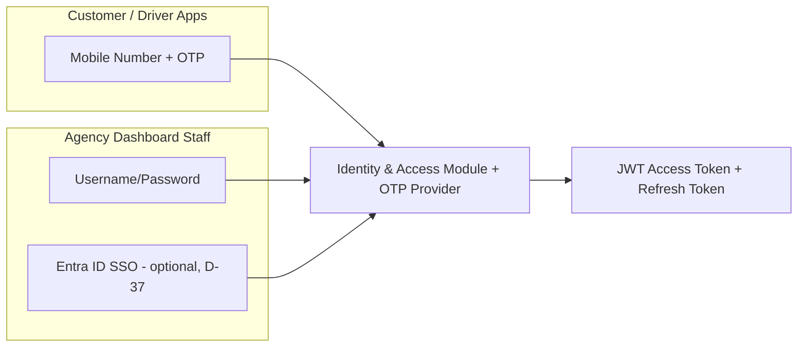

# 08 — Security Architecture

## Purpose
Defines the platform's authentication, authorization, encryption, OWASP Top 10 mitigations, secrets management, audit logging, and session management design, implementing `../srs/security.md` and decisions D-01, D-06, D-37, D-38, D-39.

## Scope
Applies across all layers (API, Dashboard, mobile apps) and the Azure infrastructure hosting them.

## 1. Authentication



- **Customer/Driver**: OTP-based authentication (per SRS explicit requirement). OTP requests rate-limited (max N per phone number per hour) and OTP codes expire after a short window (recommended 5 minutes), mitigating brute-force and SMS-pumping abuse.
- **Dashboard Staff**: username/password, handled by the platform's own Identity & Access module (`identity` schema, `docs/data/03-database-schema.md`) with passwords hashed using **Argon2id** — a memory-hard algorithm, and the current recommended default — never a fast general-purpose hash. Optional **Azure AD / Microsoft Entra ID SSO** (D-37) for tenants requiring centralized workforce identity management.
- **JWT** access tokens (short-lived, ~15 minutes) + **Refresh Tokens** (longer-lived, rotated on use, revocable) per D-37 — refresh token rotation detects token theft (reuse of an already-rotated token triggers full session revocation).

## 2. JWT Structure & Claims

```json
{
  "sub": "user-guid",
  "tenant_id": "tenant-guid",
  "branch_id": "branch-guid",
  "role": "Dispatcher",
  "permissions": ["orders:read", "orders:assign", "routes:write"],
  "exp": 1234567890
}
```

- `tenant_id` is the authoritative source for all tenant-scoping (`06-database-architecture.md` §2) — never trusted from a request body/header.
- Permissions are embedded as claims (not re-fetched per request) for performance, with a short access-token lifetime limiting the staleness window if a permission is revoked mid-session; revocation-sensitive actions additionally re-check permissions against the database (see §3).

## 3. RBAC & Permissions (per D-38)

**Confirmed roles**: Super Admin, Agency Admin, Manager, Warehouse Staff, Dispatcher, Accountant, Driver, Customer.

- Roles are collections of fine-grained **permissions** (e.g., `orders:read`, `orders:cancel`, `inventory:adjust`, `ledger:write`), not hardcoded role checks scattered through code — routes declare their required permission declaratively through a FastAPI dependency (e.g. `Depends(requires("orders:cancel"))`), which resolves the authenticated principal's effective permissions before the handler runs. The same permission definitions govern WebSocket subscription authorization (`16-realtime-architecture.md` §5).
- **Permission-based UI** (per `../srs/security.md` §2): the same permission list is returned to the client on login and drives which UI actions/routes are rendered — the API remains the enforcement point regardless of what the UI shows, per defense-in-depth.
- High-sensitivity actions (inventory adjustment approval — D-16; refund approval — D-17; cancellation-after-dispatch approval — D-19) require a **second, live permission check against the database** rather than relying solely on JWT claims, since these are infrequent, high-value actions where claim staleness risk is unacceptable.
- **Super Admin** operates above tenant scope (tenant onboarding/configuration, D-01) — its actions are logged with extra scrutiny (§6) since it's the one role capable of crossing tenant boundaries by design.

## 4. Encryption

| Data | At Rest | In Transit |
|---|---|---|
| Database (PostgreSQL) | Encryption at rest, always-on (managed-service default) | TLS 1.2+ |
| Blob Storage (KYC docs, photos, signatures, invoices) | Storage Service Encryption (SSE), customer-managed key option via Key Vault | TLS 1.2+ |
| KYC documents specifically | Additionally encrypted at the application layer (envelope encryption via Key Vault-managed key) before upload, given their sensitivity (`../srs/security.md` §3) | TLS 1.2+ |
| Secrets/connection strings | Azure Key Vault | TLS 1.2+ |
| Mobile local storage (Driver App offline DB) | SQLCipher (`05-mobile-architecture.md` §7) | N/A (device-local) |

Payment card data is never stored by the platform directly — card transactions are tokenized via the integrated PCI-DSS-compliant Payment Gateway (`../srs/security.md` §3); the platform stores only the gateway's transaction/token reference.

## 5. OWASP Top 10 Mitigations

| Risk | Mitigation |
|---|---|
| A01 Broken Access Control | RBAC/permissions (§3) enforced server-side on every endpoint via FastAPI dependencies, and on every WebSocket subscription (`16-realtime-architecture.md` §5); tenant isolation backstopped by PostgreSQL Row-Level Security (`06-database-architecture.md` §2) |
| A02 Cryptographic Failures | §4 above; TLS everywhere; no sensitive data in JWTs beyond claims needed for authz |
| A03 Injection | SQLAlchemy parameter binding throughout; no string-interpolated SQL; Pydantic v2 input validation (`07-api-architecture.md` §7) |
| A04 Insecure Design | Threat modeling performed per bounded context during design phase; domain invariants enforced at the aggregate level, not just UI |
| A05 Security Misconfiguration | Infrastructure as Code (Bicep/Terraform) for consistent environment configuration; security headers (CSP, HSTS, X-Content-Type-Options) enforced via middleware |
| A06 Vulnerable Components | Automated dependency scanning in CI across all three stacks (GitHub Dependabot; `pip-audit` for Python, `npm audit` for the Nx workspace, `dart pub outdated` for Flutter) |
| A07 Identification & Auth Failures | OTP rate limiting, refresh token rotation, account lockout after repeated failed password attempts (Dashboard) |
| A08 Software & Data Integrity Failures | CI/CD pipeline requires signed commits/protected branches; package integrity via lockfiles |
| A09 Security Logging & Monitoring Failures | `12-observability.md`; audit logging (§6) |
| A10 Server-Side Request Forgery | Outbound calls (payment gateway, SMS provider) restricted to an allow-list of known hosts; no user-controllable URL fetches |

## 6. Audit Logging

- Implemented as described in `06-database-architecture.md` §6 (`audit.audit_log`, append-only, with `UPDATE`/`DELETE` revoked from the application role — the application cannot rewrite its own audit trail).
- Per D-39, scope explicitly includes: financial transactions, inventory adjustments, **login events** (success and failure), and administrative changes (role assignment, tenant configuration changes).
- Super Admin actions and any cross-tenant-capable operation are flagged with an additional severity tag for prioritized security review.

## 7. Secrets Management

- **Azure Key Vault** holds all connection strings, API keys (payment gateway, SMS/email provider), and encryption keys.
- Application instances and the background worker use **Managed Identity** to access Key Vault — no secrets in application configuration, source control, or CI/CD variables in plaintext. This includes the AG Grid (Enterprise, where enabled per feature) and PrimeNG licence keys used at frontend build time (ADR-020, ADR-028) — never committed, regardless of tier.
- Secret rotation policy: automated rotation for Key Vault-managed keys where supported; documented manual rotation runbook for third-party API keys (payment gateway, SMS provider).

## 8. Session Management

- Dashboard: JWT access token in memory (not localStorage, to reduce XSS token-theft surface), refresh token in an `HttpOnly`, `Secure`, `SameSite=Strict` cookie.
- Mobile apps: tokens in platform secure storage (`05-mobile-architecture.md` §7).
- Session timeout: configurable per tenant (ties to BR-31's configurability principle), with a sensible default (e.g., 30 minutes idle for Dashboard staff, longer for mobile given OTP re-auth friction).
- Logout invalidates the refresh token server-side immediately (not just client-side token deletion).

## 9. Best Practices
- Principle of least privilege for every role (§3) — start from zero permissions and add explicitly, never start from "all" and subtract.
- All authz decisions logged when they result in a `403`, to detect probing/misconfiguration.
- Regular (at minimum annual, or before major releases) third-party penetration testing.

## 10. Risks
- **JWT claim staleness**: mitigated via short access-token lifetime + live re-check for high-sensitivity actions (§3).
- **Multi-tenant privilege escalation**: a compromised Super Admin credential is the highest-impact risk given its cross-tenant reach — mitigated via mandatory MFA for Super Admin accounts specifically (recommended even though not explicitly required for other roles in Phase 1) and the elevated audit scrutiny in §6.

## 11. Alternatives Considered
- **Session-based auth (server-side sessions) instead of JWT** — rejected; JWT better supports the stateless, horizontally-scaled API design (`01-system-architecture.md` §7) and the offline-first mobile requirement (a valid, cached token allows queued offline actions to be prepared before connectivity returns).
- **Storing JWT in localStorage** — rejected due to XSS exposure; in-memory + HttpOnly refresh cookie chosen instead (§8).

## 12. Future Improvements
- Mandatory MFA rollout beyond Super Admin (e.g., Agency Admin) as the platform scales and higher-value tenants are onboarded.
- Formal SOC 2 / ISO 27001 readiness assessment once the platform reaches broader multi-tenant commercial scale.
