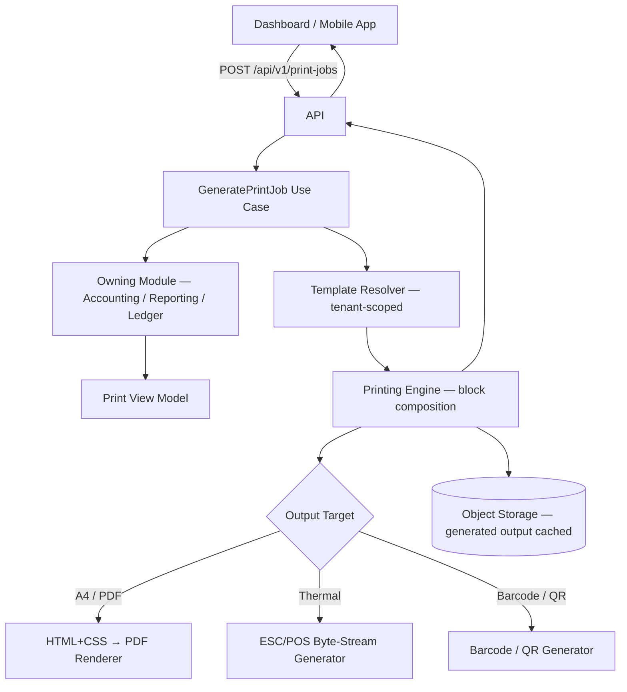
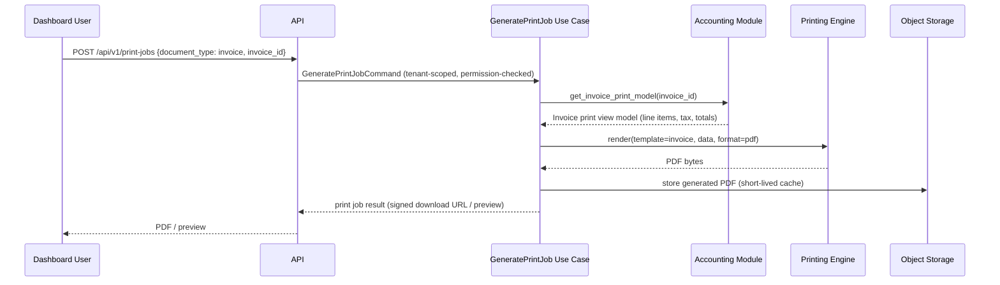

# 09 — Printing Architecture

## Purpose
Designs a single, reusable printing engine serving every print/receipt requirement named in the SRS: invoices, delivery receipts, payment/cash receipts, customer ledger printouts, daily/inventory/driver/GST reports, thermal and A4 output, PDF export, and barcode/QR generation.

## Scope
A shared backend capability consumed by the Dashboard (primary), and indirectly by the mobile apps, which request server-rendered receipts/PDFs rather than rendering print layouts on-device.

> **Stack note.** The *architectural* decision here — one server-side, tenant-configurable, block-based template engine — is unchanged and remains Accepted as **ADR-010**. Only the rendering libraries were rebound from .NET to Python in Phase 0 (2026-08-09), per **ADR-016**. The original is preserved at [`superseded/09-printing-architecture-dotnet.md`](./superseded/09-printing-architecture-dotnet.md).
>
> **The specific PDF library is deliberately not selected.** See §6.

## 1. Design Goals

- **One engine, many templates** — no per-document-type bespoke rendering code (mirrors the SRS's "receipt templates should be configurable and reusable" requirement).
- **Format-agnostic templates** — a single template definition renders to thermal (58 mm/80 mm, per D-41), A4, and PDF, rather than maintaining parallel templates per output format.
- **Server-side rendering** — identical output regardless of which client initiates the print, and templating logic in one place.
- **Renderer-agnostic template model** — the block model does not know which library produces the final bytes. This is what makes §6's deferral cost-free.

## 2. Architecture

The printing engine lives in the **Infrastructure layer** and is invoked by an application-layer use case. It never reaches into other modules' data directly — it receives a prepared **print view model** from the owning module (`docs/data/16-printing-data-model.md`).

## 3. Template Model

- Templates are **tenant-scoped configuration** (BR-31, D-42), stored as structured layout definitions — never hardcoded per document type in application code. A tenant changing its footer text must not require a deployment.
- Templates are composed of reusable **blocks**: Header/Logo, Company Information, Customer Details, Line Items Table, Tax Breakdown, Totals, Footer/Terms, Barcode/QR Block, Signature Block.
- A `DocumentType` enumeration — Invoice, DeliveryReceipt, PaymentReceipt, CashReceipt, CustomerLedger, DailySalesReport, InventoryReport, DriverReport, GstReport — maps to a default block composition per tenant, which tenant admins can customize (logo, terms, footer message) **without a code change or redeployment**.
- Certain blocks are **mandatory and non-removable** — the tax breakdown and GST fields in particular. A tenant must not be able to configure themselves into a non-compliant invoice.

## 4. Print Preview

The same rendering pipeline produces the preview. There is **no separate preview-only code path**, which is the only way to guarantee the SRS requirement that preview matches printed output.

## 5. Thermal Printing

- **ESC/POS byte-stream generation** for 58 mm and 80 mm thermal printers (D-41), produced directly from the block model with no HTML intermediate — thermal output is character-cell, not page-layout.
- Dashboard printing targets common receipt-printer drivers via a browser or OS-level print bridge.
- The Driver App integrates a Bluetooth/USB thermal SDK for on-the-spot delivery and payment receipts in the field.
- Receipts must remain legible on low-quality printers: minimal graphics, optimized fonts, support for automatic paper cut.

## 6. A4 / PDF Export

**Approach:** the block model renders to an **HTML + CSS intermediate**, which a Python renderer converts to A4-formatted PDF. The HTML intermediate lets print layouts reuse the design-token vocabulary (`docs/ui/09-design-tokens.md`), keeping printed output visually consistent with the Dashboard.

**The specific library is deferred** (ADR-016, tracked as DW-07). Candidates:

| Candidate | Strengths | Considerations |
|---|---|---|
| **WeasyPrint** | CSS Paged Media support, strong typographic control, HTML/CSS authoring model | Native system dependencies (Pango, Cairo) affect the container image |
| **ReportLab** | Programmatic layout, no system dependencies, mature | Lower-level; less natural fit for an HTML intermediate |

The decision hinges on **rendering fidelity for GST-compliant invoice layouts and multi-page report pagination** — an empirical question, best answered by a spike against real templates during Phase 17 (Printing) rather than guessed now.

Deferring costs nothing because the template model, block composition, `DocumentType` mapping, preview pipeline, and caching policy are all renderer-independent.

## 7. Barcode & QR Generation

- Python `qrcode` for QR codes and `python-barcode` for Code 128 (per `knowledge/08-printing-summary.md`).
- Used today for invoice, booking, delivery, and customer reference codes.
- Pre-positioned in the template model for Phase 2's cylinder-level QR/barcode tracking (D-36) — when that ships, the engine gains a new block type, not a new architecture.

## 8. Data Flow Example — Invoice Print

## 9. Performance

- Large reports (thousands of rows, many pages) render **asynchronously as background jobs** (`03-backend-architecture.md` §7), returning a job handle the client polls or receives via real-time notification. Rendering a 50-page GST report inside a request would block a worker and blow the response-time SLA (D-34).
- Small documents — receipts, single invoices — render synchronously.
- Generated output is cached briefly in object storage for repeat downloads within a session.

## 10. Security

- Print jobs are **authenticated, authorized, and tenant-scoped** like any other operation. A user may print only documents they are permitted to read.
- Generated files are served via **short-lived signed URLs**, never public object-storage paths.
- Print and export actions are **audited** — user, tenant, document type, timestamp (D-41, `knowledge/08-printing-summary.md`).

## 11. Best Practices

- **Templates never embed business logic.** Tax calculation and totals are computed by the owning module (Accounting, Reporting); the engine renders values it is given. This keeps the engine a pure presentation concern and prevents a second, divergent implementation of tax rules.
- **Render from print view models, never from domain entities or ORM models** (`docs/data/16-printing-data-model.md`).
- Generated PDFs are cached, but the **source of truth remains the transactional data** — a regenerated invoice must always match the originally issued amounts (BR-06 immutability applied to financial documents).
- Print layouts must remain readable in **grayscale**; avoid heavy backgrounds.
- Printing must respect **accessibility**: readable typography, sufficient contrast, logical reading order, and tagged PDF structure where the chosen renderer supports it.
- Locale-aware currency, date, and number formatting, tenant-configurable (`knowledge/08-printing-summary.md`).

## 12. Risks

- **Thermal printer driver fragmentation** — real-world models vary significantly in ESC/POS support. Mitigated by targeting a documented, tested subset of common models at launch, with a per-tenant configuration escape hatch for printer-specific quirks.
- **Template customization sprawl** — tenant-level customization risks inconsistent branding or, worse, legally non-compliant documents. Mitigated by mandatory non-removable blocks (§3).
- **Renderer fidelity gap** — the deferred library choice may not meet GST layout requirements. Mitigated by making the spike a gated deliverable of Phase 17, with headless-browser rendering as a documented fallback (§14).
- **System dependency weight** — WeasyPrint's native dependencies increase image size and build complexity. A factor in the spike, not a blocker.

## 13. Alternatives Considered

- **Client-side rendering (browser print CSS) per document type** — rejected; would duplicate layout logic across Dashboard and mobile, and per output format, directly contradicting "one engine, many templates".
- **Third-party document-generation SaaS** — rejected; an external dependency for a capability core to daily agency operations, which must work reliably even when connectivity to third parties is degraded.
- **Headless-browser rendering (Playwright/Chromium → PDF)** — high fidelity, but a heavy runtime dependency for a server-side batch capability. Playwright is already committed for E2E testing, where that weight is justified; it is **retained as the fallback** if neither §6 candidate meets fidelity requirements.

## 14. Future Improvements

- Cylinder-level barcode/QR label printing once Phase 2 individual cylinder tracking ships (D-36).
- WYSIWYG template editor for tenant admins, beyond initial configuration-based customization.
- Batch printing, scheduled report generation with automatic email delivery, digital signatures, and watermarks (`knowledge/08-printing-summary.md` §Future Enhancements).
