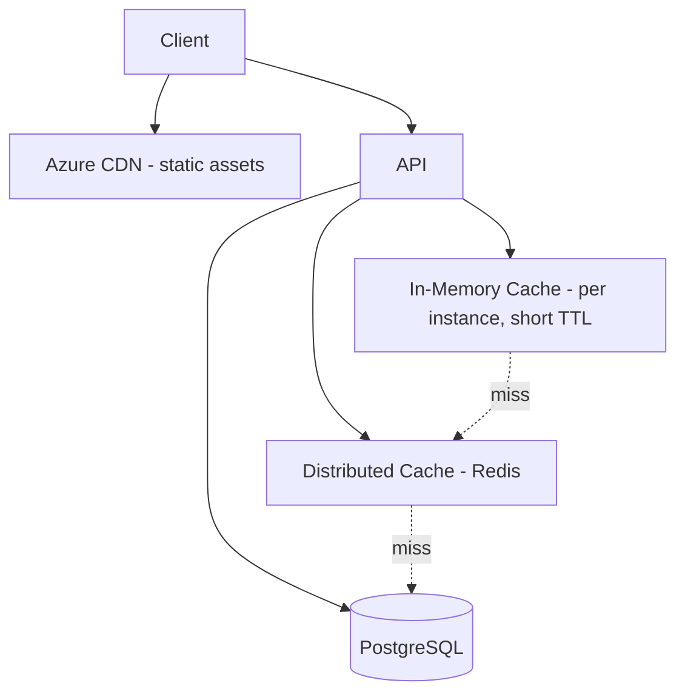

# 10 — Performance Strategy

## Purpose
Defines the caching, delivery, database, and API optimization strategy required to meet the confirmed performance SLAs (D-34).

## Scope
Cross-cutting across backend, frontend, and infrastructure. References `../srs/performance.md` as the source of truth for target numbers.

## 1. Confirmed Performance Targets (D-34, restated for architecture traceability)

| Metric | Target |
|---|---|
| API response (average) | < 300ms |
| Search | < 1 second |
| Dashboard load | < 2 seconds |
| Report generation | < 10 seconds |
| Concurrent users | 500+ per tenant |
| Scaling model | Horizontal |

## 2. Caching Strategy

- **L1 (in-memory, per API instance)**: extremely short-lived (seconds) caching of hot, rarely-changing reference data (cylinder types, tax rate config) to avoid a Redis round-trip on every request.
- **L2 (Redis, distributed)**: tenant-scoped cache keys (`tenant:{id}:...`) for: tenant configuration (BR-31 values), permission sets, and dashboard KPI aggregates (short TTL, e.g., 30–60s, since KPIs are "real-time" but not necessarily sub-second-fresh). The same Redis instance also serves sessions, rate limiting, the background-job queue, and the real-time Pub/Sub backplane (`16-realtime-architecture.md`) — so it is a critical dependency and monitored as one.
- **Cache invalidation**: write-through on configuration changes (tenant admin updates a GST rate → cache entry invalidated immediately) rather than relying solely on TTL expiry, to avoid stale business-critical values like pricing/tax.
- No caching of Cylinder Ledger balances or Inventory counts beyond request-scope — these are read live from the transactional store given their correctness criticality (BR-01–BR-15); caching here would risk showing stale stock/balance data, which directly undermines the "system should always know exact customer holdings" requirement.

## 3. CDN

- **Azure CDN** (or Azure Front Door's built-in CDN capability) serves the Dashboard's static assets (JS/CSS bundles, fonts, design-token-driven theme CSS) and any publicly cacheable content (e.g., print-preview PDFs briefly, per `09-printing-architecture.md` §9).
- Mobile app assets are bundled at build time (not CDN-served), consistent with standard Flutter app packaging.

## 4. Frontend Performance (Dashboard)

- Route-level lazy loading (`04-frontend-architecture.md` §7) minimizes initial bundle size toward the < 2s dashboard-load target.
- Virtual scrolling on all large lists/tables (Angular CDK).
- `NgOptimizedImage` for KYC thumbnails, delivery photos.
- Signal-based change detection (Angular 20 default) reduces unnecessary re-renders versus Zone.js-driven change detection in older Angular versions.

## 5. Mobile Performance
- Offline-first local reads (`05-mobile-architecture.md`) mean most Driver App interactions never wait on network latency at all.
- Image/photo compression before upload (delivery proof photos) to reduce sync payload size and time.

## 6. Database Optimization

- Indexing strategy per `06-database-architecture.md` §9 and `docs/data/04-database-indexing.md`, targeted at the actual query patterns behind the Search (<1s) and Dashboard (<2s) targets.
- **Read-side queries bypass aggregate hydration**, selecting only required columns through SQLAlchemy Core or database views (query side of CQRS, `03-backend-architecture.md` §2). Loading a full aggregate to render a list row is pure waste.
- **Eager-load deliberately** on the write side to avoid N+1 query patterns; lazy loading is disabled on async sessions, which surfaces the problem at development time rather than under load.
- **PostgreSQL full-text search** (GIN/`tsvector`) for customer lookup rather than `LIKE '%…%'`, which does not use an index and degrades sharply with table size.
- Read-heavy Reporting queries are evaluated against a read replica once report generation approaches the 10-second ceiling under real load, to avoid competing with transactional (OLTP) traffic.
- **Statement timeouts** are set so a pathological query degrades one request rather than saturating the connection pool.

## 7. API Optimization

- Response compression (Brotli/Gzip) enabled at the edge.
- Pagination enforced by default (`07-api-architecture.md` §4) — no endpoint returns unbounded result sets.
- **Performance timing middleware** (`03-backend-architecture.md` §3) records every request's duration and logs any use case exceeding its target threshold, feeding directly into `12-observability.md` alerting so SLA regressions are caught automatically, not discovered via user complaints.
- **Async all the way.** A single blocking call inside an async handler stalls the event loop for every concurrent request on that instance — the highest-impact and least visible performance regression available in this stack. All I/O uses async libraries; genuinely CPU-bound work is offloaded to the background worker.

## 8. Horizontal Scaling

- Stateless API instances (session state externalized to Redis, §2) allow the container host to add/remove instances based on CPU and request-queue metrics, directly supporting the "500+ concurrent users per tenant, horizontal scaling enabled" target.
- **Real-time fan-out via a Redis Pub/Sub backplane** (`16-realtime-architecture.md`) so a client connected to one instance still receives events raised on any other — real-time does not constrain instance count.
- **WebSocket connections are stateful and long-lived**, so connection count per instance is a capacity metric in its own right, tracked alongside CPU and memory.
- **Connection pooling** is sized deliberately: many async instances can exhaust PostgreSQL connections quickly, so server-side pooling (e.g. PgBouncer in transaction mode) is expected at scale (`06-database-architecture.md` §14).

## 9. Load Testing Plan
- Pre-production load tests (per SRS Phase 7) simulate: peak-hour booking traffic, a full day's delivery-confirmation volume across a full fleet, and concurrent multi-staff report generation — validated against the §1 targets before each major release.

## 10. Best Practices
- Every new endpoint's expected p95 latency is documented at design time and validated against §1 targets before merge, not discovered post-launch.
- No N+1 query patterns — enforced via code review and, where feasible, automated query-count assertions in integration tests for critical list endpoints.

## 11. Risks
- **Cache staleness for configuration**: mitigated by write-through invalidation (§2).
- **Reporting query growth outpacing OLTP capacity**: mitigated by the read-replica escalation path (§6) and by favoring precomputed/materialized aggregates for the heaviest reports over live aggregation once volume justifies the added complexity.

## 12. Alternatives Considered
- **Full read/write database separation (CQRS with separate physical stores)** — deferred for Phase 1 (see `03-backend-architecture.md` §2); revisit if reporting load genuinely can't be satisfied by a read-replica alone.
- **Client-side caching of Ledger/Inventory data** — rejected per §2, given the correctness-critical nature of that data.

## 13. Future Improvements
- Introduce a dedicated reporting read-replica or materialized-view refresh pipeline once real production query patterns are known.
- Evaluate output caching (HTTP response caching) for genuinely public, non-tenant-varying endpoints if any emerge (currently none identified, since nearly everything is tenant-scoped).
