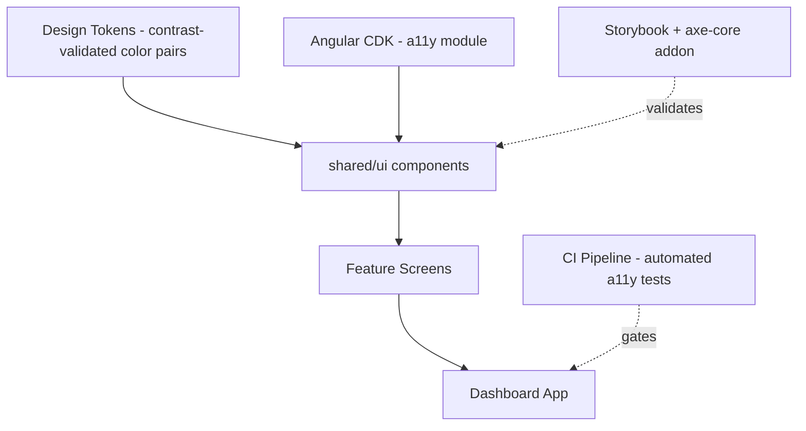
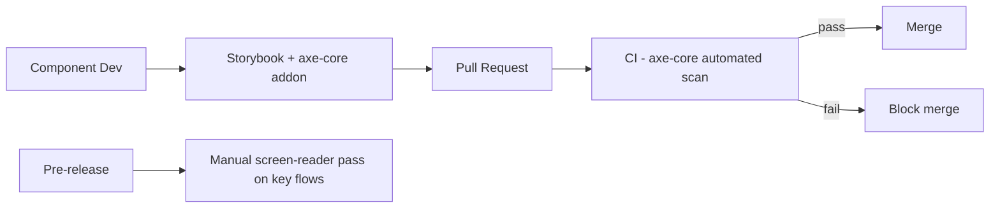

# 11 — Accessibility Strategy

## Purpose
Defines the technical implementation strategy for WCAG 2.2 AA compliance (D-35, confirmed as a Phase 1 requirement), translating `../srs/accessibility.md` into concrete architectural/component-level practices.

## Scope
Primarily the Agency Web Dashboard (highest UI complexity); mobile apps follow platform-native accessibility APIs via Flutter.

## 1. Standard & Scope
- **WCAG 2.2 Level AA**, required at Phase 1 launch (D-35), applied to the Dashboard's full component library (`04-frontend-architecture.md` §5) and every feature screen built from it.

## 2. Architectural Approach

Accessibility is treated as a **shared library concern**, not a per-feature afterthought: every component in `libs/shared/ui` (`04-frontend-architecture.md`) is built accessible-by-default, so feature teams inherit compliance rather than re-implementing it per screen.

## 3. Keyboard Navigation
- Every interactive `shared/ui` component supports full keyboard operability (Tab, Shift+Tab, Enter, Space, Arrow keys where applicable — e.g., Data Grid row navigation) via Angular CDK's `a11y` module (`FocusKeyManager`, `ListKeyManager`).
- Global keyboard shortcuts (Ctrl+K, Ctrl+N, etc., per `../srs/non-functional.md` §5) are centralized in one service (`04-frontend-architecture.md` §9) with a documented, non-conflicting keymap, and must not override native assistive-technology shortcuts.

## 4. Screen Reader Support
- Semantic HTML enforced in every `shared/ui` component (native `<button>`, `<table>`, `<nav>` etc. over generic `
`s with click handlers).
- ARIA roles/attributes applied per the WAI-ARIA Authoring Practices for custom widgets (Data Grid → `role="grid"`, Dropdown → `role="listbox"`/`combobox`, Stepper → `role="tablist"`-adjacent pattern), implemented once in `shared/ui` and reused.
- Screen-reader testing (NVDA + Chrome, VoiceOver + Safari) included in the Definition of Done for any new `shared/ui` component.

## 5. Focus Management
- Modal/Drawer components trap focus (CDK `FocusTrap`) while open and restore focus to the triggering element on close — implemented once in the shared Dialog/Drawer component.
- Route transitions move focus to the new page's primary heading, so keyboard/screen-reader users aren't stranded on a stale focus target.
- Visible focus indicators (never `outline: none` without a compliant replacement) driven by the design token system (`04-frontend-architecture.md` §6), consistent across Light/Dark/High-Contrast themes.

## 6. High Contrast & Reduced Motion
- **High Contrast theme** is a first-class theme token set (`04-frontend-architecture.md` §6), not a CSS filter/inversion hack — ensures icons, borders, and focus indicators remain meaningful, not just inverted colors.
- All animations respect `prefers-reduced-motion`; the design system's animation tokens include a reduced-motion variant (typically near-instant transition) applied automatically, not per-component opt-in.

## 7. Accessible Tables
- The shared Enterprise Data Grid component (`04-frontend-architecture.md` §5) implements proper `<th scope="col">`/row header semantics, sortable-column ARIA states (`aria-sort`), and keyboard row/cell navigation as a built-in feature — every feature using the Data Grid inherits this without extra work.

## 8. Accessible Forms
- Shared form components enforce programmatic label association (`<label for>`/`aria-labelledby`), inline error messages linked via `aria-describedby`, and a consolidated error summary component (per `../srs/non-functional.md` §8) that receives focus on submit failure so screen-reader users immediately hear what needs correction.
- Validation state is never conveyed by color alone (icon + text accompany every error/success state).

## 9. Automated & Manual Testing

- **Automated**: axe-core integrated into both Storybook (component-level, dev-time feedback) and CI (Playwright + axe-core, page-level scan on critical flows — booking, order approval, invoice generation) — a CI gate, not just advisory.
- **Manual**: screen-reader walkthroughs of the same critical flows before each release, since automated tools catch roughly a third to half of real-world accessibility issues at best; manual review is a mandatory complement, not optional polish.

## 10. Best Practices
- Accessibility acceptance criteria included in every feature's Definition of Done (per `../srs/documentation` expectations elsewhere in the SRS), not treated as a separate, deferrable workstream.
- Each PrimeNG component is accessibility-audited before adoption into `shared/ui`, per ADR-028's hybrid component strategy (`04-frontend-architecture.md` §5), since inheriting an inaccessible third-party widget undermines the shared-library strategy in §2.

## 11. Risks
- **Data Grid complexity**: the AG Grid data grid (sorting/filtering/grouping/column-chooser, at whichever tier a given instance uses — Community by default, Enterprise where a documented requirement needs it, per ADR-028) is the single highest-risk component for accessibility regressions given its complexity — mitigated by concentrating extra manual testing effort here specifically, and by not allowing feature teams to build ad-hoc alternative grids that bypass the shared, tested implementation.
- **Third-party widget gaps**: PrimeNG/Angular Material components may have accessibility gaps in edge cases — mitigated by the pre-adoption audit in §10 and by wrapping (not directly exposing) third-party components through `shared/ui`, so gaps can be patched centrally.

## 12. Alternatives Considered
- **Per-feature accessibility implementation** (each feature team handles its own ARIA/keyboard logic) — rejected; inconsistent quality and duplicated effort versus the shared-library-first approach in §2.
- **Retrofitting accessibility after Phase 1 launch** — rejected per D-35's explicit confirmation that WCAG 2.2 AA is a Phase 1 launch requirement, not a post-launch improvement.

## 13. Future Improvements
- Expand automated coverage from axe-core (catches a subset of issues) toward more comprehensive automated + user-testing-with-assistive-technology-users programs as the platform matures.
- Extend the same shared-component accessibility discipline to a future customer-facing web portal, if one is built (see `05-mobile-architecture.md` §12).
