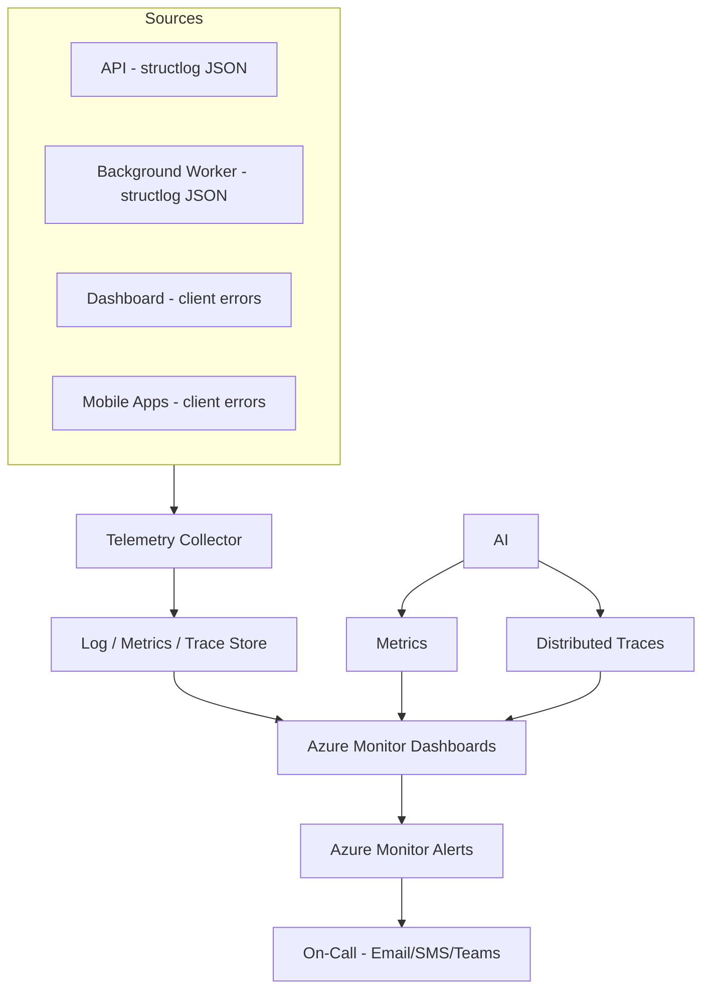

# 12 — Observability

## Purpose
Defines the logging, monitoring, metrics, distributed tracing, health check, and alerting strategy so the platform's operational health — and any SLA regression against `10-performance-strategy.md` §1 — is visible before it becomes a customer-facing incident.

## Scope
Applies to the backend API, background jobs, and (where applicable) client-side error reporting for the Dashboard and mobile apps.

## 1. Architecture

## 2. Logging
- **`structlog`** structured JSON logs (`03-backend-architecture.md` §10), emitted to stdout and collected by the platform — never written to local files, so the application stays stateless and container-native.
- Every log entry carries: `tenant_id`, `correlation_id`, `user_id` (if authenticated), `request_path`.
- Log levels: `DEBUG` (dev only), `INFO` (normal operation milestones — order created, delivery confirmed), `WARNING` (recoverable anomalies — retry occurred, cache miss on an expected-hit path), `ERROR` (handled exceptions), `CRITICAL` (unhandled/process-level failures).
- **Sensitive-data redaction is a `structlog` processor** — a central mechanism in the logging pipeline, never a rule developers must remember at each call site. Passwords, tokens, OTPs, KYC contents, and payment details never reach a log sink.

## 3. Monitoring & Metrics

| Metric Category | Examples |
|---|---|
| API Performance | p50/p95/p99 latency per endpoint, error rate, request volume |
| Business KPIs (technical proxies) | Orders created/min, deliveries confirmed/min, ledger transactions/min — feeding the KPI set in `docs/data/15-reporting-data-model.md` from the infrastructure side |
| Infrastructure | Container CPU/memory, PostgreSQL connection-pool saturation and query latency, Redis hit ratio, **WebSocket connection count per instance** |
| Background Jobs | Job success/failure rate, job duration, queue depth |
| Real-Time | Publish rate vs. client receive rate, subscriber-loop health, disconnect rate (`16-realtime-architecture.md` §10) |
| Mobile Sync (Driver App) | Sync queue depth, sync failure rate, average time-to-sync after connectivity restored |

## 4. Distributed Tracing
- **OpenTelemetry** instrumentation traces a request end-to-end: edge → ASGI middleware → router → use case → repository → PostgreSQL, plus outbound calls (payment gateway, SMS provider) and Redis operations.
- `trace_id` returned in every API error response (`07-api-architecture.md` §6) so a customer-reported issue can be traced directly to its full execution path without reproducing it.
- **Cross-boundary correlation**: the same `correlation_id` flows from client request → API → domain event dispatch → enqueued background job → real-time push, so a single business transaction (e.g. "delivery confirmed") is traceable end-to-end even as it fans out across multiple downstream effects (`02-domain-driven-design.md` §5 event list, `16-realtime-architecture.md` §7).

## 5. Health Checks
- FastAPI exposes `/health/live` (the process is running) and `/health/ready` (dependencies — PostgreSQL, Redis, object storage, secret store — are reachable). The distinction matters: liveness failures should restart the container, readiness failures should only remove it from rotation. These endpoints are consumed by the container host's health probes and by deployment pipelines to gate traffic cutover (`13-deployment.md`).
- Background worker health is surfaced through job success/failure metrics plus an alert on stuck or missed recurring jobs. **A scheduled job that stops running silently is itself an incident** — the SLA Breach Scanner not firing for an hour means the Complaint SLA guarantee (D-20) is unprotected while every dashboard still looks green.

## 6. Alerts

| Alert | Condition | Severity |
|---|---|---|
| API latency SLA breach | p95 > target (`10-performance-strategy.md` §1) sustained 5 min | High |
| Elevated error rate | 5xx rate > 1% over 5 min | High |
| Database DTU/vCore saturation | > 80% sustained 10 min | Medium |
| Failed login spike | Unusual spike in failed auth attempts (possible credential-stuffing) | High (security) |
| Cross-tenant query isolation test failure | Any CI/synthetic isolation-test failure (`06-database-architecture.md` §12) | Critical |
| Inventory reconciliation variance | Unusually large variance detected (`../engineering/inventory-flow.md`, D-16) | Medium (business alert, routed to Warehouse/Agency Admin, not just engineering) |
| Complaint SLA breach scanner failure | Job hasn't run successfully in > 1 hour | High |
| Backup failure | Any scheduled backup job failure | Critical |

- Alerts route to on-call engineering (via Azure Monitor Action Groups → Teams/Email/SMS/PagerDuty-equivalent) for technical alerts, and to the relevant business role (Warehouse/Agency Admin) for business-anomaly alerts like inventory variance — not everything is an engineering pager event.

## 7. Client-Side Observability
- Dashboard: Application Insights JavaScript SDK captures unhandled exceptions, route-change performance, and Core Web Vitals, correlated back to the same `CorrelationId` scheme where a client action triggered an API call.
- Mobile: crash reporting (e.g., Firebase Crashlytics or App Center) plus custom sync-engine telemetry (queue depth, conflict rate) reported back to Application Insights via a lightweight custom events endpoint, so mobile and backend observability live in one place rather than two disconnected tools.

## 8. Best Practices
- Every new endpoint ships with baseline dashboards (latency, error rate, volume) as part of its Definition of Done — not added retroactively after an incident.
- Alert thresholds tied directly to the confirmed SLAs (`10-performance-strategy.md` §1), not arbitrary numbers, so "alerting" and "SLA compliance" are the same conversation.

## 9. Risks
- **Alert fatigue**: overly sensitive thresholds erode on-call trust — mitigated by tuning thresholds against real production baselines post-launch rather than guessing conservatively upfront, and by routing business-anomaly alerts away from the engineering on-call rotation (§6).
- **PII leakage into telemetry**: mitigated by the same masking discipline as logging (§2), applied consistently to client-side telemetry as well.

## 10. Alternatives Considered
- **Third-party observability stack (Datadog, Grafana/Prometheus)** — considered; Application Insights/Azure Monitor chosen for native integration with the Azure-centric infrastructure (`13-deployment.md`) and lower operational overhead for a 10-person team; revisit if multi-cloud or more advanced APM features become necessary.

## 11. Future Improvements
- Introduce synthetic transaction monitoring (scripted end-to-end booking/delivery flows run on a schedule) once the platform has enough production history to define realistic synthetic baselines.
- Expand business-anomaly alerting (beyond inventory variance) to other KPI thresholds (`../data/15-reporting-data-model.md`, D-29 KPI definitions) as those definitions mature.
