# 13 — Deployment

## Purpose
Defines the deployment **direction**: target cloud, containerization strategy, environment model, CI/CD pipeline shape, and release approach — while deliberately leaving the specific hosting topology and IaC tool open until they can be decided on evidence.

## Scope
Covers backend API, background worker, Dashboard hosting, mobile app distribution, and supporting cloud services at the level of *what capability is needed*, not *which product provides it*.

> **Stack note.** Rewritten in Phase 0 (2026-08-09). The superseded version committed to a full Azure topology (App Service Premium v3, Azure Functions, Azure SignalR, Azure SQL Elastic Pool, Bicep) that followed from the .NET and SQL Server decisions; it is preserved at [`superseded/13-deployment-dotnet.md`](./superseded/13-deployment-dotnet.md).

---

## ⚠️ 1. What Is Decided and What Is Not

**Decided (ADR-022, amended by ADR-027):**

- **The database is hosted on Supabase** — managed PostgreSQL only. Supabase Auth, Storage, Realtime and Edge Functions are **not** adopted (ADR-027).
- **Azure remains the target cloud for application hosting.**
- The backend is a **containerized ASGI application**.
- The application architecture binds to **capabilities**, not to specific Azure products.
- Four environments, GitHub Actions CI/CD, manual-gated production promotion.

**Deliberately not decided:**

| Open decision | Options | Decide by |
|---|---|---|
| Container hosting | Azure Container Apps · Azure App Service (containers) · other Azure container hosting | Before production deployment |
| Infrastructure as Code | Bicep · Terraform | Before production deployment |

These are **not oversights**. Committing to a topology now — with no running code, no measured load, and no operational experience — would be guessing, and would foreclose options for no benefit. The decision is tracked as **DW-05** and requires its own ADR.

**One hard constraint the eventual choice must satisfy:** the host must support **long-lived WebSocket connections**, because real-time is Phase 1 scope (ADR-015, `16-realtime-architecture.md`).

---

## 2. Deployment Units

| Unit | What it is | Notes |
|---|---|---|
| **API** | Containerized FastAPI ASGI application, multiple stateless instances | Serves REST and WebSocket traffic |
| **Background Worker** | Same container image, different entrypoint | Separate process so batch work never competes with request latency (`03-backend-architecture.md` §7) |
| **Dashboard** | Static build output from the Nx workspace | Served from static hosting + CDN |
| **Mobile apps** | Flutter builds | Distributed through app stores |
| **Database migrations** | Alembic, run as a distinct pipeline step | Runs under an elevated role, before new application versions take traffic |

The API and worker sharing one image is deliberate: they share the same domain and application layers, so building them separately would create a version-skew hazard for no benefit.

## 3. Capability Map

The architecture depends on these capabilities. Azure product names are the expected mapping, not a commitment to a specific SKU or hosting model.

| Capability | Purpose | Expected Azure service |
|---|---|---|
| Container hosting | API + worker | *Open — see §1* |
| Managed PostgreSQL | Primary datastore (`06-database-architecture.md`) | **Supabase** (ADR-027) — *not* Azure Database for PostgreSQL |
| Managed Redis | Cache, sessions, rate limiting, job queue, real-time backplane | Azure Cache for Redis |
| Object storage | KYC documents, delivery proofs, invoices, print cache (D-40) | Azure Blob Storage |
| Secret management | Connection strings, API keys, licence keys | Azure Key Vault, accessed by managed identity |
| Static hosting + CDN | Dashboard | Azure Static Web Apps or Blob + CDN |
| Edge / WAF | TLS termination, WAF, DDoS protection | Azure Front Door |
| Observability | Logs, metrics, traces, alerting (`12-observability.md`) | Azure Monitor + Log Analytics |

**Nothing in the application code binds to any of these.** Object storage sits behind a port, Redis behind the cache and publisher ports, secrets behind configuration. Local development uses Docker Compose with PostgreSQL, Redis, and a MinIO-compatible object store, so local and deployed topologies stay structurally similar.

## 4. Environments

| Environment | Purpose | Notes |
|---|---|---|
| **Dev** | Active development integration | Shared, reset-tolerant data |
| **QA/Test** | Manual + automated QA, UAT | Stable, seeded test-tenant data |
| **Staging** | Pre-production, production-like configuration | Load testing (`10-performance-strategy.md`), final sign-off |
| **Production** | Live tenants | Geo-redundant, full monitoring and alerting |

Each environment is a fully separate resource group, provisioned identically by IaC, **differing only in scale parameters and secret values** — never in topology, and never in application code.

## 5. CI/CD Pipeline (GitHub Actions)

```mermaid
flowchart LR
    PR[Pull Request] --> Build[Build + Unit Tests]
    Build --> Arch[Boundary Contracts: import-linter + mypy --strict]
    Arch --> Contract[OpenAPI Spec Drift Check]
    Contract --> Lint[Lint + Static Analysis]
    Lint --> Sec[Dependency / Security Scan]
    Sec --> Int[Integration Tests + Tenant Isolation Tests]
    Int --> A11y[Accessibility Scan — axe-core]
    A11y --> Approve[PR Approval]
    Approve --> Merge[Merge to main]
    Merge --> Dev[Auto-Deploy: Dev]
    Dev --> QA[Manual Gate: QA]
    QA --> Stg[Manual Gate: Staging]
    Stg --> Load[Load Test Gate]
    Load --> Prod[Manual Gate: Production]
```

Every pull request must pass, as merge-blocking gates:

- Unit tests (domain, application)
- **Architecture boundary contracts** — `import-linter` + `mypy --strict` (ADR-024)
- **OpenAPI spec drift check** — the committed spec must match the generated one (ADR-026)
- Lint and static analysis
- Dependency vulnerability scan
- Integration tests, including the **tenant isolation suite** (BR-30)
- Accessibility scan (`11-accessibility-strategy.md`)

Production deployment is a **manual-gated promotion from Staging**, never a direct push, requiring both a passing Staging load test and human approval.

Workflows are path-filtered so a Flutter-only change does not rebuild the backend — the CI-time mitigation ADR-001 called for.

## 6. Database Migrations

- Alembic migrations run as a **distinct pipeline step before** the new application version takes traffic.
- Every forward migration has a documented rollback path.
- Migrations follow **expand/contract**: add new structures, deploy code that uses them, remove old structures in a later release. This is what makes a rolling deployment safe while old and new versions briefly run together.
- Migrations run under an **elevated database role**, not the application role (`06-database-architecture.md` §2.2).
- **RLS policies are created and altered in migrations**, alongside the tables they protect.

## 7. Release Strategy

- **Zero-downtime rolling or slot-based deployment**, health-checked (`12-observability.md`) and smoke-tested before taking full traffic, with a fast rollback path. The specific mechanism depends on the deferred hosting choice (§1).
- **Configuration is externalized.** The same build artifact is promoted unchanged from Dev to Production; only environment configuration and secrets differ. No environment-specific code branches.
- **Mobile releases** follow phased app-store rollout (percentage-based on Google Play / App Store), independent of the backend's cadence. API versioning (ADR-009) ensures older app versions in the field keep working during the rollout window — which is exactly why URL-segment versioning was chosen.

## 8. Object Storage Layout

Separate containers per data category — `kyc-documents`, `delivery-proofs`, `invoices`, `print-cache` — with container-level access policies. KYC and delivery-proof containers are **private**, accessed only via short-lived signed URLs issued by the API. Never public. Geo-redundant for DR.

## 9. Secrets

One secret store per environment. Application instances and workers authenticate by **managed identity** — no secrets in source control, no secrets in pipeline variables. The AG Grid Enterprise licence key (ADR-020) is supplied this way to the frontend build.

## 10. Best Practices

- Same build artifact from Dev to Production.
- Infrastructure defined entirely as code; no manual portal configuration. This directly mitigates the Security Misconfiguration risk in `08-security-architecture.md`.
- Migrations backward-compatible for at least one release.
- Health endpoints distinguish **liveness** (process is up) from **readiness** (PostgreSQL, Redis, object storage reachable); readiness gates traffic cutover.
- Container images are scanned for vulnerabilities and built from pinned base images.

## 11. Risks

- **Deferred topology risk** — leaving hosting open means the load-testing and cost-modelling work happens later than it otherwise would. Accepted deliberately: deciding without evidence is the worse failure. Mitigated by the containerized, capability-bound design keeping the switching cost low.
- **Migration/deploy ordering** — a non-backward-compatible migration breaks the old version still serving traffic during a rolling deploy. Mitigated by expand/contract (§6).
- **WebSocket + hosting compatibility** — an otherwise attractive host that handles long-lived connections poorly would undermine Phase 1 real-time. Flagged as an explicit evaluation criterion in §1.
- **Geo-replication lag** — DR failover could lose a small window of recent transactions. Mitigated by agreeing an acceptable RPO with the business and monitoring replication lag as a first-class metric.
- **Connection exhaustion** — many async instances against managed PostgreSQL can exhaust connections. Mitigated by pool sizing and server-side pooling (`06-database-architecture.md` §14).

## 12. Alternatives Considered

- **Committing now to Container Apps + Terraform** — rejected as premature; the trade-offs depend on scaling behaviour, cost at real load, and team familiarity, none of which are observable yet.
- **Kubernetes (AKS)** — rejected for Phase 1; disproportionate operational overhead for a modular monolith and a team of ten. Revisit if and when bounded contexts are extracted into independently deployed services (`01-system-architecture.md` §11).
- **Serverless functions for the API** — rejected; long-lived WebSocket connections and warm database connection pools fit poorly with a per-request serverless model.
- **Azure DevOps Pipelines instead of GitHub Actions** — both viable; GitHub Actions chosen for tighter integration with GitHub-hosted source control, and documented as swappable.

## 13. Future Improvements

- **Resolve DW-05**: the hosting topology and IaC ADR, before production.
- Canary releases (percentage-based traffic shifting) as a refinement over all-or-nothing cutover, once traffic volume justifies the pipeline complexity.
- Automated DR failover rehearsal — a documented DR plan that has never been executed is a hypothesis.
