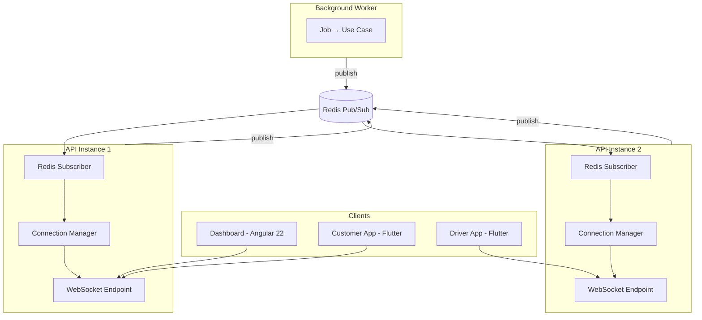

# 16 — Real-Time Architecture

## Purpose
Defines how the platform delivers live updates to the Agency Dashboard, Customer App, and Driver App: transport, cross-instance fan-out, channel model, authorization, delivery semantics, and the abstraction that keeps the transport replaceable.

## Scope
Covers server-to-client push for the confirmed Phase 1 real-time use cases. Does not cover the offline-sync mechanism of the Driver App (see `05-mobile-architecture.md` §3) — that is a different problem with a different solution, and the two must not be conflated.

> **Status.** New document, created in Phase 0 (2026-08-09). Real-time was confirmed as **Phase 1 scope**. This replaces the Azure SignalR direction in the superseded architecture set. See ADR-015 (supersedes ADR-007).

## 1. Requirement

Real-time updates are a **Phase 1 requirement**, covering five confirmed use cases:

| # | Use case | Audience | Trigger |
|---|---|---|---|
| 1 | Order status updates | Customer App, Dashboard | Order state transitions (`docs/data/08-state-machines.md`) |
| 2 | Delivery status updates | Customer App, Dashboard | Delivery lifecycle events, proof-of-delivery capture |
| 3 | Driver assignment updates | Driver App, Dashboard | Driver/vehicle/route assignment and reassignment |
| 4 | Dispatcher operational updates | Dashboard (dispatcher role) | Queue changes, failed deliveries, exceptions needing action |
| 5 | Dashboard live updates | Dashboard | KPI and operational-metric refresh |

## 2. Design Constraints

Three constraints shape everything below:

1. **The API runs as multiple stateless instances.** A client connected to instance A must receive an event raised on instance B. This was ADR-007's core constraint and it is unchanged.
2. **Tenant isolation is absolute** (BR-30). A subscriber must not be able to receive another tenant's events under any circumstance, including a malformed or malicious subscription request.
3. **Real-time is an enhancement, never the source of truth.** Every client can reconstruct correct state from the REST API. This is what makes at-most-once delivery acceptable, and it is a deliberate architectural choice rather than a limitation being tolerated.

## 3. Architecture

**FastAPI native WebSockets** for client connections; **Redis Pub/Sub** as the cross-instance backplane (ADR-015).



### 3.1 Publish path

```
Domain event raised inside an aggregate
  → Unit of Work commits the transaction
    → Domain event dispatcher runs (after commit — never before)
      → Realtime handler maps the domain event to a client-facing message
        → RealtimePublisher.publish(channel, message)
          → Redis PUBLISH
            → every API instance's subscriber receives it
              → Connection Manager fans out to matching local connections
```

**Events publish only after commit.** A client must never be told about state that a rollback then erases. This is the same ordering rule stated in `03-backend-architecture.md` §6, and it is the single most important property of this pipeline.

### 3.2 The transport abstraction

The application layer publishes through a port, never through Redis or WebSocket types directly:

```python
# application/common/ports.py — illustrative
class RealtimePublisher(Protocol):
    async def publish(self, channel: str, message: RealtimeMessage) -> None: ...
```

Domain and application code import only this protocol. The Redis implementation lives in `infrastructure/realtime/`. Swapping the transport — to SSE, to a managed service, to a broker — changes one infrastructure module and nothing else.

This is not speculative generality: ADR-015 explicitly anticipates the transport evolving, and §8 names the conditions under which it would.

## 4. Channel Model

Channels are hierarchical and **always tenant-prefixed**:

```
tenant:{tenant_id}:order:{order_id}          # one order's status
tenant:{tenant_id}:customer:{customer_id}    # a customer's own events
tenant:{tenant_id}:driver:{user_id}          # a driver's assignments
tenant:{tenant_id}:dispatch                  # dispatcher operational feed
tenant:{tenant_id}:dashboard                 # KPI / live metrics
```

The tenant prefix is **constructed server-side from the verified JWT claim**, never from client input. A client cannot name a channel; it names a *subscription intent* (e.g. "this order"), and the server builds the channel string. This makes cross-tenant subscription structurally impossible rather than merely rejected — the difference matters, because rejection logic can have bugs and string construction from a verified claim cannot.

## 5. Authorization

A WebSocket connection is authorized exactly as strictly as the equivalent REST endpoint:

1. **Connection:** the JWT is verified during the handshake. An unauthenticated or expired token is refused before upgrade.
2. **Subscription:** each subscription request is checked against the same RBAC permission (D-38) required to `GET` the corresponding resource. A customer may subscribe to their own orders; a dispatcher may subscribe to the tenant dispatch feed; a driver may subscribe to their own assignments only.
3. **Token expiry:** access tokens expire while connections persist. The connection re-validates on token refresh and is closed if the client fails to refresh, so a revoked user does not keep receiving events indefinitely on a long-lived socket.
4. **Payload minimization:** messages carry identifiers and status, not full business records. A client receiving "order X moved to Delivered" then fetches detail through the REST API, subject to normal authorization. This limits the blast radius of any subscription-authorization defect.

## 6. Delivery Semantics

**At-most-once, fire-and-forget.** Redis Pub/Sub does not persist messages; a client that is disconnected when an event is published does not receive it.

This is acceptable — and chosen deliberately — because of constraint 3 in §2:

- On connect and reconnect, clients **fetch current state from the REST API**, then apply subsequent live messages on top. The mobile apps already do this as part of their normal lifecycle.
- Message ordering within a channel is best-effort. Clients treat messages as **state notifications, not state deltas** — a message says "order X is now Delivered", not "increment X". An out-of-order or duplicated notification is therefore harmless.
- Every message carries the aggregate's `version`, so a client can discard a notification older than the state it already holds.

If a future requirement genuinely needs guaranteed delivery, that means **Redis Streams with consumer groups, or a durable broker** — a deliberate architectural change with its own ADR, not a patch to this design.

## 7. Operational Characteristics

| Concern | Approach |
|---|---|
| Connection scaling | WebSocket connections are stateful and long-lived; connection count per instance is a first-class capacity metric (`12-observability.md`) |
| Hosting requirement | The hosting platform **must** support long-lived WebSocket connections. This is the one hard constraint the deferred hosting decision must respect (ADR-022) |
| Backpressure | Per-connection send queues are bounded; a client that cannot keep up is disconnected rather than allowed to consume unbounded memory |
| Heartbeat | Ping/pong keepalive detects half-open connections that would otherwise leak |
| Reconnection | Clients reconnect with exponential backoff and jitter, then re-fetch state via REST |
| Redis failure | Live updates degrade; **core operations are unaffected**. Clients fall back to periodic REST polling. Real-time is never on the critical path for correctness |
| Correlation | The originating request's correlation ID propagates onto real-time messages, so a business transaction is traceable across its full fan-out |

## 8. When to Revisit the Transport

The abstraction exists so this decision can change. It should be revisited if any of the following becomes true:

- Guaranteed delivery becomes a requirement (→ Redis Streams or a durable broker).
- Connection volume outgrows what the application instances can hold alongside HTTP traffic (→ a dedicated real-time tier or a managed service).
- A significant portion of clients sit behind proxies that block WebSocket upgrade (→ SSE fallback behind the same port).

None of these are true today.

## 9. Best Practices

- **Never publish from domain code.** Aggregates record events; the dispatcher publishes. An aggregate that imports a publisher has lost its framework independence.
- **Never publish before commit.**
- **Never trust client-supplied channel names.**
- **Never send sensitive data in a real-time message** — identifiers and status only.
- **Never make real-time delivery a correctness dependency.** If a business rule only works when the socket is connected, the rule is in the wrong place.

## 10. Risks

- **Silent fan-out failure** — a broken subscriber loop means clients see stale UI while every REST call still succeeds, which is easy to miss in monitoring. Mitigated by alerting on publish/receive rate ratios and connection counts, not just on errors.
- **Connection leak** — abandoned connections accumulate without heartbeat enforcement, exhausting instance memory over days. Mitigated by keepalive and bounded connection lifetime.
- **Authorization drift** — a real-time channel gradually exposing more than its REST equivalent as features are added. Mitigated by deriving channel authorization from the same permission definitions as the REST endpoints, rather than restating them.
- **Redis as a shared dependency** — Redis already serves cache, sessions, rate limiting, and the job queue. Adding pub/sub concentrates more behind one component; mitigated by the graceful degradation in §7 and by monitoring Redis as a critical dependency.

## 11. Alternatives Considered

- **Server-Sent Events (SSE)** — genuinely close, and simpler: plain HTTP, automatic browser reconnection, no upgrade handshake. Rejected as the primary transport because it is unidirectional, and the Driver and Dispatcher flows benefit from a bidirectional channel. **Retained as the natural fallback** behind the same abstraction where WebSockets are blocked.
- **Client polling** — rejected on ADR-007's original grounds: higher latency, wasted API load, worse UX. Retained only as the degraded mode when Redis is unavailable.
- **Azure SignalR Service** — the superseded direction (ADR-007); not applicable to FastAPI, and would add vendor cost and lock-in for a problem Redis already solves at this scale.
- **A managed real-time service** (Azure Web PubSub, Pusher, Ably) — rejected for Phase 1 on the same grounds. Revisit if connection volume outgrows the application tier (§8).

## 12. Future Improvements

- SSE fallback transport behind the existing `RealtimePublisher` port.
- Redis Streams with consumer groups if guaranteed delivery becomes a requirement.
- Presence tracking (which dispatchers/drivers are currently online) — useful for assignment workflows, not required in Phase 1.
- Server-driven push notification for mobile clients that are backgrounded and therefore hold no socket — currently covered by the Notifications module (SMS/push), which is a separate and complementary channel.
