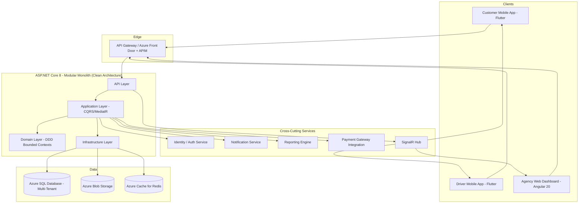
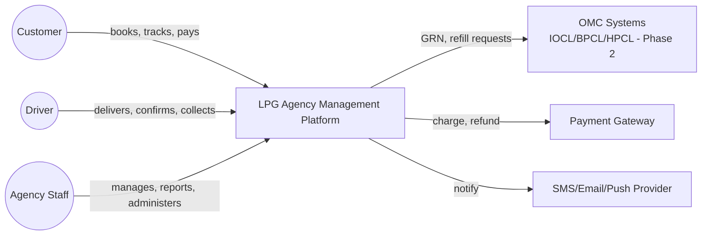
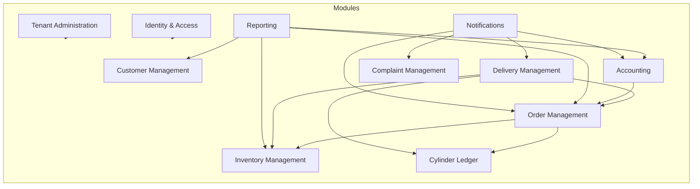
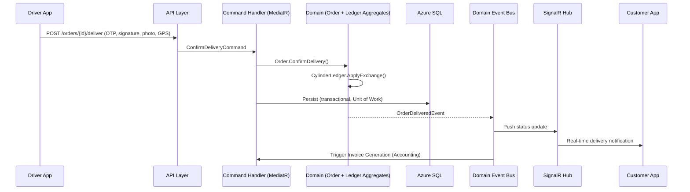
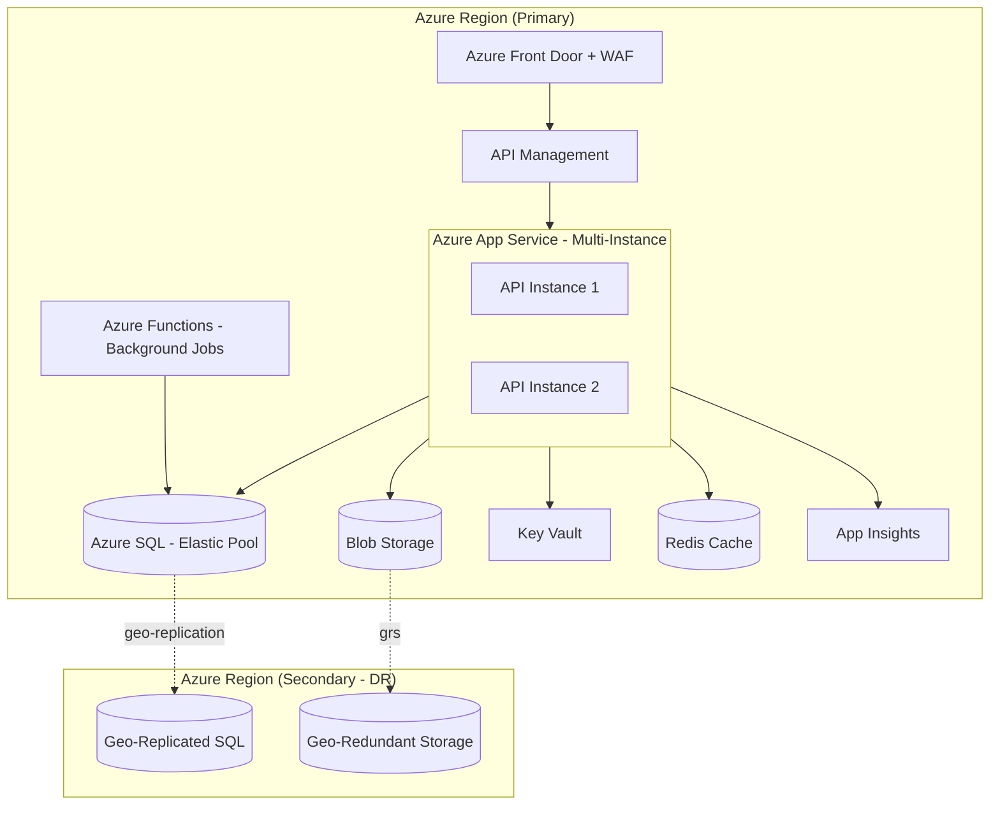

> # ⛔ SUPERSEDED — DO NOT IMPLEMENT FROM THIS DOCUMENT
>
> | | |
> |---|---|
> | **Status** | Superseded on 2026-08-09 |
> | **Replaced by** | [`docs/architecture/01-system-architecture.md`](../01-system-architecture.md) |
> | **Superseding ADR** | [ADR-012 — Python 3.13 + FastAPI Backend](../15-architecture-decision-records.md) |
> | **Original path** | `docs/architecture/01-system-architecture.md` |
>
> **Why superseded:** this document specifies an **ASP.NET Core 8 / C# / MediatR / Azure SQL / SignalR** system. The confirmed backend stack is **Python 3.13 + FastAPI + SQLAlchemy 2.x + PostgreSQL + Redis**, as stated in `AGENTS.md` (the authoritative source) and implemented throughout `docs/data/`. The .NET direction was never built.
>
> **What survives:** the system context, bounded-context component model, design principles, and the modular-monolith and multi-tenancy decisions are stack-independent and were carried forward into the replacement document. Only technology bindings changed.
>
> **Retained for:** decision traceability. See `docs/architecture/superseded/README.md`.

---

# 01 — System Architecture

## Purpose
Defines the high-level technical architecture for the LPG Agency Management Platform: how the three client applications, backend services, data stores, and Azure infrastructure fit together, and the principles governing every subsequent architecture document in this folder.

## Scope
Covers system context, major components, cross-cutting data flow, deployment topology, technology choices, and the foundational design principles and architecture decisions (ADR summaries; full ADRs in `15-architecture-decision-records.md`). Does not cover implementation code or detailed schema (see `06-database-architecture.md`).

## Source of Truth
This document — and the entire `docs/architecture/` folder — is derived from the approved SRS (`docs/business/`, `docs/modules/`, `docs/workflows/`, `docs/requirements/`, `docs/business/decisions.md`). Where a technical decision is driven by a specific SRS/decision item, it is cited inline (e.g., "per D-01").

## 1. High-Level Architecture

The platform is a **multi-tenant, cloud-native SaaS system** (per D-01) built on Clean Architecture and Domain-Driven Design, exposing a single set of versioned REST APIs consumed by three independent front-ends.

## 2. System Context Diagram

## 3. Component Diagram (Bounded-Context View)

Each box corresponds to a bounded context from `02-domain-driven-design.md`, implemented as a module within the modular monolith (see ADR-002 for the monolith-vs-microservices decision).

## 4. Data Flow (Example: Delivery Confirmation)

## 5. Deployment Overview

Full detail in `13-deployment.md`.

## 6. Technology Choices

| Layer | Technology | Rationale |
|---|---|---|
| Backend API | .NET 8, ASP.NET Core | Per SRS technology direction; strong typing, mature ecosystem, first-class Azure support |
| Architecture Pattern | Clean Architecture + DDD, CQRS via MediatR | Testability, separation of concerns, maintainability over a 10-year horizon |
| Database | Azure SQL Database (Elastic Pool) | Relational integrity critical for ledger/inventory invariants (BR-01–BR-15); elastic pool supports multi-tenant scaling |
| Web Dashboard | Angular 20, Nx Monorepo, Tailwind CSS v4 | Per SRS; Nx enables shared libraries across potential future Angular-based apps |
| Mobile Apps | Flutter | Single codebase for Customer + Driver apps across Android/iOS |
| Caching | Azure Cache for Redis | Session state, reference data caching, SignalR backplane |
| Real-Time | SignalR (Azure SignalR Service) | Order/delivery status push to all three clients |
| File Storage | Azure Blob Storage | KYC docs, delivery photos/signatures, invoices, per D-40 |
| Identity | ASP.NET Core Identity + JWT, optional Entra ID | Per D-37 |
| Background Jobs | Azure Functions / Hangfire | Reminders, reconciliation batch jobs, scheduled reports (D-28) |
| CI/CD | Azure DevOps or GitHub Actions | Per SRS; GitHub Actions assumed primary in this documentation set |
| Observability | Application Insights, Azure Monitor | Native Azure integration |

## 7. Design Principles

1. **Domain-first**: business invariants (cylinder ledger, inventory non-negativity) live in the Domain layer, never in UI or database triggers alone.
2. **Tenant isolation by default**: every query is tenant-scoped at the data-access layer, not left to individual developers to remember (see `06-database-architecture.md` §2).
3. **API as the only integration point**: all three clients call the same versioned REST API; no client talks to the database or storage directly.
4. **Configuration over code**: GST rates, cylinder caps, credit limits, cancellation policy, reminder intervals are tenant-scoped configuration (BR-31), not hardcoded or requiring redeployment.
5. **Auditability by construction**: ledger and inventory transactions are append-only; audit logging is a cross-cutting concern applied via interceptors/behaviors, not bolted on per-feature.
6. **Offline-tolerant where required**: the Driver App is offline-first (D-24); the backend must support idempotent, timestamp-ordered sync operations.
7. **Design for horizontal scale**: stateless API instances behind a load balancer; session state externalized to Redis; SignalR backed by Azure SignalR Service to scale beyond a single instance.
8. **Everything testable**: Clean Architecture layering exists specifically so Domain and Application logic can be unit-tested without a database or HTTP context.

## 8. Key Architecture Decisions (Summary — full rationale in ADR document)

| Decision | Summary | ADR |
|---|---|---|
| Modular monolith over microservices for Phase 1 | Lower operational complexity while bounded contexts are still stabilizing; enables future extraction | ADR-002 |
| Shared database, tenant-discriminator multi-tenancy | Simpler ops than DB-per-tenant, still satisfies isolation requirement (BR-30) at current scale | ADR-003 |
| CQRS via MediatR (in-process, not event-sourced) | Read/write separation without the operational cost of full event sourcing | ADR-004 |
| Azure SQL over Cosmos DB | Strong relational consistency needed for ledger/inventory invariants | ADR-005 |
| Flutter for both mobile apps | Single codebase, matches SRS direction, strong offline/local-storage ecosystem | ADR-006 |
| SignalR for real-time status | Matches "real-time order status" NFR without introducing a separate message broker for Phase 1 | ADR-007 |

## 9. Risks

- **Modular monolith discipline risk**: without enforced module boundaries (see `03-backend-architecture.md` §7), the monolith can degrade into a "big ball of mud," undermining the future extraction path. Mitigated via architecture tests (e.g., NetArchTest) enforcing dependency direction.
- **Shared-database multi-tenancy risk**: a missed tenant filter is a data-leak risk. Mitigated via global query filters + mandatory architecture-level tests (see `06-database-architecture.md`).
- **Offline-sync conflict risk**: Driver App offline-first design introduces conflict-resolution complexity (see `05-mobile-architecture.md`).

## 10. Alternatives Considered

- **Microservices from day one** — rejected for Phase 1: premature given team size and unstabilized bounded contexts; revisit once specific modules (e.g., Reporting, Notifications) show independent scaling needs.
- **Database-per-tenant** — rejected for Phase 1 due to higher operational/DevOps overhead versus the shared-database-with-discriminator approach at expected initial tenant counts; documented as a future migration path (see `06-database-architecture.md` §9).
- **Event sourcing for the Cylinder Ledger** — considered given the ledger's natural append-only structure, but rejected for Phase 1 in favor of a conventional transactional table + projection, to reduce team ramp-up cost; the door is left open since the ledger's design already resembles an event log (see `02-domain-driven-design.md`).

## 11. Future Improvements

- Extract high-traffic or independently-scaling modules (e.g., Reporting, Notifications) into separate services once real usage data justifies it.
- Evaluate database-per-tenant or tenant-sharded elastic pools once tenant count/scale exceeds current shared-pool capacity.
- Introduce a message broker (Azure Service Bus) if/when true asynchronous, durable cross-module messaging is needed beyond in-process MediatR notifications.
