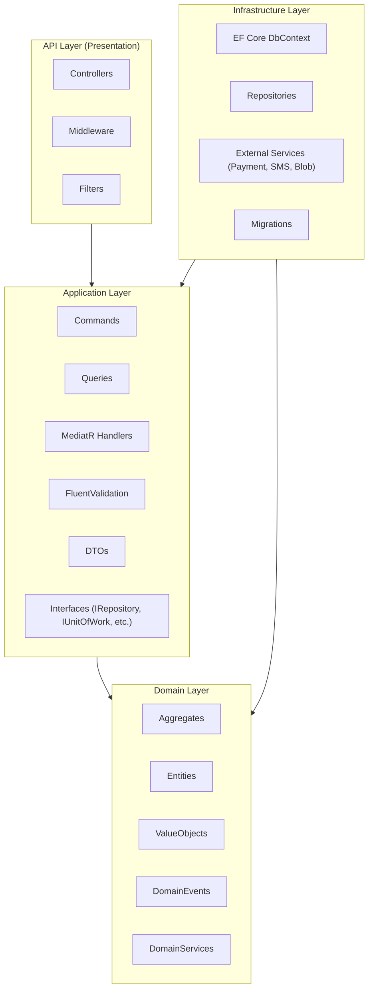
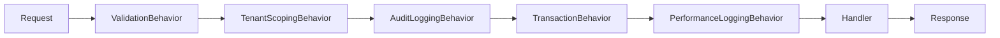

> # ⛔ SUPERSEDED — DO NOT IMPLEMENT FROM THIS DOCUMENT
>
> | | |
> |---|---|
> | **Status** | Superseded on 2026-08-09 |
> | **Replaced by** | [`docs/architecture/03-backend-architecture.md`](../03-backend-architecture.md) |
> | **Superseding ADRs** | ADR-012 (FastAPI), ADR-014 (application services replace MediatR), ADR-017 (tenant isolation), ADR-023 (background jobs), ADR-024 (boundary enforcement) — see [`15-architecture-decision-records.md`](../15-architecture-decision-records.md) |
> | **Original path** | `docs/architecture/03-backend-architecture.md` |
>
> **Why superseded:** this document specifies **ASP.NET Core layering, CQRS via MediatR `IPipelineBehavior`, EF Core `DbContext`, FluentValidation, Serilog, Hangfire, Azure Functions, and SignalR**. None of these exist in the confirmed Python/FastAPI stack.
>
> **What survives:** the Clean Architecture dependency rule, the CQRS read/write split, the repository-per-aggregate-root and Unit-of-Work patterns, and — most importantly — **the five cross-cutting behaviors** (validation, tenant scoping, audit logging, transaction, performance logging). Those five carry real business rules (BR-28, BR-30) and were re-expressed as FastAPI/SQLAlchemy mechanisms in the replacement document rather than dropped.
>
> **Retained for:** decision traceability. See `docs/architecture/superseded/README.md`.

---

# 03 — Backend Architecture

## Purpose
Defines the internal architecture of the ASP.NET Core backend: layering, CQRS/MediatR usage, repository/unit-of-work patterns, dependency injection, background jobs, real-time communication, validation, logging, error handling, API versioning, and the enforced folder structure.

## Scope
Applies to the single backend solution (modular monolith, per ADR-002). Does not cover frontend or mobile internals (see `04-frontend-architecture.md`, `05-mobile-architecture.md`).

## 1. Clean Architecture Layers



**Dependency rule**: dependencies point inward only. Domain has zero dependencies on Application, Infrastructure, or API. Application depends only on Domain (and defines interfaces that Infrastructure implements — Dependency Inversion). This is enforced with architecture tests (NetArchTest / ArchUnitNET) in CI, not just convention.

## 2. CQRS + MediatR

- **Commands** mutate state (e.g., `ConfirmDeliveryCommand`, `RecordPaymentCommand`) and return minimal results (typically an ID or a success/failure result object, not a full read model).
- **Queries** read state (e.g., `GetCustomerLedgerQuery`) and can bypass the full aggregate-loading path, reading directly from optimized read models/views for performance (`10-performance-strategy.md`).
- **Pipeline Behaviors** (MediatR `IPipelineBehavior`) implement cross-cutting concerns uniformly:
  1. `ValidationBehavior` — runs FluentValidation validators before the handler executes.
  2. `TenantScopingBehavior` — injects/validates `TenantId` on every command/query (BR-30).
  3. `AuditLoggingBehavior` — logs actor/timestamp/before-after for mutating commands (BR-28).
  4. `TransactionBehavior` — wraps command handlers in a Unit of Work transaction.
  5. `PerformanceLoggingBehavior` — logs handler duration against the SLA targets in `10-performance-strategy.md`.



Rejected alternative: full Event Sourcing / separate read-and-write databases — deferred (see ADR-004); Phase 1 uses CQRS as an in-process pattern only, same database for both sides, with read-optimized views/projections where needed.

## 3. Repository Pattern & Unit of Work

- One repository interface per **Aggregate Root only** (per DDD document §7) — e.g., `IOrderRepository`, `ICylinderLedgerRepository`, `IInventoryLocationRepository`.
- Repositories return/accept full aggregates, never partial DTOs.
- `IUnitOfWork` wraps `DbContext.SaveChangesAsync()` and is invoked once per command via `TransactionBehavior`, guaranteeing BR-29 (no partial updates) — a single command either commits all aggregate changes or none.
- Query-side (CQRS reads) bypasses repositories and queries the `DbContext`/read-models directly for performance, since queries have no invariants to protect.

## 4. Dependency Injection

- Constructor injection throughout; no service locator pattern.
- Composition root in the API layer's `Program.cs`, registering:
  - Infrastructure implementations against Application-defined interfaces.
  - MediatR handlers and pipeline behaviors (scanned by assembly).
  - FluentValidation validators (scanned by assembly).
  - Tenant resolution middleware and `ICurrentTenantService` as a scoped service.

## 5. Background Jobs

Implemented via **Azure Functions (Timer-triggered)** for scheduled work and **Hangfire** (hosted within the API's App Service, backed by the same Azure SQL) for on-demand/delayed jobs:

| Job | Trigger | Purpose |
|---|---|---|
| Refill Reminder Job | Daily timer | Evaluate consumption patterns, send reminders (D-26) |
| Scheduled Report Job | Daily/Weekly/Monthly timer | Generate and email reports (D-28) |
| SLA Breach Scanner | Every 15 min | Detect complaint SLA breaches, trigger escalation events (D-20) |
| Low Stock Alert Scanner | Hourly | Warehouse low-stock alerting (FR-IM-04) |
| Reconciliation Reminder | Daily (end of shift window) | Prompt mandatory daily vehicle reconciliation (D-31) |
| Notification Retry | Every 5 min | Retry failed notification sends |

## 6. Real-Time: SignalR

- A single `OrderTrackingHub`, backed by **Azure SignalR Service** (not in-process) to support horizontal scaling of API instances.
- Domain events (e.g., `DeliveryConfirmedEvent`) are translated to SignalR group messages, scoped per `TenantId` + `CustomerId` group to prevent cross-tenant leakage.

## 7. Folder Structure (Backend Solution)

```
/src
  /LpgPlatform.Domain
    /CylinderLedger
    /Inventory
    /Orders
    /Delivery
    /Accounting
    /Complaints
    /Customers
    /Tenants
    /Common (base classes: AggregateRoot, ValueObject, Entity, DomainEvent)
  /LpgPlatform.Application
    /CylinderLedger (Commands, Queries, Validators, DTOs)
    /Inventory
    /Orders
    /Delivery
    /Accounting
    /Complaints
    /Customers
    /Tenants
    /Common (Behaviors, Interfaces, Exceptions)
  /LpgPlatform.Infrastructure
    /Persistence (DbContext, EF Configurations, Migrations, Repositories)
    /ExternalServices (PaymentGateway, SmsProvider, BlobStorage)
    /Identity
    /BackgroundJobs
  /LpgPlatform.Api
    /Controllers (versioned: /v1/...)
    /Middleware (TenantResolution, ExceptionHandling)
    /Filters
    /Hubs (SignalR)
  /LpgPlatform.Contracts (shared DTOs/versioned API contracts, referenced by API tests and optionally by a generated client)
/tests
  /LpgPlatform.Domain.Tests
  /LpgPlatform.Application.Tests
  /LpgPlatform.Infrastructure.Tests
  /LpgPlatform.Api.IntegrationTests
  /LpgPlatform.ArchitectureTests
```

## 8. Validation

- **FluentValidation** at the Application layer, one validator per Command/Query, run automatically by `ValidationBehavior`.
- Domain-level invariants (e.g., balance never negative) are enforced *inside* aggregates regardless of validator coverage — validation is a fast-fail UX convenience, not the sole guard.

## 9. Logging

- **Serilog** structured logging, sinks to Application Insights.
- Correlation ID propagated from API Gateway through every log entry and SignalR message for cross-service traceability (see `12-observability.md`).
- Sensitive fields (KYC data, payment details) are never logged in plaintext — enforced via Serilog destructuring policies / masking.

## 10. Error Handling

- Global exception-handling middleware translates exceptions to RFC 7807 **ProblemDetails** responses (see `07-api-architecture.md` §6).
- Domain exceptions (e.g., `InsufficientLedgerBalanceException`) map to `400 Bad Request` with a business-meaningful error code; unexpected exceptions map to `500` with a generic message and full detail only in logs (never leaked to the client).

## 11. API Versioning
- URL-segment versioning (`/api/v1/...`) via `Asp.Versioning.Mvc`, detailed in `07-api-architecture.md` §3.

## 12. Best Practices
- No business logic in Controllers — controllers only translate HTTP to MediatR commands/queries and back.
- No direct `DbContext` usage outside Infrastructure.
- All async all the way (no sync-over-async blocking calls).
- Idempotency keys supported on mutating endpoints likely to be retried by the offline-first Driver App (D-24) — see `05-mobile-architecture.md` §3.

## 13. Risks
- **MediatR pipeline overuse**: too many generic behaviors can obscure control flow for new engineers — mitigated by keeping the behavior pipeline short and well-documented (§2 above is the complete, final list for Phase 1).
- **Modular monolith boundary erosion**: see `01-system-architecture.md` §9; architecture tests are the primary mitigation.

## 14. Alternatives Considered
- **MinimalAPIs instead of Controllers** — considered for lower ceremony; Controllers retained for Phase 1 due to better first-class support for versioning, filters, and OpenAPI generation at the time of this design.
- **Dapper instead of EF Core for reads** — considered for query-side performance; deferred, EF Core's compiled queries and `AsNoTracking()` are sufficient for Phase 1 targets (`10-performance-strategy.md`); Dapper remains an option for specific hot-path reporting queries if EF Core proves insufficient.

## 15. Future Improvements
- Introduce a dedicated read-model/projection store (e.g., a reporting-optimized schema or Cosmos DB) if Reporting query load grows beyond what Azure SQL read replicas comfortably serve.
- Extract Notifications and Reporting into separately deployable services once independent scaling needs are demonstrated (ties to `01-system-architecture.md` §11).
