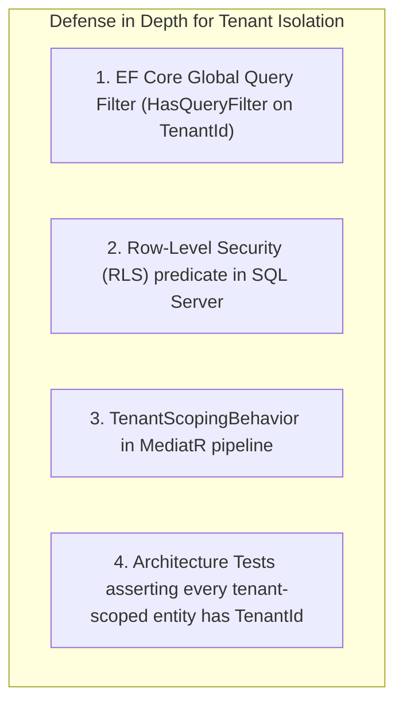
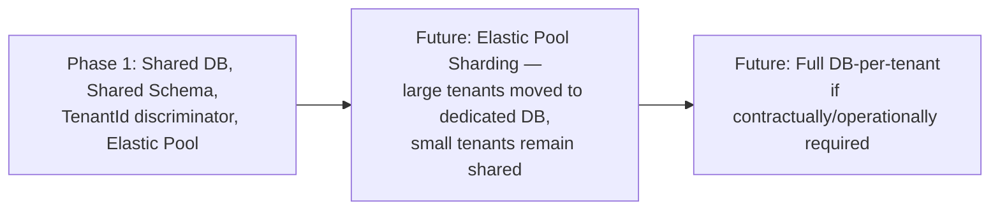

> # ⛔ SUPERSEDED — DO NOT IMPLEMENT FROM THIS DOCUMENT
>
> | | |
> |---|---|
> | **Status** | Superseded on 2026-08-09 |
> | **Replaced by** | [`docs/architecture/06-database-architecture.md`](../06-database-architecture.md) |
> | **Superseding ADRs** | ADR-013 (PostgreSQL over Azure SQL), ADR-017 (PostgreSQL RLS tenant isolation) — see [`15-architecture-decision-records.md`](../15-architecture-decision-records.md) |
> | **Original path** | `docs/architecture/06-database-architecture.md` |
>
> **Why superseded:** this document specifies **Azure SQL Database with an Elastic Pool, EF Core Global Query Filters, SQL Server Row-Level Security, `uniqueidentifier`/`datetime2` types, PascalCase naming, and EF Core Migrations**. The confirmed database is **PostgreSQL** with SQLAlchemy 2.x and Alembic. The authoritative physical schema — already PostgreSQL-native, with `uuid`/`timestamptz` types, `snake_case` naming, and PostgreSQL RLS via `SET LOCAL app.current_tenant_id` — has been in `docs/data/03-database-schema.md` all along, and this document contradicted it.
>
> **What survives:** the shared-database / shared-schema / `tenant_id`-discriminator multi-tenancy model (ADR-003 stands), defense-in-depth tenant isolation, the append-only audit and ledger strategy, soft-delete policy, the tenant-leading composite index rule, and the documented database-per-tenant scale-out path. All were carried forward with PostgreSQL mechanisms.
>
> **Retained for:** decision traceability. See `docs/architecture/superseded/README.md`.

---

# 06 — Database Architecture

## Purpose
Defines the database strategy: multi-tenancy model, schema organization, naming conventions, auditing, soft delete, indexing, partitioning, and backup strategy for Azure SQL Database.

## Scope
Applies to the primary relational store (Azure SQL). Blob Storage strategy is covered in `13-deployment.md`; caching in `10-performance-strategy.md`.

## 1. Database Strategy

**Azure SQL Database, single logical database per environment, using an Elastic Pool**, chosen over Cosmos DB specifically because the Cylinder Ledger and Inventory domains require strong relational consistency and multi-table transactional guarantees (BR-01–BR-15, BR-29) that a NoSQL store would require significant application-level compensation to achieve safely (see ADR-005).

## 2. Multi-Tenancy Strategy (per D-01, BR-30)

**Shared database, shared schema, discriminator column** (`TenantId` on every tenant-scoped table), enforced at multiple layers so a missed application-level filter is not the only line of defense:



- **EF Core Global Query Filters** automatically scope every LINQ query to the current tenant (resolved from the JWT/tenant-resolution middleware) — the primary, always-on mechanism.
- **SQL Server Row-Level Security (RLS)** as a database-level backstop, in case a raw/ad-hoc query bypasses EF Core (e.g., a reporting query or a future BI tool connection).
- `TenantId` is a `uniqueidentifier`, indexed as the leading column in every composite index on tenant-scoped tables (see §7).

**Why shared-schema over database-per-tenant (Phase 1)**: lower operational overhead (single set of migrations, backups, monitoring) at expected initial tenant counts; documented migration path to database-per-tenant (via elastic pool sharding) if a specific large tenant later requires dedicated resources or stricter contractual isolation (§9).

## 3. Schema Organization

SQL Server schemas used as a namespace mechanism mirroring bounded contexts (`02-domain-driven-design.md`):

```
dbo (shared reference data: Tenant, Branch, Warehouse, CylinderType)
customer     (Customer, CustomerAddress, KycDocument)
orders       (Order, OrderLine, OrderStatusHistory, FailedDeliveryRecord, CancellationRecord)
delivery     (Route, RouteStop, VehicleLoadEvent, VehicleShiftReconciliation, ProofOfDelivery)
inventory    (InventoryLocation, InventoryTransaction, GoodsReceiptNote, ReconciliationRecord)
ledger       (CylinderLedger, LedgerTransaction)
accounting   (Invoice, Payment, CreditNote, CashHandover)
complaints   (Complaint, ComplaintAssignment, ComplaintResolution, ComplaintFeedback)
identity     (Users, Roles, Permissions — ASP.NET Core Identity tables)
audit        (AuditLog — append-only, all schemas write here)
```

## 4. Naming Conventions

| Object | Convention | Example |
|---|---|---|
| Table | PascalCase, singular | `Order`, `CylinderLedger` |
| Column | PascalCase | `TenantId`, `CreatedAtUtc` |
| Primary Key | `Id` (uniqueidentifier) | `Order.Id` |
| Foreign Key | `<ReferencedTable>Id` | `Order.CustomerId` |
| Index | `IX_<Table>_<Columns>` | `IX_Order_TenantId_Status` |
| Unique Constraint | `UQ_<Table>_<Columns>` | `UQ_Customer_TenantId_ConsumerNumber` |
| Check Constraint | `CK_<Table>_<Rule>` | `CK_InventoryLevel_QuantityNonNegative` |
| Foreign Key Constraint | `FK_<Table>_<ReferencedTable>` | `FK_OrderLine_Order` |

All timestamps stored as `datetime2` in UTC, suffixed `...Utc` (e.g., `DeliveredAtUtc`) to avoid the timezone ambiguity flagged in `requirements/*` regarding multi-branch/region reporting.

## 5. Auditing

- `audit.AuditLog` table (append-only, no updates/deletes permitted even by admins — enforced via a database trigger rejecting UPDATE/DELETE) captures: `TenantId`, `EntityName`, `EntityId`, `Action`, `PerformedBy`, `PerformedAtUtc`, `BeforeState` (JSON), `AfterState` (JSON) — populated by the `AuditLoggingBehavior` (`03-backend-architecture.md` §2), satisfying BR-28 and D-39 (which explicitly adds login events to the audit scope, handled via ASP.NET Core Identity event hooks writing to the same table).
- Domain-critical tables (`LedgerTransaction`, `InventoryTransaction`, `Invoice`, `Payment`) are additionally **append-only at the table level** (no UPDATE permission granted to the application's SQL login on these tables; corrections are new offsetting rows, per BR-06).

## 6. Soft Delete

- Tenant-facing entities (Customer, Order, etc.) use a `IsDeleted bit` + `DeletedAtUtc` pattern with an EF Core global query filter excluding soft-deleted rows by default (composed with the tenant filter from §2).
- Per FR-CM-07, Customer records are **never** hard-deleted; other operational entities (e.g., a Draft order abandoned by a customer) may be hard-deleted if they never left the Draft state, since no downstream data references them yet — decided per-entity, defaulting to soft delete unless there's a specific, documented reason not to.

## 7. Index Strategy

- Every tenant-scoped table: composite index leading with `TenantId`, since virtually every query is tenant-scoped (§2).
- `Order`: `IX_Order_TenantId_Status_RequestedDate` (dashboard queue views), `IX_Order_TenantId_CustomerId` (customer order history).
- `LedgerTransaction`: `IX_LedgerTransaction_TenantId_CustomerId_PerformedAtUtc` (ledger history queries, `workflows/cylinder-ledger.md` §8 point-in-time reconstruction).
- `InventoryTransaction`: `IX_InventoryTransaction_TenantId_LocationType_LocationId_PerformedAtUtc`.
- Covering indexes considered for the highest-traffic dashboard list views once real query plans are available post-launch (avoiding premature over-indexing, which slows writes on high-volume tables like `LedgerTransaction`/`InventoryTransaction`).

## 8. Partitioning Strategy

- **Phase 1**: no physical table partitioning; Elastic Pool DTU/vCore headroom and the indexing strategy above are sufficient at expected initial scale (`requirements/performance.md` D-34 targets).
- **Documented future path**: table partitioning by `TenantId` (or by month, for append-only transaction tables like `LedgerTransaction`/`InventoryTransaction`/`AuditLog`) once data volume justifies it — SQL Server partitioned views or native table partitioning, revisited alongside the database-per-tenant sharding path (§9) as the two are complementary scaling levers.

## 9. Multi-Tenancy Scale-Out Path (Future)



## 10. Backup Strategy

- Azure SQL automated backups: full weekly, differential every 12 hours, transaction log every 5–10 minutes (Azure-managed defaults), enabling **Point-in-Time Restore (PITR)** within the retention window (35 days on Business Critical/General Purpose tiers, configurable).
- **Geo-redundant backups** to the paired Azure region, supporting the Disaster Recovery objective named explicitly in the SRS.
- Long-term retention (LTR) policy for statutory/GST record-keeping (weekly backups retained per the jurisdiction's required retention period — exact duration to be confirmed with finance/legal, per the residual note in `requirements/security.md` §8).

## 11. Best Practices
- All schema changes via EF Core Migrations, code-reviewed, applied through CI/CD (never manual production schema edits).
- No cross-schema foreign keys that would create circular dependencies between bounded contexts — cross-context references are by ID only (e.g., `Order.CustomerId` with no enforced FK into a different bounded context's aggregate internals beyond the root), consistent with the DDD aggregate boundary rules.

## 12. Risks
- **RLS + EF Core filter drift**: if the RLS predicate and the EF Core global query filter definitions diverge over time, subtle tenant-isolation bugs could result — mitigated by a shared, generated tenant-predicate definition and an architecture/integration test suite specifically asserting cross-tenant query isolation.
- **Append-only table growth**: `LedgerTransaction`, `InventoryTransaction`, and `AuditLog` grow unbounded — mitigated long-term by the partitioning/archival path in §8.

## 13. Alternatives Considered
- **Cosmos DB (NoSQL)** — rejected; see §1 and ADR-005.
- **Database-per-tenant from day one** — rejected for Phase 1 operational simplicity; documented as the eventual path for large/contractually-isolated tenants (§9).

## 14. Future Improvements
- Table partitioning and/or elastic pool sharding once real tenant/volume data is available (§8, §9).
- Consider a dedicated read-replica for Reporting once report query load materially competes with transactional workload.
