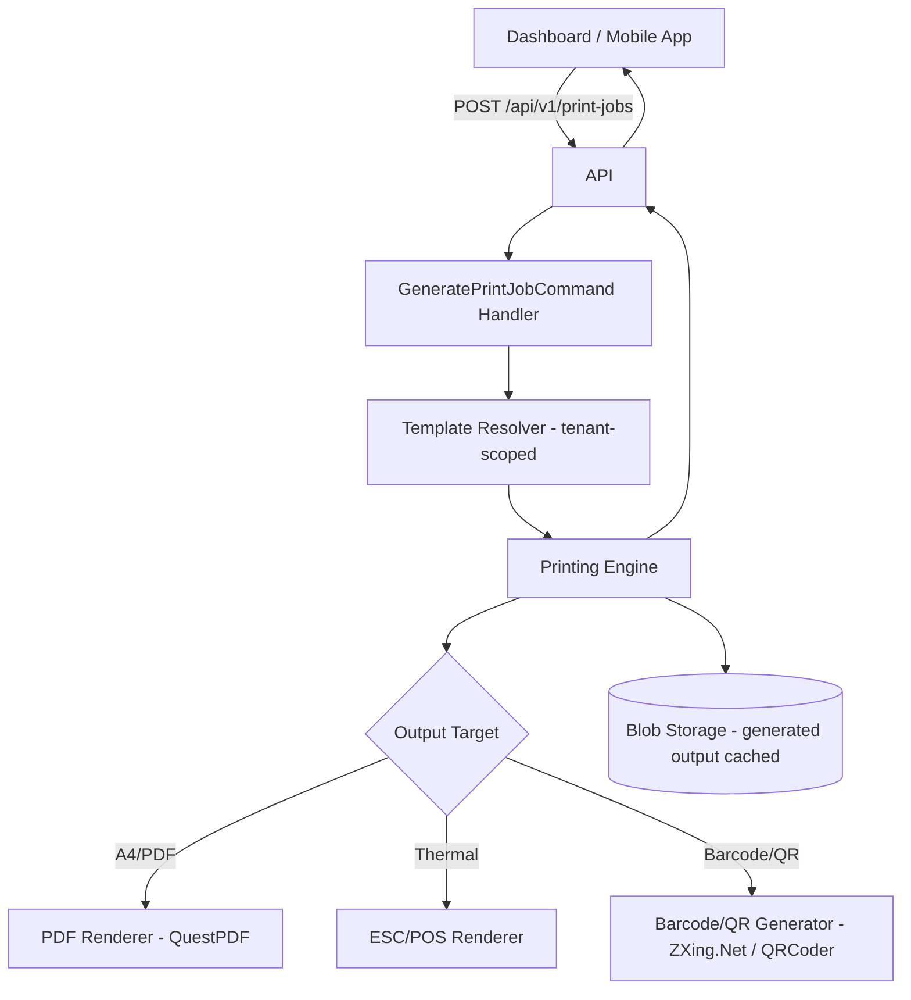
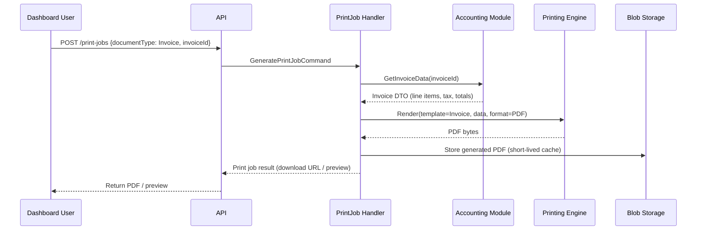

> # ⛔ SUPERSEDED — DO NOT IMPLEMENT FROM THIS DOCUMENT
>
> | | |
> |---|---|
> | **Status** | Superseded on 2026-08-09 |
> | **Replaced by** | [`docs/architecture/09-printing-architecture.md`](../09-printing-architecture.md) |
> | **Superseding ADR** | ADR-016 (Python rendering stack); note **ADR-010 itself still stands** — see [`15-architecture-decision-records.md`](../15-architecture-decision-records.md) |
> | **Original path** | `docs/architecture/09-printing-architecture.md` |
>
> **Why superseded:** the *architectural* decision in this document — one server-side, tenant-configurable, block-based template engine serving thermal, A4, and PDF — is **correct and unchanged** (ADR-010 remains Accepted). Only the .NET implementation bindings are superseded: **QuestPDF, ZXing.Net, QRCoder, and "hardcoded C#/Razor"** have no place in a Python backend.
>
> **What survives:** essentially the entire design — goals, block-based template model, `DocumentType` composition, preview via the same pipeline, ESC/POS thermal generation, caching policy, and both risks. The replacement document keeps all of it and rebinds the renderer to Python at a conceptual level.
>
> **Retained for:** decision traceability. See `docs/architecture/superseded/README.md`.

---

# 09 — Printing Architecture

## Purpose
Designs a single, reusable printing engine serving every print/receipt requirement named in the SRS: invoices, delivery receipts, payment/cash receipts, customer ledger printouts, daily/inventory/driver/GST reports, thermal and A4 output, PDF export, and barcode/QR generation.

## Scope
A shared backend capability consumed by the Dashboard (primary), and indirectly by mobile apps (which request server-rendered receipts/PDFs rather than rendering print layouts on-device).

## 1. Design Goals
- **One engine, many templates** — no per-document-type bespoke rendering code (mirrors the SRS's "receipt templates should be configurable and reusable" requirement).
- **Format-agnostic templates** — a single template definition renders to thermal (58mm/80mm, per D-41), A4, and PDF export, rather than maintaining parallel templates per output format.
- **Server-side rendering** — ensures identical output regardless of which client (Dashboard, or a print-triggered request from a mobile app) initiates the print, and keeps the templating logic in one place.

## 2. Architecture

## 3. Template Model

- Templates are **tenant-scoped configuration** (BR-31), stored as structured layout definitions (not hardcoded C#/Razor per document type), composed of reusable **blocks**: Header/Logo, Customer Details, Line Items Table, Tax Breakdown, Totals, Footer/Terms, Barcode/QR Block, Signature Block.
- A `DocumentType` enum (Invoice, DeliveryReceipt, PaymentReceipt, CashReceipt, CustomerLedger, DailySalesReport, InventoryReport, DriverReport, GstReport) maps to a default block composition per tenant, which tenant admins can customize (e.g., add their own logo/terms) without a code change or redeployment.

## 4. Print Preview
- The same template-rendering pipeline produces a **preview render** (lower-resolution PDF or HTML preview) before committing to an actual print/PDF-export job, satisfying the SRS's explicit Print Preview requirement — no separate preview-only code path.

## 5. Thermal Printing
- ESC/POS command generation for 58mm and 80mm thermal printers (D-41), targeting common receipt printer drivers via a browser-based or OS-level print bridge on the Dashboard client, and a Bluetooth/USB thermal SDK integration on the Driver App (for on-the-spot delivery/payment receipts printed in the field, if the agency uses handheld thermal printers — an operational detail confirmed with the business during rollout).

## 6. A4 / PDF Export
- **QuestPDF** (or equivalent .NET PDF library) renders the same block-based template to A4-formatted PDF, used for both direct printing and the explicit "PDF Export" requirement (downloadable invoices, reports).

## 7. Barcode & QR Generation
- **ZXing.Net / QRCoder** generate barcode and QR blocks, usable today for invoice/receipt reference codes and pre-positioned in the template model for Phase 2's cylinder-level QR/barcode tracking (D-36) — the printing engine does not need to change when that feature ships, only a new block type (`CylinderQrBlock`) is added.

## 8. Data Flow Example — Invoice Print

## 9. Best Practices
- Templates never embed business logic (tax calculation, totals) — the Printing Engine only renders data already computed by the owning module (Accounting, Reporting), keeping the engine a pure presentation concern.
- Generated PDFs are cached in Blob Storage briefly (e.g., for repeat downloads within a session) but the source of truth remains the underlying transactional data — a regenerated invoice PDF must always match the original issued amounts (immutability, per BR-06-style append-only principles applied to financial documents).

## 10. Risks
- **Thermal printer driver fragmentation**: real-world thermal printer models vary significantly in ESC/POS command support — mitigated by targeting a documented, tested subset of common printer models at launch, with a configuration escape hatch per tenant for printer-specific quirks.
- **Template customization sprawl**: allowing tenant-level template customization risks inconsistent branding/legal-compliance across tenants (e.g., a tenant removing required GST fields) — mitigated by making certain blocks (tax breakdown, GST fields) mandatory/non-removable in the template editor.

## 11. Alternatives Considered
- **Client-side rendering (e.g., browser print CSS) per document type** — rejected; would require duplicating layout logic per client (Dashboard vs. mobile) and per format (thermal vs. A4), directly contradicting the "one engine, many templates" goal.
- **Third-party document-generation SaaS** — considered; rejected to avoid an external dependency for a capability that's core to daily agency operations and needs to work reliably even during degraded connectivity to third parties.

## 12. Future Improvements
- Cylinder-level barcode/QR printing (labels affixed to physical cylinders) once Phase 2's individual cylinder tracking ships (D-36).
- WYSIWYG template editor for tenant admins, beyond the initial configuration-file-based customization.
