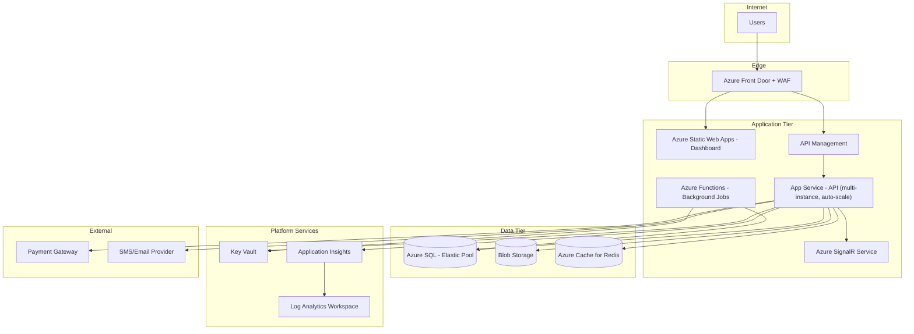

> # ⛔ SUPERSEDED — DO NOT IMPLEMENT FROM THIS DOCUMENT
>
> | | |
> |---|---|
> | **Status** | Superseded on 2026-08-09 |
> | **Replaced by** | [`docs/architecture/13-deployment.md`](../13-deployment.md) |
> | **Superseding ADR** | [ADR-022 — Azure Target Cloud, Hosting Topology Deferred](../15-architecture-decision-records.md) |
> | **Original path** | `docs/architecture/13-deployment.md` |
>
> **Why superseded:** two reasons. First, the topology is downstream of the .NET decision — **Azure App Service (Premium v3), Azure Functions, Azure SignalR Service, Azure SQL Elastic Pool, EF Core migration steps, and slot-swap deployment** all assume a .NET runtime and SQL Server. Second, and deliberately: the exact Azure hosting topology (Container Apps vs App Service vs other container hosting) and the IaC tool (**Bicep vs Terraform**) are **explicitly not being locked at this stage** — they are to be decided in a dedicated deployment architecture decision before production deployment.
>
> **What survives:** the four-environment model (Dev/QA/Staging/Production), the CI/CD gate sequence, manual-gated production promotion, expand/contract migration discipline, per-category blob container isolation with short-lived signed URLs, managed-identity secret access, and phased mobile app-store rollout. All carried forward as *direction* rather than committed topology.
>
> **Retained for:** decision traceability. See `docs/architecture/superseded/README.md`.

---

# 13 — Deployment

## Purpose
Defines the Azure infrastructure topology, CI/CD pipeline, environment strategy, and infrastructure-as-code approach.

## Scope
Covers backend API, Dashboard static hosting, mobile app distribution pipelines, and supporting Azure services.

## 1. Azure Architecture

## 2. Environments

| Environment | Purpose | Notes |
|---|---|---|
| Dev | Active development integration | Shared, reset-tolerant data |
| QA/Test | Manual + automated QA, UAT | Stable, seeded test-tenant data |
| Staging | Pre-production, production-like config | Used for load testing (`10-performance-strategy.md` §9), final sign-off |
| Production | Live tenants | Geo-redundant, full monitoring/alerting active |

Each environment is a fully separate Azure resource group, provisioned identically via Infrastructure as Code (§4), differing only in scale (SKU tiers) and secret values.

## 3. CI/CD Pipeline (GitHub Actions)

```mermaid
flowchart LR
    PR[Pull Request] --> Build[Build + Unit Tests]
    Build --> ArchTest[Architecture Tests]
    ArchTest --> Lint[Lint + Static Analysis]
    Lint --> SecScan[Dependency/Security Scan]
    SecScan --> IntTest[Integration Tests]
    IntTest --> A11y[Accessibility Scan - axe-core]
    A11y --> Approve[PR Approval]
    Approve --> MergeMain[Merge to main]
    MergeMain --> DeployDev[Auto-Deploy: Dev]
    DeployDev --> DeployQA[Manual Gate: Deploy QA]
    DeployQA --> DeployStaging[Manual Gate: Deploy Staging]
    DeployStaging --> LoadTest[Load Test Gate]
    LoadTest --> DeployProd[Manual Gate: Deploy Production]
```

- Every PR must pass: unit tests, architecture tests (`03-backend-architecture.md` §1, `06-database-architecture.md` §12), lint/static analysis, dependency vulnerability scan, integration tests, and an accessibility scan (`11-accessibility-strategy.md` §9) before merge.
- Production deployment is a manual-gated promotion from Staging, never a direct push — requiring both a passing Staging load test and human approval.
- Database migrations run as a distinct pipeline step (EF Core Migrations) before the new API version is switched into traffic, with a documented rollback migration for every forward migration.

## 4. Infrastructure as Code
- **Bicep** (Azure-native IaC) defines every resource in §1 per environment, version-controlled alongside application code, ensuring Dev/QA/Staging/Production topological parity (differing only in scale parameters) and eliminating manual "ClickOps" configuration drift (directly mitigating the Security Misconfiguration risk noted in `08-security-architecture.md` §5).

## 5. Deployment Strategy
- **Blue-Green / Slot-based deployment** on Azure App Service: new version deployed to a staging slot, health-checked (`12-observability.md` §5) and smoke-tested, then swapped into production traffic — near-zero-downtime releases with an instant rollback path (swap back) if issues surface immediately post-release.
- Mobile app releases (Customer App, Driver App) follow standard app-store phased rollout (percentage-based rollout on Google Play/App Store) to limit blast radius of a bad mobile release, independent of the backend's own release cadence — API versioning (`07-api-architecture.md` §3) ensures older mobile app versions in the field continue functioning during the rollout window.

## 6. Azure App Service
- Linux-based App Service Plan, Premium v3 tier (supports auto-scale, VNet integration, slots).
- Auto-scale rules based on CPU and HTTP queue length, targeting the 500+ concurrent users/tenant SLA (`10-performance-strategy.md` §8).

## 7. Azure SQL
- Elastic Pool (per `06-database-architecture.md` §1), Business Critical or General Purpose tier depending on environment, with geo-replication to the paired region for DR (`06-database-architecture.md` §10).

## 8. Blob Storage
- Separate containers per data category (`kyc-documents`, `delivery-proofs`, `invoices`, `print-cache`) with container-level access policies — KYC/delivery-proof containers are private, accessed only via short-lived SAS tokens issued by the API, never directly public.
- Geo-Redundant Storage (GRS) for DR.

## 9. Key Vault
- One Key Vault per environment; App Service and Functions access via Managed Identity (`08-security-architecture.md` §7) — no secrets in source control or pipeline variables.

## 10. Application Insights
- One Application Insights resource per environment, feeding the shared Log Analytics Workspace strategy in `12-observability.md`.

## 11. Redis Cache
- Azure Cache for Redis (Standard/Premium tier per environment), serving both the distributed cache (`10-performance-strategy.md` §2) and the SignalR backplane role (shared or dedicated instance, decided per environment scale).

## 12. Best Practices
- No environment-specific code branches — configuration (connection strings, feature flags) is entirely externalized via Key Vault + App Configuration, with the same build artifact promoted unchanged from Dev through Production.
- Database migrations are backward-compatible for at least one release (the API can run against both the pre- and post-migration schema briefly during a slot-swap window) to support zero-downtime deploys.

## 13. Risks
- **Migration/deploy ordering**: a migration that isn't backward-compatible could break the old-version instance still serving traffic during a slot swap — mitigated by the "expand/contract" migration pattern (add new columns/tables first, deploy code that uses them, remove old columns/tables in a later release).
- **Geo-replication lag**: DR failover could lose a small window of the most recent transactions — mitigated by documenting an acceptable RPO with the business and monitoring replication lag as a first-class metric (`12-observability.md`).

## 14. Alternatives Considered
- **AKS (Kubernetes)** — considered for its flexibility; rejected for Phase 1 given the modular-monolith architecture doesn't yet need per-service independent scaling/deployment, and App Service's lower operational overhead better fits current team size (consistent with the monolith-first decision in `01-system-architecture.md` ADR-002).
- **Azure DevOps Pipelines instead of GitHub Actions** — both viable per the SRS's "Azure DevOps or GitHub Actions" language; GitHub Actions assumed here for tighter integration with GitHub-hosted source control, documented as a swappable choice.

## 15. Future Improvements
- Migrate to AKS if/when specific bounded contexts are extracted into independently deployed services (`01-system-architecture.md` §11).
- Introduce canary releases (percentage-based traffic shifting) as a refinement over the current all-or-nothing slot swap, once traffic volume justifies the added pipeline complexity.
