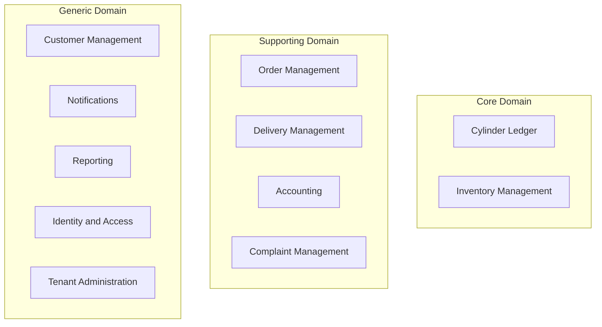
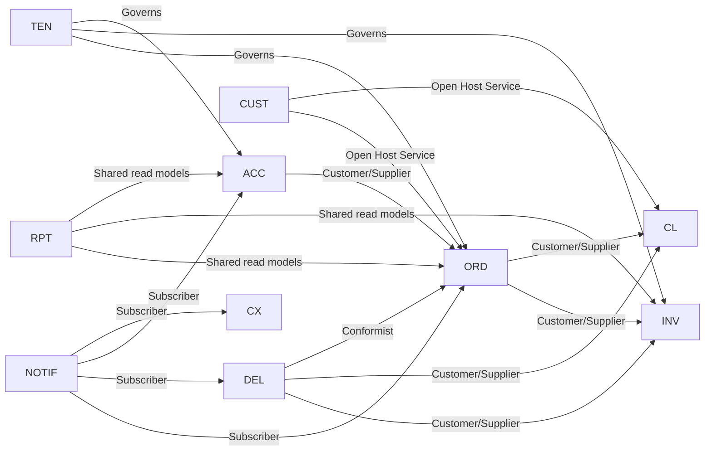
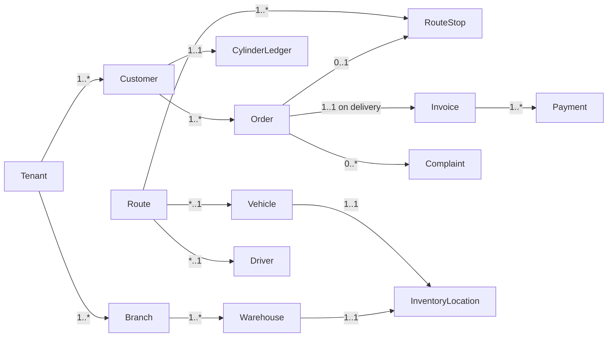

# 01 — Domain Model

## Purpose
Defines the complete business domain: bounded contexts, aggregates, entities, value objects, domain services, domain events, aggregate boundaries/lifecycles, relationships, and business ownership — the foundation for `03-database-schema.md` and `11-api-contracts.md`.

## Scope
Implementation-independent domain design, expressed for eventual realization in Python (SQLAlchemy 2.x aggregates, Pydantic v2 DTOs) per the confirmed stack, but containing no code.

## Design Decisions
- **DDD tactical patterns map to Python idioms, not code here**: aggregates will be plain Python domain classes (not SQLAlchemy ORM models directly — see `03-database-schema.md` §Design Decisions for the persistence-model/domain-model separation this implies) so business logic stays framework-independent, testable without a database, consistent with Clean Architecture.
- **Business Ownership**: each bounded context has one accountable business owner role (below), used to resolve ambiguity about who approves a schema/contract change in that context.

## 1. Business Domains & Ownership

| Domain Classification | Bounded Contexts | Business Owner |
|---|---|---|
| **Core Domain** | Cylinder Ledger, Inventory Management | Warehouse/Operations Lead |
| **Supporting Domain** | Order Management, Delivery Management, Accounting, Complaint Management | Operations Manager / Finance Lead / Customer Service Lead |
| **Generic Domain** | Customer Management, Notifications, Reporting, Identity & Access, Tenant Administration, Platform Administration | Product Owner |

Cylinder Ledger and Inventory are Core because they're explicitly named "the most important module" in the SRS and are the platform's differentiator versus manual/paper-based agencies.

## 2. Bounded Context Map

## 3. Aggregate Catalog

| # | Aggregate Root | Bounded Context | Business Owner |
|---|---|---|---|
| 1 | Tenant | Tenant Administration | Product Owner |
| 2 | Customer | Customer Management | Product Owner |
| 3 | Order | Order Management | Operations Manager |
| 4 | Route | Delivery Management | Operations Manager |
| 5 | CylinderLedger | Cylinder Ledger (Core) | Warehouse/Operations Lead |
| 6 | InventoryLocation | Inventory Management (Core) | Warehouse/Operations Lead |
| 7 | Invoice | Accounting | Finance Lead |
| 8 | Complaint | Complaint Management | Customer Service Lead |
| 9 | Driver | Delivery Management | Operations Manager |
| 10 | Vehicle | Delivery Management | Operations Manager |
| 11 | IdentityUser | Identity and Access | Product Owner |
| 12 | Branch | Tenant Administration | Product Owner |
| 13 | Warehouse | Tenant Administration | Product Owner |
| 14 | TenantConfiguration | Tenant Administration | Product Owner |
| 15 | CylinderType | Tenant Administration | Product Owner |
| 16 | PriceListEntry | Tenant Administration | Product Owner |
| 17 | FeatureFlag | Platform Administration (new, Phase 7) | Product Owner |
| 18 | FeatureFlagOverride | Tenant Administration | Product Owner |

## 4. Aggregates, Entities, Value Objects, Lifecycles

### 4.1 Tenant
- **Value Objects:** TenantStatus, SubscriptionPlan
- **Lifecycle:** `Trial → Active → Suspended → Closed` (also `Active → Closed`, `Suspended → Active`). Never hard-deleted.
- **Divergence from the original design (Phase 7 implementation note):** Branch, Warehouse, and TenantConfiguration were originally modeled as entities nested inside the Tenant aggregate. Implementation made each its own aggregate root instead — own repository, own CRUD use cases, referencing `Tenant` by ID only. Loading the whole Tenant graph to edit a single branch was impractical, and every other "master data" table in the codebase (Identity's Role/Permission, Tenant itself) already follows one-aggregate-root-per-table. See §4.12–§4.14 below for their (now-independent) specs. The relationships in §7's diagram are unchanged (Tenant →1..* Branch, Branch →1..* Warehouse) — only the aggregate-boundary drawn around them changed, from "inside Tenant" to "sibling roots referencing Tenant by ID."

### 4.1a Branch
- **Value Objects:** none beyond plain fields (name, region — optional, free text)
- **Lifecycle:** created → renamed (in place). Never hard-deleted (referenced by Warehouse, IdentityUser, and future Inventory/Order data).
- References `Tenant` by ID only.

### 4.1b Warehouse
- **Value Objects:** none beyond plain fields (name, address_line)
- **Lifecycle:** created → renamed (in place). Never hard-deleted.
- References `Tenant` and `Branch` by ID only.

### 4.1c TenantConfiguration
- **Value Objects:** none — `config_key` is a string constrained to a recognized-key catalog (`gst_rate_percent`, `cancellation_fee_amount`, `credit_limit_default` as of Phase 7; jsonb `config_value` allows later phases to add new keys without a schema change), `config_value` is jsonb.
- **Lifecycle:** append-only/historized — "changing" a value means inserting a new row with a later `effective_from`; there is no update or delete. `TenantConfigurationResolver` (§5) picks the value in effect at a given point in time.
- References `Tenant` by ID only.

### 4.1d CylinderType
- **Value Objects:** none beyond plain fields (name unique per tenant, weight_kg numeric > 0, is_active)
- **Lifecycle:** created → renamed / weight adjusted (in place) → activated/deactivated. Never hard-deleted (Inventory and Order Management, Phases 9–10, will foreign-key against it).
- References `Tenant` by ID only.

### 4.1e PriceListEntry
- **Value Objects:** CustomerType (domestic/commercial/industrial/government)
- **Lifecycle:** append-only/historized, same pattern as TenantConfiguration — "setting a price" inserts a new row with a later `effective_from`. `branch_id` is nullable: null means a tenant-wide default, non-null overrides it for that branch. `EffectivePriceResolver` (§5) picks the effective price for a (cylinder type, customer type, branch, point in time) combination — a branch-specific override wins over the tenant-wide default when both exist.
- References `Tenant`, `CylinderType`, and (optionally) `Branch` by ID only.

### 4.2 Customer
- **Entities:** CustomerAddress, KycDocument
- **Value Objects:** ConsumerNumber, CustomerType, KycStatus
- **Lifecycle:** `Draft → KycPending → KycVerified → Active → Inactive/Suspended → Closed`.

### 4.3 Order
- **Entities:** OrderLine, OrderStatusHistory, FailedDeliveryRecord, CancellationRecord
- **Value Objects:** OrderStatus, BookingSource, DeliveryAddress (snapshot)
- **Lifecycle:** 10-state machine, `08-state-machines.md` §2. "Booking" is the business term for an Order prior to `Confirmed` — no separate Booking entity.

### 4.4 Route
- **Entities:** RouteStop, VehicleLoadEvent, VehicleShiftReconciliation
- **Value Objects:** ProofOfDelivery, RouteStatus
- **Lifecycle:** `Planned → Loaded → InProgress → Completed → Reconciled`.

### 4.5 CylinderLedger (Core)
- **Entities:** LedgerTransaction (append-only, immutable)
- **Value Objects:** CylinderBalance, LedgerTransactionType
- **Lifecycle:** created at Customer activation, grows monotonically, settles at connection closure.

### 4.6 InventoryLocation (Core)
- **Entities:** InventoryTransaction, GoodsReceiptNote, ReconciliationRecord
- **Value Objects:** CylinderStatus (7-state), Quantity
- **Lifecycle:** one per Warehouse/Vehicle; Vehicle-level may carry stock across days until reconciled.

### 4.7 Invoice
- **Entities:** Payment, CreditNote, CashHandover
- **Value Objects:** Money, TaxBreakdown
- **Lifecycle:** `Draft → Issued → PartiallyPaid → Paid → Closed`, branch to `Refunded`.

### 4.8 Complaint
- **Entities:** ComplaintAssignment, ComplaintResolution, ComplaintFeedback
- **Value Objects:** SlaTarget, ComplaintCategory, ComplaintPriority
- **Lifecycle:** `Open → Assigned → InProgress → Resolved/Escalated → Closed`.

### 4.9 Driver
- **Value Objects:** DriverStatus, LicenseInfo
- **Lifecycle:** `Onboarded → Active → OnLeave → Inactive`.

### 4.10 Vehicle
- **Value Objects:** VehicleStatus, OwnershipType, CapacityUnits
- **Lifecycle:** `Registered → Active → Maintenance → Retired`.

### 4.11 IdentityUser
- **Value Objects:** Role, Permission (referenced, not owned)
- **Lifecycle:** `Invited → Active → Locked/Disabled`.
- **Phase 7 addition:** `change_role(new_role)` — validated against the 8 confirmed role codes (`identity.role` stays platform-managed/read-only, per Phase 7's Scope Boundaries; this only reassigns which of the 8 existing roles a staff `IdentityUser` holds), records `IdentityUserRoleChanged`.

### 4.12 FeatureFlag (Platform Administration bounded context — new in Phase 7)
- **Entities:** none
- **Value Objects:** RolloutPercentage (0–100), Schedule (`starts_at`/`ends_at`, both optional)
- **Lifecycle:** created → edited (description/default/rollout/schedule, in place) — platform-wide, not tenant-owned. Lives in a new `platform` schema with no RLS (the same non-RLS-reference-data precedent `identity.role`/`identity.permission` already set), since a flag genuinely spans tenants. Write access is enforced at the application layer (`feature_flags:manage_platform`, live-checked, `super_admin` only) rather than by database grants, because the application always connects to Postgres as a single role.

### 4.13 FeatureFlagOverride (Tenant Administration)
- **Value Objects:** none beyond plain fields (flag_key FK, is_enabled)
- **Lifecycle:** created → toggled (in place). Standard tenant-scoped RLS. An explicit override always wins over the platform default/rollout for that tenant — see `FeatureFlagService` below.
- References `Tenant` (implicitly, via RLS) and `FeatureFlag` by key.

## 5. Domain Services

| Service | Purpose | Spans |
|---|---|---|
| CreditLimitEvaluator | Evaluate outstanding balance + credit limit before booking | Customer + Accounting |
| CylinderCapPolicy | Evaluate ledger balance vs. configured cap | Order + Cylinder Ledger |
| VehicleCapacityChecker | Validate route assignment against vehicle/inventory | Delivery + Inventory |
| ReconciliationService | Compute expected vs. actual stock/cash variance | Delivery + Inventory + Accounting |
| SlaCalculator | Compute Complaint SLA deadline from category/priority config | Complaint |
| TenantConfigurationResolver | Resolve effective tenant-scoped config value at a point in time | Tenant Administration (used broadly) |
| EffectivePriceResolver | Resolve the effective price for a (cylinder type, customer type, branch, point in time) combination — branch-specific override wins over tenant-wide default | Tenant Administration (feeds Order Management, Phase 10) |
| FeatureFlagService | `is_enabled(flag_key, tenant_id) -> bool`: schedule check → tenant override (short-circuits) → platform default → rollout-percentage (consistent hash of tenant_id) | Platform Administration + Tenant Administration |

Each will be realized as a plain Python service/function (not tied to FastAPI or SQLAlchemy) invoked from Application-layer use cases — kept here as a design concept, not code.

## 6. Domain Events (Summary — full catalog `09-domain-events.md`)
Cross-aggregate coordination happens exclusively via domain events, published within the same request/unit-of-work as the triggering use case (async-safe, since the backend is fully async FastAPI/SQLAlchemy 2.x). No aggregate directly mutates another aggregate's state.

## 7. Aggregate Boundaries (By ID Reference Only)

## 8. Design Notes — Aggregate Boundary Rationale
- Driver and Vehicle are independent aggregate roots (not subordinate to Route) since they have lifecycles (onboarding, maintenance, leave) independent of any specific route.
- `InventoryLocation` is scoped to Warehouse/Vehicle only; Customer-level cylinder holding is owned exclusively by `CylinderLedger`, preventing a dual source of truth.
- Cross-aggregate references are by ID only — this is what keeps aggregates independently testable and lets any bounded context's persistence later move behind a different repository implementation (e.g., a read-replica, a cache-backed repository) without touching Domain code.

## Risks
- Aggregate boundary drift if developers reach across boundaries directly instead of via events/services — mitigated by dependency-direction tests (`03-database-schema.md` design decisions) and code review checklists referencing this document.
- CylinderLedger's ever-growing transaction history needs partitioning attention (`19-data-migration.md`).

## Alternatives Considered
- A single "Inventory" aggregate spanning Warehouse/Vehicle/Customer — rejected to avoid duplicating ledger-owned state.
- Merging Order and Route — rejected; independent consistency boundaries and cardinalities (many Orders can exist and be cancelled before ever touching a Route).

## Best Practices
- Aggregates expose only intention-revealing methods (e.g., `order.confirm_delivery(pod)`), never raw attribute mutation, so invariants are enforced in one place.
- Value Objects are immutable and compared by value (dataclasses with `frozen=True` at implementation time — noted here as a design constraint, not code).

## Future Scalability
- ID-only cross-aggregate references allow any bounded context to be extracted into a separately deployed FastAPI service later without a domain-model rewrite, consistent with a modular-monolith-first approach.
