# 02 — Entity Relationship Diagrams

## Purpose
Complete Mermaid ER diagrams for the PostgreSQL schema: every table and relationship, with explicit 1:1/1:N/M:N classification, lookup tables, junction tables, and tenant isolation strategy shown structurally.

## Scope
Structural diagrams; column-level detail in `03-database-schema.md`.

## Design Decisions
- PostgreSQL **schemas** (not just naming prefixes) are used to namespace each bounded context (`tenant`, `customer`, `orders`, `delivery`, `inventory`, `ledger`, `accounting`, `complaints`, `identity`, `audit`), mirroring the bounded contexts in `01-domain-model.md` and enabling per-schema permission grants (e.g., `DENY` equivalents via `REVOKE` on `ledger.ledger_transaction`).
- Every tenant-scoped table carries `tenant_id` and is protected by **PostgreSQL Row-Level Security (RLS) policies**, not just an application-layer filter — the diagrams below annotate tenant isolation at the schema level.

## 1. Relationship Cardinality Index

| Relationship | Cardinality |
|---|---|
| tenant → branch | 1:N |
| branch → warehouse | 1:N |
| tenant → tenant_configuration | 1:N |
| tenant → cylinder_type | 1:N |
| customer → customer_address | 1:N |
| customer → kyc_document | 1:N |
| customer → cylinder_ledger | 1:1 |
| customer → order | 1:N |
| customer → complaint | 1:N |
| order → order_line | 1:N |
| order → order_status_history | 1:N |
| order → failed_delivery_record | 1:0..1 |
| order → cancellation_record | 1:0..1 |
| order → invoice | 1:0..1 |
| order ↔ route_stop | 1:0..1 |
| route → route_stop | 1:N |
| route → vehicle_load_event | 1:N |
| route → vehicle_shift_reconciliation | 1:0..1 |
| route → driver | N:1 |
| route → vehicle | N:1 |
| route_stop → proof_of_delivery | 1:0..1 |
| warehouse → inventory_location | 1:1 |
| vehicle → inventory_location | 1:1 |
| inventory_location → inventory_transaction | 1:N |
| inventory_location → inventory_balance | 1:N |
| inventory_location → goods_receipt_note | 1:N |
| inventory_location → reconciliation_record | 1:N |
| cylinder_ledger → ledger_transaction | 1:N |
| cylinder_ledger → ledger_balance | 1:N |
| invoice → payment | 1:N |
| invoice → credit_note | 1:N |
| complaint → complaint_assignment | 1:0..1 |
| complaint → complaint_resolution | 1:0..1 |
| complaint → complaint_feedback | 1:0..1 |
| identity_user ↔ role | **M:N** via user_role (junction) |
| role ↔ permission | **M:N** via role_permission (junction) |
| identity_user → branch | N:1 |
| driver → identity_user | 1:1 |
| audit_log → tenant | N:1 (logical, not FK-enforced) |

**Lookup (pure reference) tables:** `cylinder_type`, `role`, `permission`, `complaint_category` *(tenant-scoped)*, `tax_type` *(tenant-scoped)*, `country`, `currency`, `language`, `theme` — no business transaction directly owns rows here; they're referenced by FK from transactional tables. Full catalog: `05-reference-data.md`.

**Junction tables:** `user_role`, `role_permission` — the only true M:N relationships in the schema, both composite-PK, no surrogate key needed.

## 2. Consolidated Cross-Context ER Diagram

```mermaid
erDiagram
    TENANT ||--o{ BRANCH : "1-N"
    TENANT ||--o{ TENANT_CONFIGURATION : "1-N"
    TENANT ||--o{ CYLINDER_TYPE : "1-N"
    BRANCH ||--o{ WAREHOUSE : "1-N"
    BRANCH ||--o{ CUSTOMER : "1-N"
    BRANCH ||--o{ DRIVER : "1-N"
    BRANCH ||--o{ VEHICLE : "1-N"

    CUSTOMER ||--o{ CUSTOMER_ADDRESS : "1-N"
    CUSTOMER ||--o{ KYC_DOCUMENT : "1-N"
    CUSTOMER ||--|| CYLINDER_LEDGER : "1-1"
    CUSTOMER ||--o{ ORDER : "1-N"
    CUSTOMER ||--o{ COMPLAINT : "1-N"

    CYLINDER_LEDGER ||--o{ LEDGER_TRANSACTION : "1-N"
    CYLINDER_LEDGER ||--o{ LEDGER_BALANCE : "1-N"

    ORDER ||--o{ ORDER_LINE : "1-N"
    ORDER ||--o{ ORDER_STATUS_HISTORY : "1-N"
    ORDER |o--o| FAILED_DELIVERY_RECORD : "1-0..1"
    ORDER |o--o| CANCELLATION_RECORD : "1-0..1"
    ORDER |o--o| ROUTE_STOP : "1-0..1"
    ORDER |o--o| INVOICE : "1-0..1"
    ORDER ||--o{ COMPLAINT : "1-N reference"

    ROUTE ||--o{ ROUTE_STOP : "1-N"
    ROUTE ||--o{ VEHICLE_LOAD_EVENT : "1-N"
    ROUTE |o--o| VEHICLE_SHIFT_RECONCILIATION : "1-0..1"
    ROUTE }o--|| DRIVER : "N-1"
    ROUTE }o--|| VEHICLE : "N-1"
    ROUTE_STOP |o--o| PROOF_OF_DELIVERY : "1-0..1"

    WAREHOUSE ||--|| INVENTORY_LOCATION : "1-1"
    VEHICLE ||--|| INVENTORY_LOCATION : "1-1"
    INVENTORY_LOCATION ||--o{ INVENTORY_TRANSACTION : "1-N"
    INVENTORY_LOCATION ||--o{ INVENTORY_BALANCE : "1-N"
    INVENTORY_LOCATION ||--o{ GOODS_RECEIPT_NOTE : "1-N"
    INVENTORY_LOCATION ||--o{ RECONCILIATION_RECORD : "1-N"

    INVOICE ||--o{ PAYMENT : "1-N"
    INVOICE ||--o{ CREDIT_NOTE : "1-N"

    COMPLAINT |o--o| COMPLAINT_ASSIGNMENT : "1-0..1"
    COMPLAINT |o--o| COMPLAINT_RESOLUTION : "1-0..1"
    COMPLAINT |o--o| COMPLAINT_FEEDBACK : "1-0..1"

    IDENTITY_USER }o--o{ ROLE : "M-N via user_role"
    ROLE }o--o{ PERMISSION : "M-N via role_permission"
    IDENTITY_USER }o--|| BRANCH : "N-1"
    DRIVER ||--|| IDENTITY_USER : "1-1"
```

## 3. Tenant Isolation Diagram (Structural View)

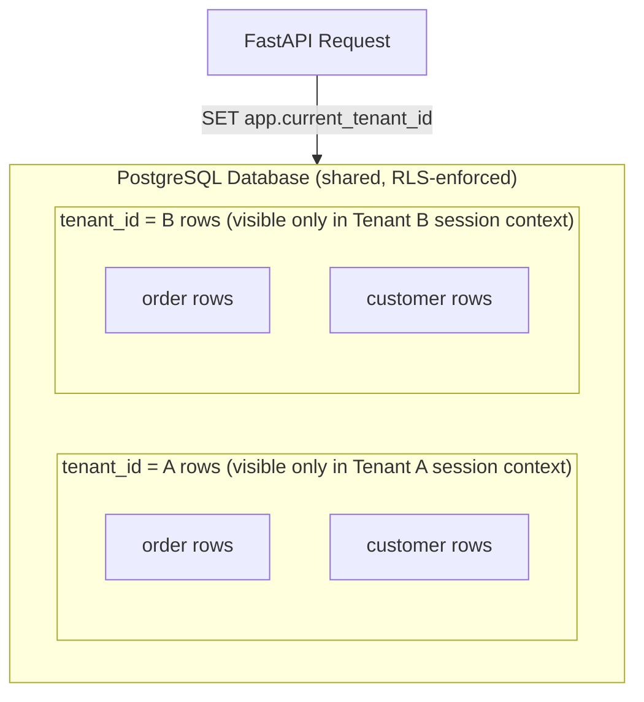

Every RLS-protected table has a policy of the form `USING (tenant_id = current_setting('app.current_tenant_id')::uuid)`, set once per request via a SQLAlchemy session-scoped `SET LOCAL` — detailed in `03-database-schema.md` §Design Decisions.

## 4. Per-Schema Diagrams

### 4.1 `tenant` schema
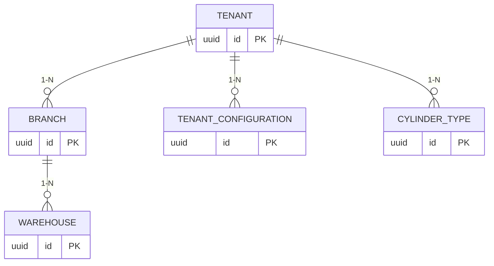

### 4.2 `customer` schema
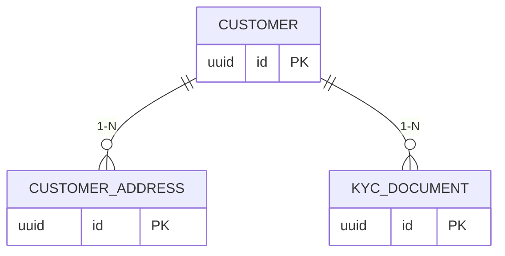

### 4.3 `orders` schema
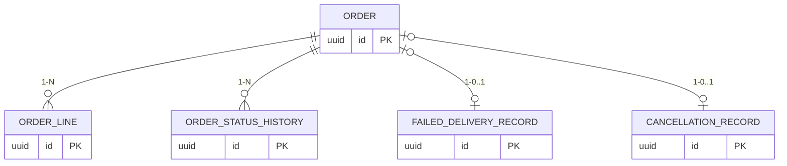

### 4.4 `delivery` schema
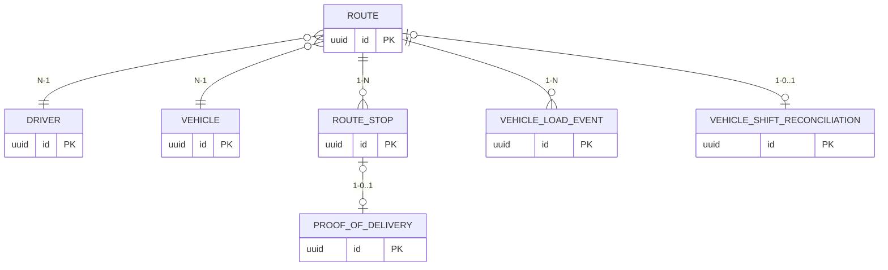

### 4.5 `inventory` schema
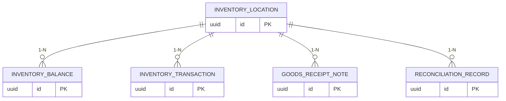

### 4.6 `ledger` schema
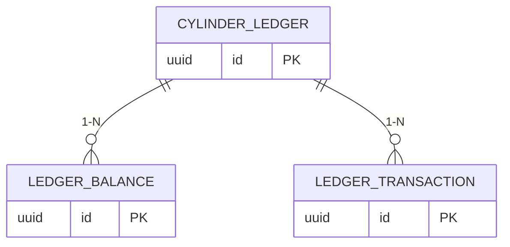

### 4.7 `accounting` schema
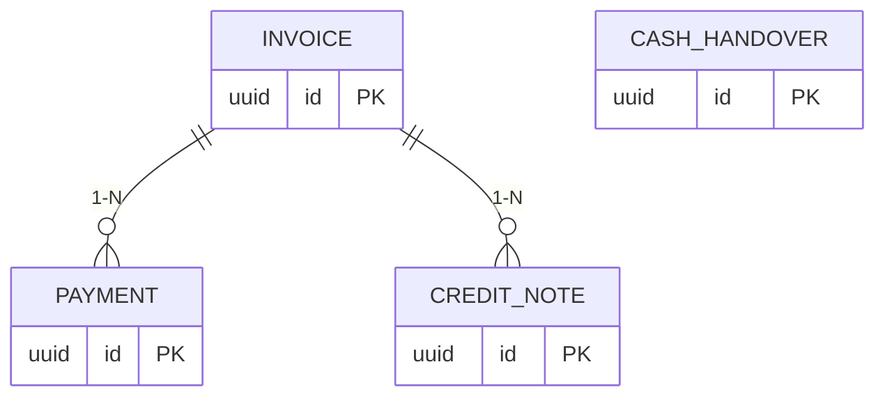

### 4.8 `complaints` schema
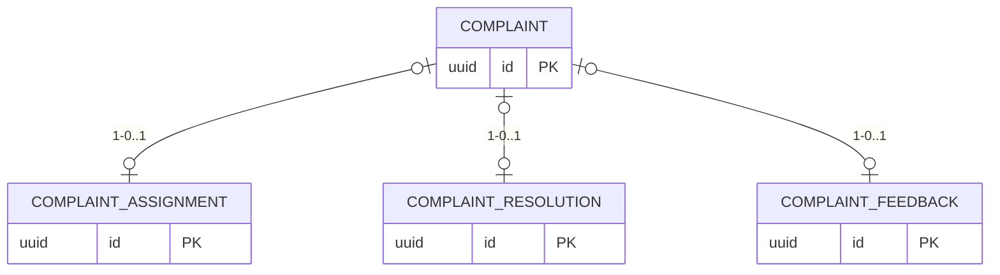

### 4.9 `identity` schema
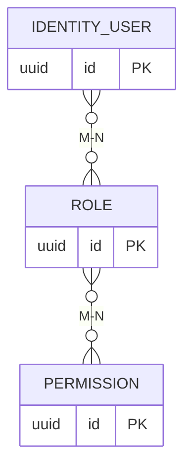

### 4.10 `audit` schema
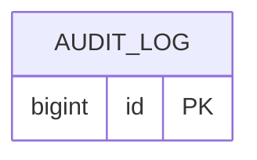

## Risks
- Diagram/schema drift — `03-database-schema.md` is authoritative in case of conflict.
- RLS policy omission on a new table is a real data-leak risk — mitigated by a migration-review checklist requiring an RLS policy for every new tenant-scoped table (`19-data-migration.md`).

## Alternatives Considered
- Single mega-diagram — rejected as unreadable at this table count; per-schema split chosen.
- Application-layer-only tenant filtering (no RLS) — rejected; RLS is a documented defense-in-depth layer, not the sole mechanism.

## Best Practices
- Every M:N relationship explicitly called out (§1) since these are historically the most mistake-prone.
- Schemas mirror bounded contexts 1:1, so a developer can find any table by knowing which module owns it.

## Future Scalability
- New Phase 2 entities (OMC integration, QR/barcode cylinder-level tracking) add new per-schema diagrams following this same pattern.
