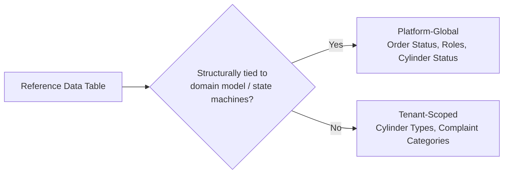

# 05 — Reference Data

## Purpose
Documents every lookup/master table: scope (Platform-Global vs. Tenant-Scoped), seed values, governance.

## Scope
Canonical catalog of valid values underlying every enum-like column in `03-database-schema.md`.

## 1. Scoping Principle

| Scope | Meaning | Change Process |
|---|---|---|
| **Platform-Global** | Identical across all tenants; part of the domain model's structural contract | Alembic migration + code review |
| **Tenant-Scoped** | Each tenant maintains its own list, seeded with defaults at provisioning | Self-service via Dashboard, no deployment |

## 2. Customer Types (Platform-Global — D-03)
`domestic`, `commercial`, `industrial`, `government`.

## 3. Cylinder Types (Tenant-Scoped — D-04, Default Seed)
5kg, 10kg, 14.2kg, 19kg, 47.5kg.

## 4. Order Status (Platform-Global — D-07)
`draft`, `booked`, `confirmed`, `assigned`, `ready_for_dispatch`, `out_for_delivery`, `delivered`, `failed_delivery`, `cancelled`, `closed`. Full state machine `08-state-machines.md` §2.

## 5. Delivery Status (Platform-Global)
**Route:** `planned`, `loaded`, `in_progress`, `completed`, `reconciled`.
**RouteStop:** `pending`, `en_route`, `delivered`, `failed`.

## 6. Vehicle Types / Ownership (Platform-Global — D-23)
`owned`, `third_party`, `rental`, `gig`.

## 7. Complaint Categories (Tenant-Scoped — D-20, Default Seed)
`short_delivery`, `damaged_cylinder`, `billing_dispute`, `driver_conduct`, `late_delivery`, `other`.

## 8. Roles (Platform-Global — D-38)
`super_admin`, `agency_admin`, `manager`, `warehouse_staff`, `dispatcher`, `accountant`, `driver`, `customer`.

## 9. Permissions (Platform-Global, Extensible — Representative Set)
`customers:create/:read/:update`, `orders:create/:read/:cancel/:cancel_approve/:deliver`, `routes:create/:read`, `inventory:load/:adjust`, `reconciliation:approve`, `ledger:read/:write`, `invoices:read`, `payments:create`, `credit_notes:request/:approve`, `complaints:create/:read/:resolve`, `reports:read/:export`, `tenant:configure`.
Full mapping in `identity.role_permission`.

## 10. Notification Types (Platform-Global)
`booking_confirmed`, `driver_assigned`, `out_for_delivery`, `delivery_confirmed`, `payment_received`, `invoice_generated`, `complaint_status_changed`, `refill_reminder`, `low_stock_alert`, `sla_breach_alert`.

## 11. Invoice Types (Platform-Global)
`standard` (per-order, D-10 default), `consolidated` (future, post-Phase-1), `credit_note` (linked correction document).

## 12. Payment Methods (Platform-Global — D-11/D-32)
`cash`, `upi`, `card`, `online_gateway`, `credit`.

## 13. Tax Types (Tenant-Scoped — India Default, D-06)
`cgst`, `sgst`, `igst`. Rates stored in `tenant.tenant_configuration` (BR-31), historized by `effective_from`.

## 14. Countries (Platform-Global, ISO 3166-1 alpha-2 — Seed: India-first)
`IN` (India), extensible.

## 15. States/Regions (Tenant-Scoped Reference, India Seed Example)
Maharashtra, Gujarat, Karnataka, Tamil Nadu, ... — used for `branch.region`; candidate for promotion to a full lookup table if state-level regulatory logic beyond GST configuration becomes necessary.

## 16. Languages (Platform-Global — D-27)
`en` (English), `hi` (Hindi), `mr` (Marathi).

## 17. Currencies (Platform-Global, ISO 4217 — Seed: INR-first)
`INR`, extensible for future multi-country tenants; `Money` value object always carries currency.

## 18. Units (Platform-Global — Measurement)
`kg` (cylinder weight), tenant currency (monetary amounts), `km` (route distance, Phase 2 route optimization).

## 19. Themes (Platform-Global — Dashboard Design System)
`light`, `dark`, `high_contrast` (WCAG 2.2 AA).

## 20. Cylinder Status (Platform-Global, 7-value — D-14)
`filled`, `empty`, `damaged`, `leakage`, `quarantine`, `repair`, `scrap`.

## 21. Booking Source (Platform-Global — D-05)
`mobile_app`, `staff`, `phone`, `walk_in`, `whatsapp` (Phase 2), `api` (Phase 2).

## 22. Ledger Transaction Types (Platform-Global — D-09)
`initial_connection`, `exchange`, `empty_return`, `new_purchase`, `additional_cylinder`, `deposit_return`, `connection_closure`, `write_off`.

## 23. Report Types (Platform-Global)
`daily_sales`, `cylinder_movement`, `inventory_reconciliation`, `driver_performance`, `customer_consumption`, `gst_report`, `outstanding_balances`, `audit_report`.

## Best Practices
- Platform-Global reference data changes ship via Alembic migration + code review (tied to state machines/RBAC).
- Tenant-Scoped reference data is self-service via Dashboard, no engineering involvement.
- All reference tables use soft-delete/deactivation only — never hard-delete a value referenced by historical transactions.

## Risks
- Tenant-Scoped reference data drift (e.g., renaming a Complaint Category referenced by historical complaints) — mitigated by deactivation-only, never deletion.

## Alternatives Considered
- All reference data tenant-scoped for maximum flexibility — rejected for values structurally tied to the domain model (Order Status, Roles, Cylinder Status), since tenant redefinition there would break state machines and RBAC.

## Future Scalability
- The Platform-Global vs. Tenant-Scoped split accommodates future countries/jurisdictions by extending Tax Types, Currencies, and Countries per tenant, without touching the structural Platform-Global enums.
