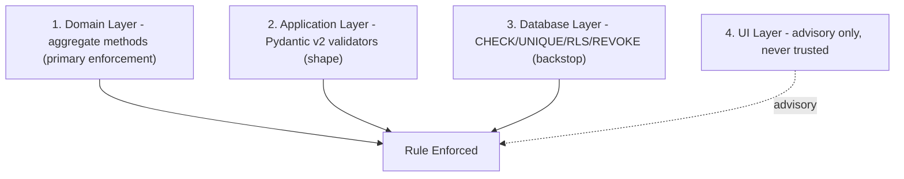

# 07 — Business Rule Catalogue

## Purpose
One central, uniquely-identified catalogue of every business rule: priority, description, validation logic, failure behavior, dependencies, example, and affected modules.

## Scope
Canonical, implementation-facing index for engineering, QA, and audit. Priority: **Critical** (data integrity/financial/regulatory), **High** (core business logic), **Medium** (UX/operational quality).

## BR-01 — Cylinder Ledger Existence
**Priority:** Critical
**Description:** Every customer has a running Cylinder Ledger tracking Filled/Empty/etc. balances per cylinder type.
**Validation Logic:** `cylinder_ledger` row created automatically on `CustomerRegistered` event, same database transaction.
**Failure Behaviour:** Customer creation fails atomically if ledger creation fails.
**Dependencies:** BR-22.
**Example:** New customer "Ramesh Patil" → ledger created, all balances 0.
**Affected Modules:** Customer Management, Cylinder Ledger.

## BR-02 — Exchange Transaction Semantics
**Priority:** Critical
**Description:** Standard refill = Exchange: +1 Filled / −1 Empty.
**Validation Logic:** `CylinderLedger.record_exchange()` applies both deltas atomically.
**Failure Behaviour:** `409 INSUFFICIENT_LEDGER_BALANCE` if BR-05 guard fails.
**Dependencies:** BR-05, BR-08.
**Example:** Customer has 1 Empty → delivery of 1 Filled, collection of 1 Empty → +1 Filled, 0 Empty.
**Affected Modules:** Cylinder Ledger, Delivery.

## BR-03 — Empty Return Semantics
**Priority:** High
**Description:** Return without refill = 0 Filled / +1 Empty.
**Validation Logic:** `CylinderLedger.record_empty_return()`.
**Failure Behaviour:** N/A — no guard condition.
**Dependencies:** None.
**Example:** Customer returns 1 empty without booking → Empty +1.
**Affected Modules:** Cylinder Ledger.

## BR-04 — Cylinder Holding Cap
**Priority:** High
**Description:** Booking blocked if it would exceed the customer-type-parameterized cylinder cap.
**Validation Logic:** `CylinderCapPolicy.evaluate(customer_id, requested_lines)` against `tenant_configuration` cap for the customer's type.
**Failure Behaviour:** `409 CYLINDER_CAP_EXCEEDED` at booking.
**Dependencies:** BR-31, D-03.
**Example:** Domestic cap = 2; customer holds 2 Filled → booking rejected unless offset by Empty exchange.
**Affected Modules:** Order Management, Cylinder Ledger.

## BR-05 — Exchange Requires Empty Balance
**Priority:** Critical
**Description:** Exchange transaction requires current Empty balance ≥ 1.
**Validation Logic:** Guard inside `CylinderLedger.record_exchange()`.
**Failure Behaviour:** `409 INSUFFICIENT_LEDGER_BALANCE`.
**Dependencies:** BR-02, D-09.
**Example:** Customer with 0 Empty attempting exchange → rejected; must use New Purchase type.
**Affected Modules:** Cylinder Ledger.

## BR-06 — Ledger Immutability
**Priority:** Critical
**Description:** Ledger transactions are append-only; corrections are offsetting entries, never edits.
**Validation Logic:** PostgreSQL `REVOKE UPDATE, DELETE` on `ledger_transaction` from the application role.
**Failure Behaviour:** SQL permission error if attempted (unreachable via application code).
**Dependencies:** BR-28.
**Example:** Erroneous +1 Filled corrected via a new "-1 Filled, reason: correction" entry.
**Affected Modules:** Cylinder Ledger.

## BR-07 — Order State Machine
**Priority:** Critical
**Description:** Orders progress only through the defined 10-state lifecycle.
**Validation Logic:** `Order` aggregate methods enforce valid transitions only.
**Failure Behaviour:** `409 INVALID_STATE_TRANSITION`.
**Dependencies:** BR-08, BR-09, D-07.
**Example:** Attempt `draft → delivered` directly → rejected.
**Affected Modules:** Order Management.

## BR-08 — Proof of Delivery Required
**Priority:** Critical
**Description:** Order cannot reach Delivered without complete POD (OTP + signature + photo + GPS).
**Validation Logic:** `Order.confirm_delivery()` requires all four fields populated.
**Failure Behaviour:** `400` if incomplete; `409 OTP_MISMATCH` if OTP wrong.
**Dependencies:** BR-23.
**Example:** Missing GPS coordinates → rejected.
**Affected Modules:** Order Management, Delivery.

## BR-09 — Vehicle Stock Sufficiency / Partial Fulfillment
**Priority:** High
**Description:** Order assignment requires vehicle stock sufficiency; partial fulfillment allowed via Backorder.
**Validation Logic:** `VehicleCapacityChecker` domain service.
**Failure Behaviour:** Insufficient lines flagged `is_backordered = true` rather than blocking the whole order.
**Dependencies:** D-08.
**Example:** Order for 2, vehicle has 1 → 1 delivered, 1 backordered.
**Affected Modules:** Order Management, Delivery, Inventory.

## BR-10 — Cancellation Inventory Reversal
**Priority:** Medium
**Description:** Cancelling an Assigned order reverses any inventory allocation.
**Validation Logic:** `Order.cancel()` triggers a compensating inventory transaction if stock was reserved.
**Failure Behaviour:** N/A — automatic compensation.
**Dependencies:** BR-09.
**Example:** Assigned order cancelled → reserved vehicle stock released.
**Affected Modules:** Order Management, Inventory.

## BR-11 — Three-Level Inventory Tracking
**Priority:** Critical
**Description:** Inventory tracked at Warehouse, Vehicle, Customer levels.
**Validation Logic:** Three distinct `inventory_location`/`cylinder_ledger` structures.
**Failure Behaviour:** N/A — structural rule.
**Dependencies:** BR-01.
**Example:** A cylinder's location is always exactly one of Warehouse/Vehicle/Customer.
**Affected Modules:** Inventory, Cylinder Ledger.

## BR-12 — Vehicle Loading Stock Transfer
**Priority:** Critical
**Description:** Vehicle loading decrements Warehouse, increments Vehicle stock atomically.
**Validation Logic:** `VehicleLoaded` event handler, same-transaction dual update.
**Failure Behaviour:** Whole operation rolls back if either side fails.
**Dependencies:** BR-29.
**Example:** 50 Filled loaded → Warehouse −50, Vehicle +50.
**Affected Modules:** Inventory, Delivery.

## BR-13 — Delivery Auto-Updates Vehicle Stock
**Priority:** Critical
**Description:** Delivery confirmation automatically updates Vehicle inventory.
**Validation Logic:** `CylinderDelivered` event handler.
**Failure Behaviour:** Delivery confirmation fails atomically if inventory update fails.
**Dependencies:** BR-08.
**Example:** Deliver 15 Filled, collect 14 Empty from a 50/10-loaded vehicle → Filled=35, Empty=24.
**Affected Modules:** Inventory, Delivery.

## BR-14 — Mandatory Daily Reconciliation
**Priority:** High
**Description:** Vehicle stock may carry over across days; daily reconciliation mandatory regardless; approver restricted.
**Validation Logic:** `ReconciliationService`; approver permission live-checked.
**Failure Behaviour:** `403` if approver lacks WarehouseManager/AgencyAdmin permission.
**Dependencies:** D-16, D-31.
**Example:** Vehicle carries stock into Day 2 → still reconciled at end of Day 1 shift.
**Affected Modules:** Inventory, Delivery.

## BR-15 — Seven-State Cylinder Model
**Priority:** High
**Description:** Cylinder status spans Filled/Empty/Damaged/Leakage/Quarantine/Repair/Scrap; GRN manual in Phase 1.
**Validation Logic:** `CylinderStatus` value object; valid transitions per state machine.
**Failure Behaviour:** `409 INVALID_STATUS_TRANSITION` for undefined edges.
**Dependencies:** D-14, D-15.
**Example:** Empty → Damaged valid; Scrap → Filled invalid.
**Affected Modules:** Inventory.

## BR-16 — GST-Compliant Invoicing
**Priority:** Critical
**Description:** Every invoice must be GST-compliant.
**Validation Logic:** Tax computed from tenant configuration GST rate in effect at issuance.
**Failure Behaviour:** Invoice generation fails if no active tax configuration exists.
**Dependencies:** BR-31.
**Example:** ₹850 subtotal, 5% GST → ₹42.50 tax, ₹892.50 total.
**Affected Modules:** Accounting.

## BR-17 — One Invoice Per Order
**Priority:** Critical
**Description:** Exactly one invoice per delivered order.
**Validation Logic:** DB unique constraint on `invoice.order_id`.
**Failure Behaviour:** `409 DUPLICATE_INVOICE`.
**Dependencies:** D-10.
**Example:** Second invoice-generation attempt for the same order → rejected.
**Affected Modules:** Accounting.

## BR-18 — Payment Method Support
**Priority:** High
**Description:** Payment via Cash, UPI, Card (COD) or online gateway.
**Validation Logic:** `payment.method` enum constraint.
**Failure Behaviour:** `400` on invalid method value.
**Dependencies:** D-11, D-32.
**Example:** Driver records ₹892.50 Cash payment at delivery.
**Affected Modules:** Accounting.

## BR-19 — Credit Limit / Outstanding Balance Check
**Priority:** Critical
**Description:** Outstanding balance/credit limit checked before booking confirmation.
**Validation Logic:** `CreditLimitEvaluator` domain service, tenant-configurable limit.
**Failure Behaviour:** `409 CREDIT_LIMIT_EXCEEDED`.
**Dependencies:** BR-31, D-11.
**Example:** ₹2000 outstanding against a ₹1500 limit → booking blocked.
**Affected Modules:** Accounting, Order Management.

## BR-20 — Refund Workflow
**Priority:** High
**Description:** Refunds follow Customer Request → Manager Approval → Credit Note → Refund → Ledger Update.
**Validation Logic:** `credit_note` state machine.
**Failure Behaviour:** `403` if approval attempted by non-Manager/AgencyAdmin.
**Dependencies:** D-17.
**Example:** ₹200 overcharge correction requested, approved, refunded.
**Affected Modules:** Accounting.

## BR-21 — KYC Verification Requirement
**Priority:** Medium
**Description:** Customers must be KYC-verified (gating policy TBD).
**Validation Logic:** `customer.kyc_status` tracked; gating point is a residual open design question.
**Failure Behaviour:** N/A pending policy confirmation.
**Dependencies:** None confirmed — flagged for business confirmation.
**Example:** New customer starts `kyc_status = pending`.
**Affected Modules:** Customer Management.

## BR-22 — Unique Consumer Number
**Priority:** Critical
**Description:** Exactly one active Consumer Number per customer per tenant.
**Validation Logic:** DB unique constraint.
**Failure Behaviour:** `409 DUPLICATE_CONSUMER_NUMBER`.
**Dependencies:** None.
**Example:** Duplicate Consumer Number within one tenant → rejected.
**Affected Modules:** Customer Management.

## BR-23 — Complete POD Elements
**Priority:** Critical
**Description:** OTP + signature + photo + GPS required together.
**Validation Logic:** `proof_of_delivery` — all four NOT NULL.
**Failure Behaviour:** `400` on partial submission.
**Dependencies:** BR-08.
**Example:** Missing photo → delivery confirmation rejected.
**Affected Modules:** Delivery.

## BR-24 — Vehicle Physical Capacity
**Priority:** Medium
**Description:** Order assignment must not exceed vehicle physical capacity.
**Validation Logic:** `VehicleCapacityChecker` against `vehicle.capacity_units`.
**Failure Behaviour:** Assignment blocked or flagged for split across vehicles.
**Dependencies:** BR-09.
**Example:** Capacity 60, route demand 75 → route splitting required.
**Affected Modules:** Delivery.

## BR-25 — Defined KPI Set
**Priority:** Medium
**Description:** On-time %, Avg Delivery Time, Productivity, Revenue, Inventory Accuracy, CSAT, Outstanding Collections.
**Validation Logic:** Computed in Reporting read models.
**Failure Behaviour:** N/A — reporting only.
**Dependencies:** D-29.
**Example:** Driver X: 96% on-time over last 30 days.
**Affected Modules:** Reporting.

## BR-26/27 — Notifications and Triggers
**Priority:** Medium
**Description:** Customers receive notifications for booking, delivery, payment, complaint status, refill reminders.
**Validation Logic:** Event subscribers per `09-domain-events.md`.
**Failure Behaviour:** Failed sends retried; never blocks the originating transaction.
**Dependencies:** D-25, D-26.
**Example:** `CylinderDelivered` → SMS + push sent.
**Affected Modules:** Notifications.

## BR-28 — Comprehensive Audit Logging
**Priority:** Critical
**Description:** All mutating actions, financial transactions, inventory adjustments, and login events are audit-logged.
**Validation Logic:** Audit-logging middleware/dependency on every mutating use case; `audit_log` DENY UPDATE/DELETE.
**Failure Behaviour:** Command fails if audit write fails (same transaction) — audit is not best-effort.
**Dependencies:** D-39.
**Example:** Every Order status change writes an audit_log row.
**Affected Modules:** Cross-Cutting.

## BR-29 — Transactional Atomicity
**Priority:** Critical
**Description:** All ledger/inventory mutations are all-or-nothing.
**Validation Logic:** SQLAlchemy async session/Unit-of-Work wraps every use case in a single transaction.
**Failure Behaviour:** Full rollback on any failure within the use case.
**Dependencies:** None — foundational.
**Example:** Delivery confirmation partially updating Ledger but not Inventory is impossible by construction.
**Affected Modules:** Cross-Cutting.

## BR-30 — Tenant Isolation
**Priority:** Critical
**Description:** Every entity carries tenant_id; no cross-tenant query/mutation.
**Validation Logic:** PostgreSQL RLS policy + repository-layer scoping (defense in depth).
**Failure Behaviour:** `404` (not `403`) on any cross-tenant resource reference.
**Dependencies:** D-01.
**Example:** User from Tenant A requesting Tenant B's Order ID → `404`.
**Affected Modules:** Cross-Cutting.

## BR-31 — Tenant-Scoped Configuration
**Priority:** High
**Description:** GST rates, cylinder caps, credit limits, cancellation policy, reminder intervals are tenant-scoped, never hardcoded.
**Validation Logic:** `tenant_configuration` table, historized by `effective_from`.
**Failure Behaviour:** N/A — configuration read, not a validation gate itself.
**Dependencies:** D-42.
**Example:** Tenant A and B both 5% GST but different cylinder caps.
**Affected Modules:** Cross-Cutting.

## BR-32 — Cash Shortfall Workflow
**Priority:** High
**Description:** Declaration → Investigation → Approval → Adjustment Entry → Audit Log.
**Validation Logic:** `cash_handover.shortfall_status` state machine.
**Failure Behaviour:** No shortfall may be written off outside this workflow.
**Dependencies:** D-18.
**Example:** Driver declares ₹200 short → investigated → approved → adjustment logged.
**Affected Modules:** Accounting.

## BR-33 — Complaint SLA Assignment
**Priority:** High
**Description:** Every complaint is categorized, prioritized, and assigned an SLA at creation.
**Validation Logic:** `SlaCalculator` domain service computes `sla_due_at` at insert — never client-supplied.
**Failure Behaviour:** `400` if category/priority missing.
**Dependencies:** D-20.
**Example:** High-priority ShortDelivery → SLA due in 24 hours (tenant-configured).
**Affected Modules:** Complaint Management.

## BR-34 — Connection Closure Sequence
**Priority:** Critical
**Description:** Cylinder return verify → ledger zero-balance/settle → deposit refund → close → archive.
**Validation Logic:** `ConnectionClosed` event orchestration enforces sequence order.
**Failure Behaviour:** `409 LEDGER_NOT_SETTLED` if attempting closure with an unsettled balance.
**Dependencies:** D-09, D-21.
**Example:** Customer with 1 Filled outstanding → closure blocked until cylinder returned or settled.
**Affected Modules:** Customer Management, Cylinder Ledger.

## Rule Enforcement Layering (Defense in Depth)

## Risks
- Registry drift as new features add rules — mitigated by requiring a catalogue update in the Definition of Done for any new invariant.

## Alternatives Considered
- Rules embedded only in code comments — rejected; unsearchable by non-engineering stakeholders who need to reference rule IDs in tickets/tests.

## Future Scalability
- Flat ID scheme extends naturally to tenant-specific rule variants (e.g., BR-31a) without renumbering, as tenant-customizable rules emerge beyond simple parametric configuration.
