# 08 — State Machines

## Purpose
Complete lifecycle state diagrams for every stateful entity — the authoritative reference for valid transitions. Any transition not shown is invalid and must be rejected by the Domain layer.

## Scope
Customer, Booking, Order, Delivery (Route/RouteStop), Inventory (Cylinder Status), Cylinder Ledger, Invoice, Payment, Complaint, Notification, Driver, Vehicle.

## 1. Customer State Machine

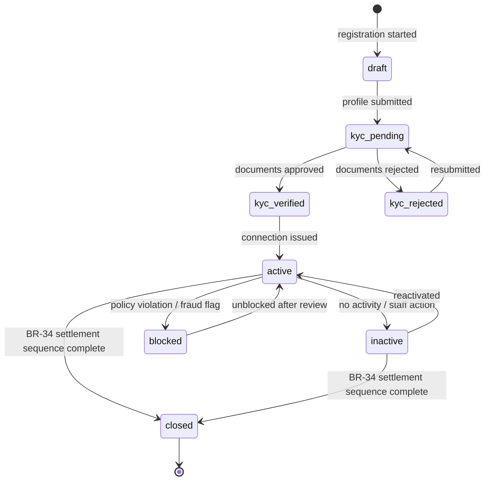

## 2. Booking / Order State Machine (D-07)

*Booking and Order share one lifecycle — no separate Booking table (`01-domain-model.md` §4.3).*

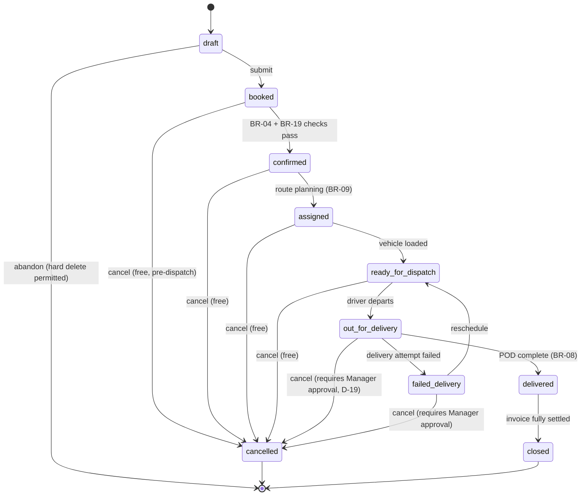

## 3. Delivery — Route State Machine

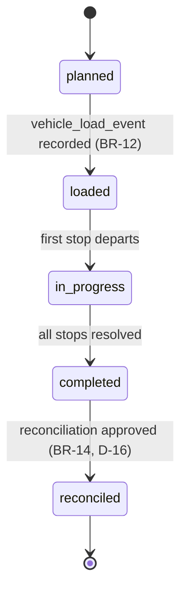

## 4. Delivery — RouteStop State Machine

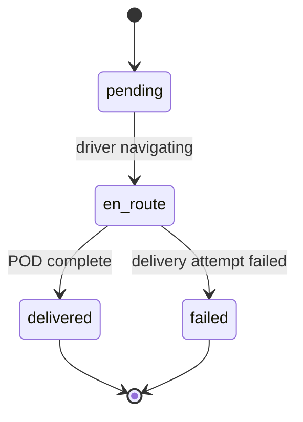

## 5. Inventory — Cylinder Status State Machine (7-state, D-14)

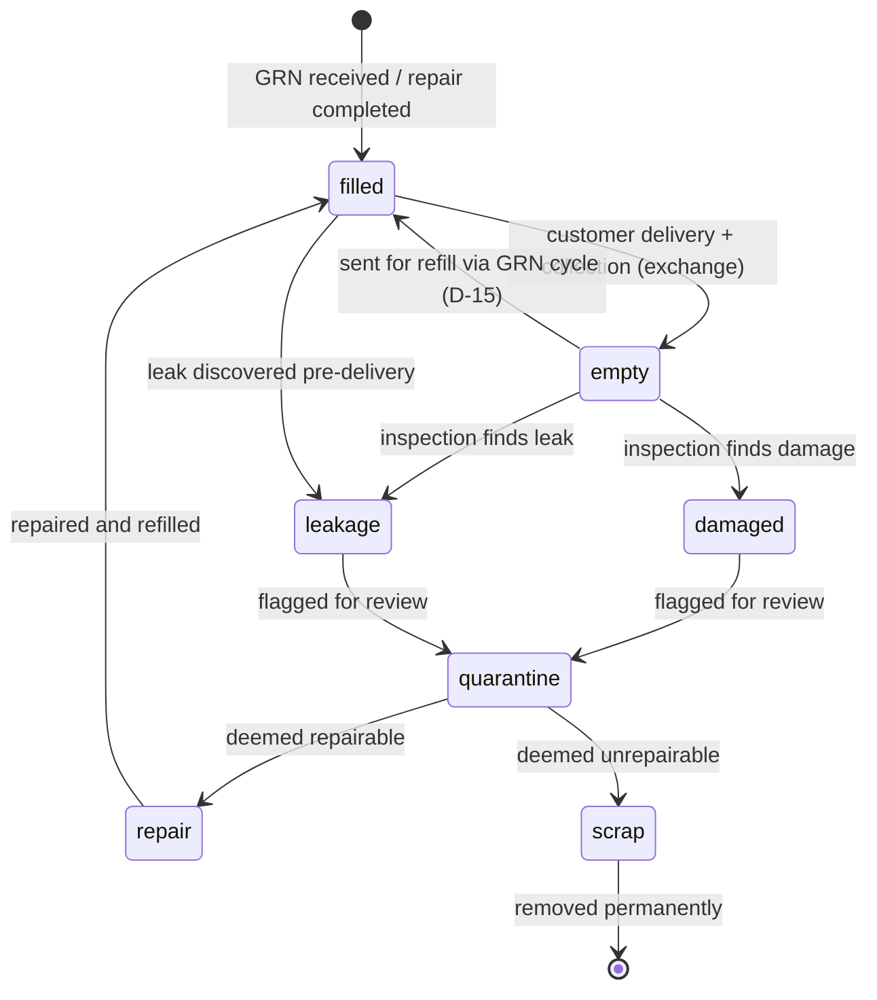

## 6. Cylinder Ledger — Customer Balance Transitions

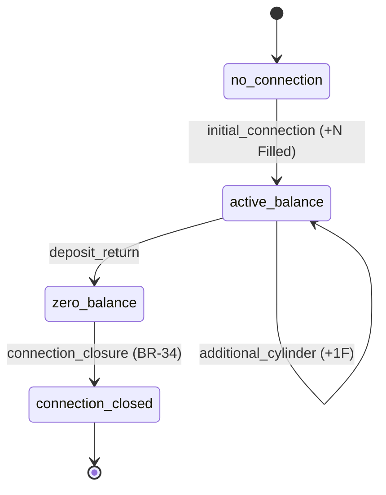

**Guard:** Exchange requires current Empty ≥ 1 (BR-05); no transition may drive Filled or Empty below 0.

## 7. Invoice / Payment State Machine (D-11)

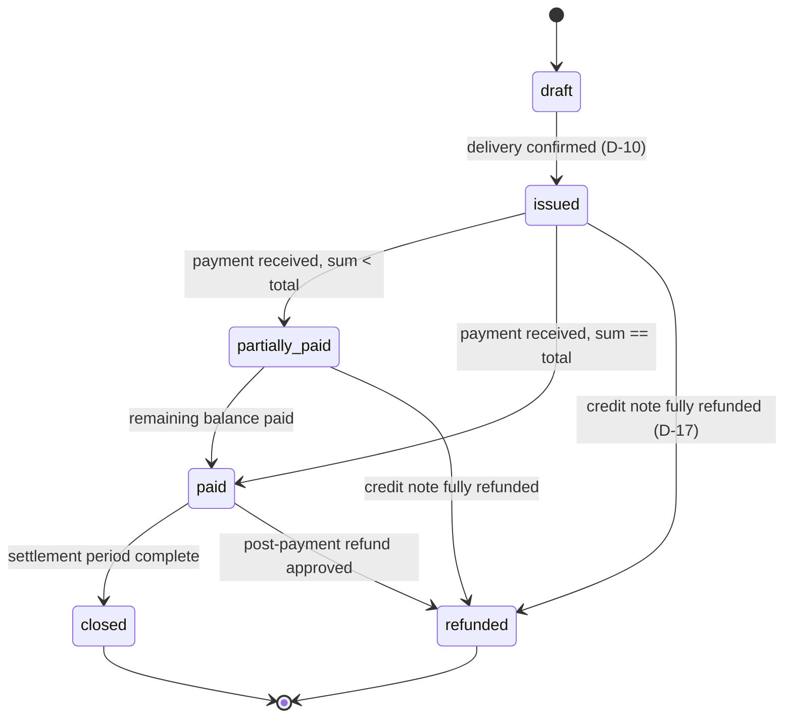

## 8. Complaint State Machine (D-20)

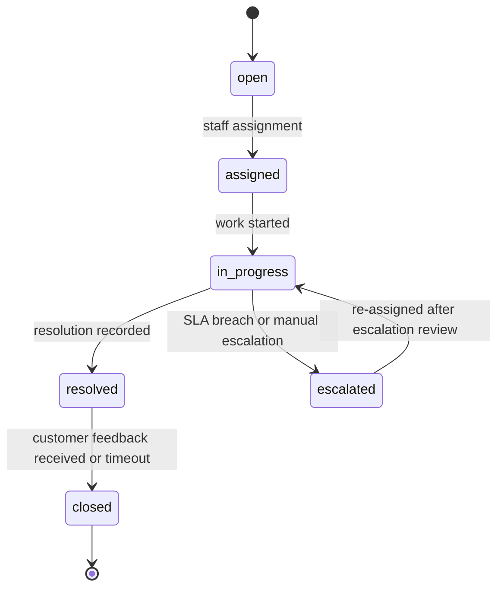

## 9. Notification State Machine

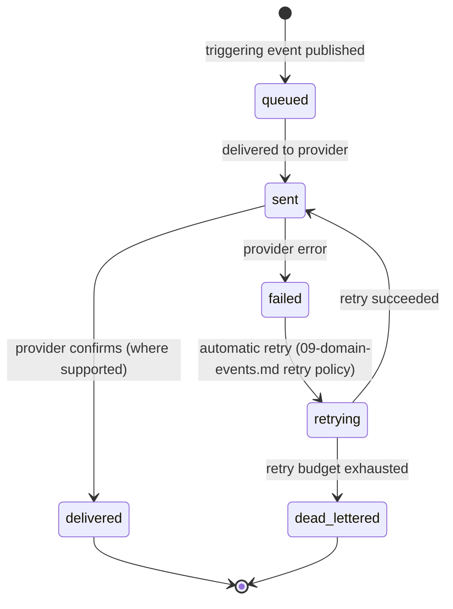

## 10. Driver State Machine

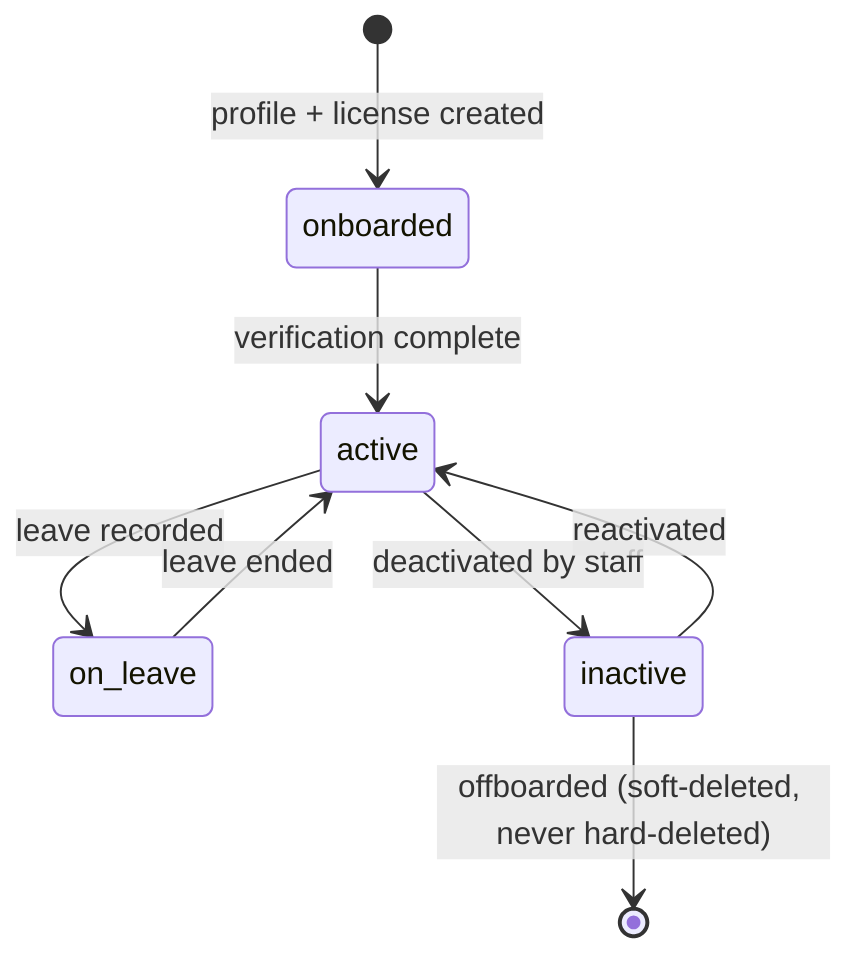

## 11. Vehicle State Machine

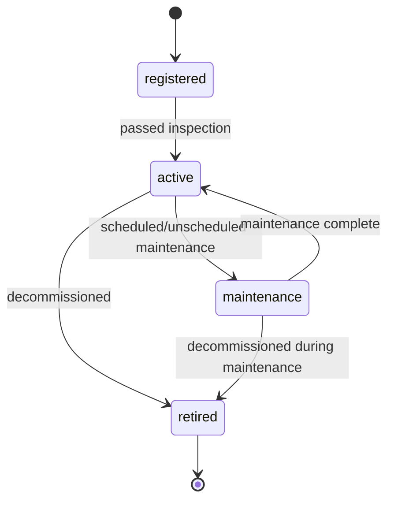

## Best Practices
- Every state machine enforced inside the aggregate's own methods, never via direct attribute mutation — database CHECK constraints are a backstop only.
- Invalid transitions raise a specific domain exception mapped to `409 Conflict` with a stable `error_code`.

## Risks
- State machine/code drift — mitigated by Domain-layer unit tests (pytest) enumerating every valid and several invalid transitions per aggregate.

## Alternatives Considered
- Generic configurable workflow engine — rejected for Phase 1 as unnecessary complexity given transitions are well-understood and stable.

## Future Scalability
- Should tenant-customizable workflows emerge, the explicit-method-per-transition design would evolve toward a data-driven state-transition table stored in `tenant_configuration`.
