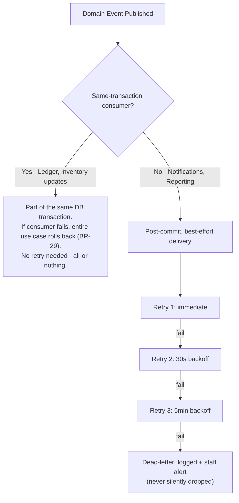

# 09 — Domain Events

## Purpose
Complete catalog of domain events: publisher, consumers, payload, business rules, retry strategy, failure handling, and idempotency considerations.

## Scope
Events publish within the same async request/Unit-of-Work as the triggering use case for same-transaction consumers; genuinely async consumers (Notifications, Reporting) publish post-commit via a lightweight in-process event bus (e.g., an async pub/sub built on `asyncio`, not a separate broker in Phase 1).

## Design Decisions
- **Idempotency is a first-class concern for every event**, not an afterthought — because the offline-first Driver App means the same logical action (e.g., a delivery confirmation) may be submitted more than once from the client. Every event payload includes enough information (typically the originating command's idempotency key or a natural business key) for a consumer to detect and ignore a duplicate.

## Retry & Failure Handling — General Policy

## Reconciliation with the implementation (2026-08-18)

The catalog below is the **design** catalog and predates most of the build. It
was verified against the code on 2026-08-18 and had drifted in both directions:
of the 18 events it names, **10 exist** at that point (**12** as of R10,
2026-08-19); the code defines **41+** events in total, so **31 are
undocumented** (unchanged by R10 — it implemented two already-documented
events, not new undocumented ones).

**Documented here but not implemented — 8, now 6:**

| Event | Owning domain | Status |
|---|---|---|
| `ComplaintRaised` | `complaint` | ✅ **implemented (R10, 2026-08-19)** — `Complaint.create()` |
| `ComplaintResolved` | `complaint` | ✅ **implemented (R10, 2026-08-19)** — `Complaint.resolve()`, fires for every outcome (`outcome` field distinguishes resolved/compensated/rejected) |
| `PaymentCollected` | `accounting` | ❌ only `InvoiceGenerated` exists |
| `RefundApproved` | `accounting` | ❌ |
| `CashShortfallDeclared` | `accounting` | ❌ |
| `ConnectionClosed` | `customer` | ❌ |
| `NotificationSent` | `notification` | ❌ only `InAppNotificationCreated` exists |
| `OrderAssigned` (a.k.a. `DriverAssigned`) | `order` / `delivery` | ⚠️ **renamed** to `OrderAssignedToRoute` in Phase 12 when routes replaced direct driver assignment — the behaviour exists, the name here does not |

The last row is a naming drift, not a gap. Of the remaining five gaps, each
would require building genuinely new domain logic first — there is no
`Payment`, `CreditNote`, or `CashHandover` domain concept anywhere in the
codebase yet (`PaymentCollected`/`RefundApproved`/`CashShortfallDeclared`
all presuppose one), no method on the `Customer` aggregate that closes a
connection (`ConnectionClosed`), and notification delivery is currently
fire-and-forget with no status-tracking mechanism a self-referential
`NotificationSent` could report on. Adding "just the event" to any of these
would be a dead event class with nothing to ever record it — see
`planning/MODULE_STATUS.md`'s R10 entry for the full accounting.

These are recorded as implementation gaps against their modules in
[`planning/MODULE_STATUS.md`](../../planning/MODULE_STATUS.md).

### Implemented event catalog, by domain

Authoritative as of 2026-08-18 — generated from
`class X(DomainEvent)` declarations under `backend/src/lpg/domain/`.

| Domain | Events |
|---|---|
| `accounting` | `InvoiceGenerated` |
| `customer` | `AddressAdded`, `CustomerApproved`, `CustomerRegistered`, `CustomerStatusChanged`, `KycDocumentSubmitted`, `KycDocumentVerified`, `PrimaryAddressSet` |
| `cylinder_ledger` | `LedgerTransactionAppended` |
| `delivery` | `DriverLicenseUpdated`, `DriverRegistered`, `DriverStatusChanged`, `OrderAssignedToRoute`, `OrderDelivered`, `OrderDeliveryFailed`, `RoutePlanned`, `RouteStatusChanged`, `VehicleLoaded`, `VehicleRegistered`, `VehicleStatusChanged` |
| `identity` | `IdentityUserLocked`, `IdentityUserLoggedIn`, `IdentityUserLoginFailed`, `IdentityUserRoleChanged` |
| `inventory` | `GoodsReceived`, `InventoryAdjusted` |
| `notification` | `InAppNotificationCreated` |
| `order` | `BookingCancelled`, `BookingConfirmed`, `BookingCreated`, `CylinderDelivered`, `DeliveryFailed`, `InventoryReserved`, `OrderClosed` |
| `tenant` | `BranchRenamed`, `CylinderTypeRenamed`, `TenantRenamed`, `TenantStatusChanged`, `WarehouseRenamed` |
| `tenant_admin` | `EmployeeRegistered`, `EmployeeStatusChanged` |
| `complaint` | `ComplaintRaised`, `ComplaintResolved` |
| `platform` | **none** |

> **A trap this catalog has already caused.** `order` emits `CylinderDelivered`
> and `delivery` emits `OrderDelivered`, and a single delivery fires **both** —
> `DeliverOrderUseCase` mutates the Order and the Route in one unit of work.
> Phase 13's ledger handler originally subscribed to both and would have
> double-counted every cylinder on every customer's ledger. A handler must
> subscribe to exactly one of them; the Order aggregate's own
> `CylinderDelivered` is the right choice, because it fires whether or not a
> route is involved.

---

## Event Catalog

### `CustomerRegistered`
- **Publisher:** Customer Management | **Consumers:** Notifications (welcome), Cylinder Ledger (creates aggregate)
- **Payload:** `customer_id, tenant_id, consumer_number, customer_type, registered_at`
- **Business Rules:** BR-01, BR-22
- **Retry/Failure:** Ledger creation is same-transaction (atomic); Notification is async best-effort.
- **Idempotency:** `customer_id` is the natural dedup key — a retried registration request that hits `DUPLICATE_CONSUMER_NUMBER` never re-publishes this event.

### `BookingCreated`
- **Publisher:** Order Management | **Consumers:** Notifications
- **Payload:** `order_id, tenant_id, customer_id, booking_source, lines, requested_date`
- **Business Rules:** BR-19, BR-04 (already passed)
- **Idempotency:** Client-supplied `Idempotency-Key` on the create-order request prevents duplicate orders from a retried submission; the event only fires once per successfully-created order.

### `BookingCancelled`
- **Publisher:** Order Management | **Consumers:** Inventory (release reservation), Notifications
- **Payload:** `order_id, cancelled_by, approved_by, reason, cancellation_charge`
- **Business Rules:** BR-10, D-19
- **Idempotency:** Cancelling an already-cancelled order is a no-op at the aggregate level (state machine rejects the transition), so the event cannot double-fire.

### `InventoryReserved`
- **Publisher:** Order Management (at route assignment) | **Consumers:** Inventory Management
- **Payload:** `order_id, route_id, lines`
- **Business Rules:** BR-09
- **Idempotency:** Reservation is keyed by `order_id` + `route_id`; a duplicate reservation attempt for the same pair is rejected, not double-applied.

### `OrderAssigned` (a.k.a. `DriverAssigned`)
- **Publisher:** Delivery Management | **Consumers:** Notifications, Order Management (→ assigned)
- **Payload:** `route_id, order_ids, driver_id, vehicle_id, route_date`
- **Business Rules:** BR-09, BR-24

### `VehicleLoaded`
- **Publisher:** Delivery Management | **Consumers:** Inventory Management
- **Payload:** `route_id, vehicle_id, warehouse_id, lines`
- **Business Rules:** BR-12
- **Retry/Failure:** Same-transaction atomic — no partial load state possible.
- **Idempotency:** A load event carries a client idempotency key (relevant if submitted from a mobile device); replay returns the original result, doesn't double-increment vehicle stock.

### `CylinderDelivered`
- **Publisher:** Delivery Management | **Consumers:** Cylinder Ledger, Inventory Management, Accounting, Notifications
- **Payload:** `order_id, route_stop_id, customer_id, lines, proof_of_delivery, delivered_at, idempotency_key`
- **Business Rules:** BR-08, BR-13, BR-02
- **Retry/Failure:** Ledger + Inventory + Invoice-trigger are same-transaction atomic; Notification is async best-effort.
- **Idempotency:** **Critical** — this is the event most exposed to offline-sync duplication (Driver App). The `idempotency_key` (persisted server-side against `(tenant_id, key) → result`, 7-day TTL) ensures a retried sync from the Driver App's offline queue never double-applies the ledger exchange or inventory decrement.

### `DeliveryFailed`
- **Publisher:** Delivery Management | **Consumers:** Order Management, Notifications
- **Payload:** `order_id, route_stop_id, reason_code, recorded_by`
- **Business Rules:** D-12

### `InventoryAdjusted`
- **Publisher:** Inventory Management | **Consumers:** Notifications (variance alert), Reporting
- **Payload:** `inventory_location_id, cylinder_type_id, from_status, to_status, quantity, transaction_type, performed_by`
- **Business Rules:** BR-15; D-16 approval required for `adjustment` type specifically.

### `GoodsReceived`
- **Publisher:** Inventory Management | **Consumers:** Reporting
- **Payload:** `grn_id, warehouse_id, cylinder_type_id, quantity_received, source_omc`
- **Business Rules:** D-15

### `PaymentCollected`
- **Publisher:** Accounting | **Consumers:** Order Management, Reporting, Notifications
- **Payload:** `payment_id, invoice_id, method, amount, collected_by, collected_at`
- **Business Rules:** BR-18, D-11
- **Idempotency:** `gateway_transaction_ref` (for online payments) or a driver-submitted idempotency key (for COD) prevents double-recording the same payment.

### `InvoiceGenerated`
- **Publisher:** Accounting (subscriber to `CylinderDelivered`) | **Consumers:** Notifications, Reporting
- **Payload:** `invoice_id, order_id, customer_id, total_amount, issued_at`
- **Business Rules:** BR-17
- **Idempotency:** DB unique constraint on `invoice.order_id` guarantees this event can only ever fire once per order, regardless of how many times `CylinderDelivered` is (idempotently) replayed.

### `ComplaintRaised`
- **Publisher:** Complaint Management | **Consumers:** Notifications
- **Payload:** `complaint_id, customer_id, category, priority, sla_due_at`
- **Business Rules:** BR-33

### `ComplaintResolved`
- **Publisher:** Complaint Management | **Consumers:** Notifications, Reporting
- **Payload:** `complaint_id, outcome, resolved_by, resolved_at`
- **Business Rules:** D-20

### `NotificationSent`
- **Publisher:** Notifications (self-referential — logs its own outcome) | **Consumers:** Reporting (delivery-rate metrics)
- **Payload:** `notification_id, recipient_id, channel, template_key, status, provider_message_id`
- **Business Rules:** D-25
- **Idempotency:** `notification_id` is the dedup key for the retry loop itself (§ Retry & Failure Handling) — a retry updates the same `notification_log` row's status, never inserts a duplicate log entry.

### `CashShortfallDeclared`
- **Publisher:** Accounting | **Consumers:** Notifications (manager alert)
- **Payload:** `cash_handover_id, driver_id, route_id, expected_amount, actual_amount, shortfall`
- **Business Rules:** BR-32

### `RefundApproved`
- **Publisher:** Accounting | **Consumers:** Notifications, Cylinder Ledger (if Deposit Return)
- **Payload:** `credit_note_id, invoice_id, amount, approved_by`
- **Business Rules:** BR-20

### `ConnectionClosed`
- **Publisher:** Customer Management | **Consumers:** Cylinder Ledger, Accounting
- **Payload:** `customer_id, closed_at, final_ledger_balance`
- **Business Rules:** BR-34

## Event Design Principles
- Events are **past-tense facts**, never commands — consumers cannot reject an event; rejection happens in the originating use case before publication.
- Every payload that could plausibly be replayed (any client-originated action, especially from the offline-first Driver App) carries an idempotency/dedup key.
- No PII beyond operational necessity in any payload.

## Risks
- **In-process-only bus (Phase 1):** a process crash between commit and async-handler completion could "lose" an event from an in-process subscriber's perspective — mitigated by keeping all *critical* same-transaction effects (Ledger, Inventory) inside the actual DB transaction, never dependent on post-commit delivery.
- **Event schema evolution:** removing/renaming a field is breaking for any future out-of-process consumer — treated with the same versioning discipline as API contracts once/if events move to a durable broker (Redis Streams or a dedicated message broker).

## Alternatives Considered
- Full event sourcing — deferred; today's events are notifications about conventionally-recorded (PostgreSQL) state changes, not the sole record of truth.
- Redis Pub/Sub for the in-process event bus — considered given Redis is already in the stack (caching); deferred in favor of a simpler in-process `asyncio`-based bus for Phase 1, since Redis Pub/Sub has no delivery guarantees (fire-and-forget) and would need Redis Streams (with consumer groups) for anything resembling reliable delivery — a reasonable Phase 2 evolution, not a Phase 1 requirement given same-transaction consumers already get their guarantees from the database transaction itself.

## Future Scalability
- **Redis Streams** is the documented seam for moving from in-process to durable, at-least-once cross-process event delivery once specific bounded contexts are extracted into separately deployed FastAPI services — Redis is already part of the confirmed stack, making this a lower-friction evolution than introducing a wholly new broker.
