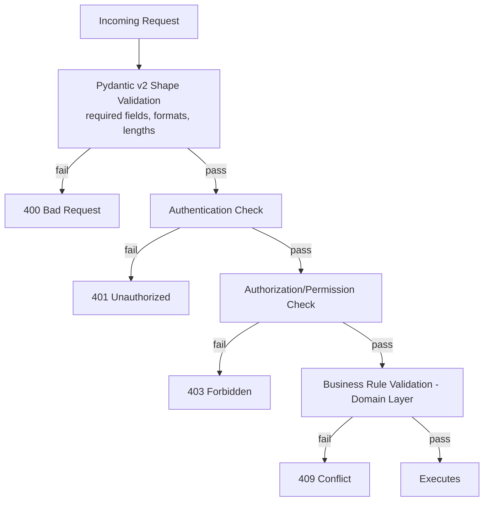

# 13 — Validation Rules

## Purpose
Centralizes every validation rule, distinguishing **shape validation** (Pydantic v2, `400`) from **business-rule validation** (Domain layer, `409`).

## Scope
Covers Authentication, Customer, Booking, Inventory, Accounting, Payments, Invoices, Reports, Printing, Master Data, Files.

## Design Decisions
- Pydantic v2 `field_validator`/`model_validator` decorators are the designated shape-validation mechanism — chosen because they run before any database access, giving fast, cheap rejection of malformed input, keeping the (comparatively expensive) Domain-layer business-rule checks reserved for requests that are already known to be well-formed.

## 1. Validation Layering

## 2. Authentication
| Rule | Type | Detail |
|---|---|---|
| OTP format | Shape | 6-digit numeric |
| OTP expiry | Business | 5 minutes — `410 OTP_EXPIRED` |
| OTP rate limit | Business | 5 requests/hour/number (Redis sliding window) — `429` |
| Password complexity (staff) | Shape | Min 10 chars, mixed case, digit, symbol |
| Account lockout | Business | 5 failed attempts → locked 15 min — `423 ACCOUNT_LOCKED` |
| Refresh token reuse | Business | Detected reuse of rotated token → full session revocation |

## 3. Customer
| Rule | Type | Detail |
|---|---|---|
| `full_name` | Shape | 1–200 chars, required |
| `phone_number` | Shape | E.164 format (Pydantic regex validator) |
| Phone uniqueness | Business | Unique/tenant — `409 DUPLICATE_PHONE` |
| `customer_type` | Shape | Enum (D-03) |
| Consumer Number uniqueness | Business | BR-22 — `409 DUPLICATE_CONSUMER_NUMBER` |
| Customer closure | Business | BR-34 sequence — `409 LEDGER_NOT_SETTLED` |

## 4. Booking / Order
| Rule | Type | Detail |
|---|---|---|
| `lines` | Shape | ≥1 line, `quantity > 0` |
| `requested_date` | Shape | Not in the past |
| `address_id` belongs to customer | Shape (cross-field) | Pydantic `model_validator` |
| Credit limit | Business | BR-19 — `409 CREDIT_LIMIT_EXCEEDED` |
| Cylinder cap | Business | BR-04 — `409 CYLINDER_CAP_EXCEEDED` |
| State transition | Business | `08-state-machines.md` §2 — `409 INVALID_STATE_TRANSITION` |
| Cancellation after dispatch | Business | D-19 — `403 APPROVAL_REQUIRED` |

## 5. Inventory
| Rule | Type | Detail |
|---|---|---|
| `quantity` | Shape | > 0 |
| Non-negative balance | Business | `409 INSUFFICIENT_STOCK` |
| Status transition | Business | `08-state-machines.md` §5 — `409 INVALID_STATUS_TRANSITION` |
| Adjustment approval | Business | D-16 — `403` |

## 6. Accounting / Payments / Invoices
| Rule | Type | Detail |
|---|---|---|
| `amount` | Shape | > 0, max 2 decimal places |
| Payment sum vs. invoice total | Business | `409 OVERPAYMENT` |
| `gateway_transaction_ref` | Shape | Required if `method` in (card, online_gateway) |
| Credit Note approval | Business | D-17 — `403` |
| Invoice immutability | Business | Corrections via Credit Note only |

## 7. Reports
| Rule | Type | Detail |
|---|---|---|
| Date range | Shape | `from_date <= to_date`, max range configurable (prevents runaway export jobs) |
| `format` | Shape | Enum: csv/excel/pdf |
| Export permission | Business | `reports:export` — `403` |

## 8. Printing
| Rule | Type | Detail |
|---|---|---|
| `document_type` | Shape | Enum (`16-printing-data-model.md`) |
| Mandatory blocks | Business | Tax breakdown/GST fields non-removable in tenant template customization |
| Print format | Shape | Enum: thermal_58/thermal_80/a4/pdf |

## 9. Master Data
| Rule | Type | Detail |
|---|---|---|
| Tenant-scoped reference edits | Business | Only Agency Admin+ may edit Cylinder Types, Complaint Categories, Tax Types |
| Platform-Global reference data | Business | Never editable via API — Alembic migration only |
| Reference data deactivation, not deletion | Business | Prevents breaking historical FK references |

## 10. Files (KYC Documents, Delivery Photos/Signatures)
| Rule | Type | Detail |
|---|---|---|
| File type | Shape | KYC: PDF/JPG/PNG; POD photo: JPG/PNG; signature: PNG/SVG |
| File size | Shape | Max 10MB (KYC), 5MB (POD photo) |
| Malware/virus scan | Business | Mandatory on ingestion before the blob reference is accepted — **flagged as not yet formalized in a prior architecture document; recommended before implementation of upload endpoints** |
| Blob reference validity | Business | Must be a tenant-scoped path the caller is authorized to reference |

## 11. Cross-Cutting
| Rule | Type | Detail |
|---|---|---|
| Idempotency replay | Business | Repeated `Idempotency-Key` returns original result, no new validation errors surface |
| Optimistic concurrency | Business | Stale `version` → `409 CONCURRENCY_CONFLICT` |
| Rate limiting | Business | Per `10-api-design-guidelines.md` §13 |
| Tenant match | Business | Resolved `tenant_id` must match every referenced entity's `tenant_id` — `404`, never `403` |

## Best Practices
- Every `error_code` is stable and documented (`18-error-catalog.md`), never a raw exception message.
- Pydantic v2's `ValidationError` is caught by a single global FastAPI exception handler translating it into the RFC 7807 shape — no per-route try/except duplication.
- Client-side validation exists for UX responsiveness only — every rule here is re-verified server-side regardless of client state.

## Risks
- File-upload malware scanning gap (§10) — flagged for formalization before relevant endpoints are implemented.

## Alternatives Considered
- Database-constraint-only validation — rejected as the sole layer; DB constraints are the backstop (`07-business-rules.md` defense-in-depth diagram), not the primary UX-facing validation layer.

## Future Scalability
- As tenant-configurable validation thresholds expand (e.g., tenant-specific max order quantity), Business-layer rules increasingly reference `tenant_configuration` rather than fixed constants.
