# 14 — Sequence Diagrams

## Purpose
Mermaid sequence diagrams for the platform's most business-critical end-to-end flows, at use-case/aggregate/event granularity, reflecting the async FastAPI + SQLAlchemy 2.x + Redis stack.

## Scope
Customer Registration, Authentication, Booking, Cylinder Allocation, Driver Assignment, Delivery, Inventory Update, Payment Collection, Invoice Generation, Complaint Resolution, Notification Flow.

## 1. Customer Registration

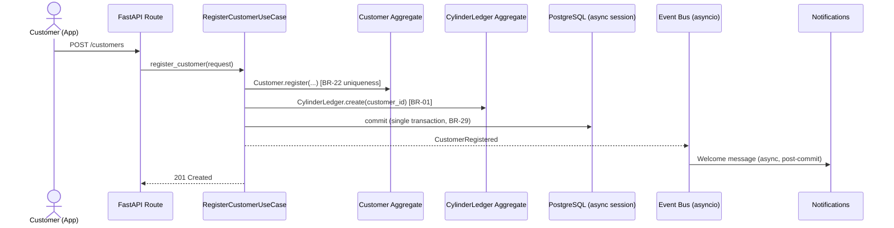

## 2. Authentication (OTP Flow)

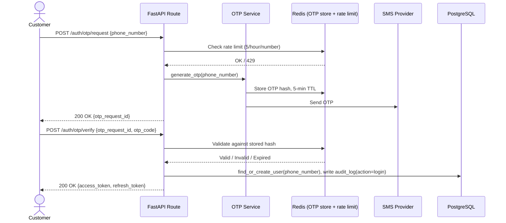

## 3. Booking

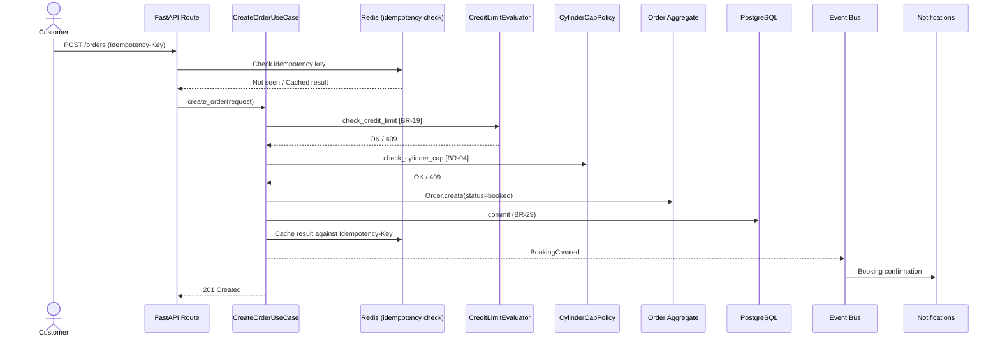

## 4. Cylinder Allocation (Route Planning + Vehicle Load)

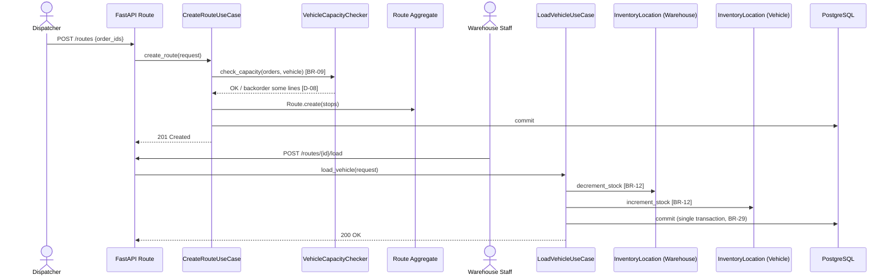

## 5. Driver Assignment

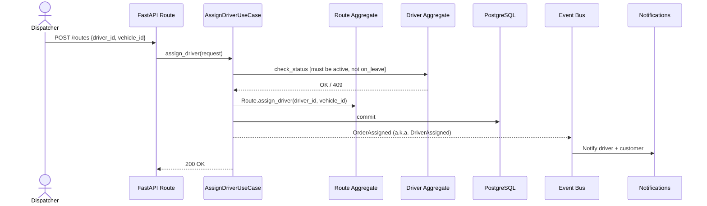

## 6. Delivery

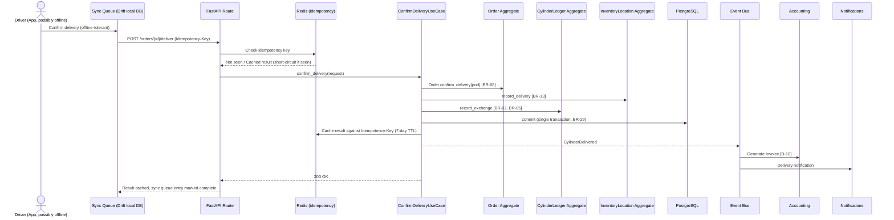

## 7. Inventory Update (Adjustment)

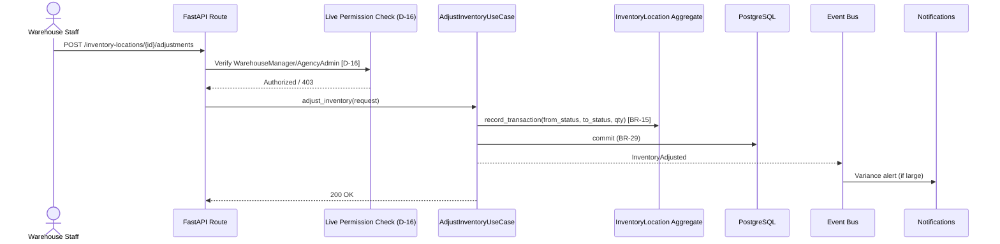

## 8. Payment Collection

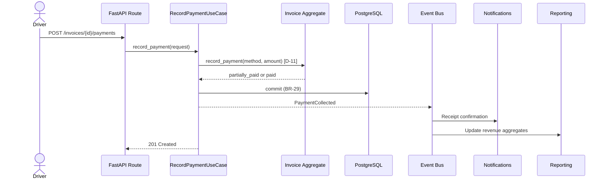

## 9. Invoice Generation

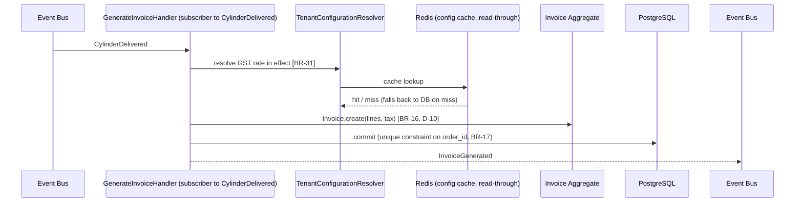

## 10. Complaint Resolution

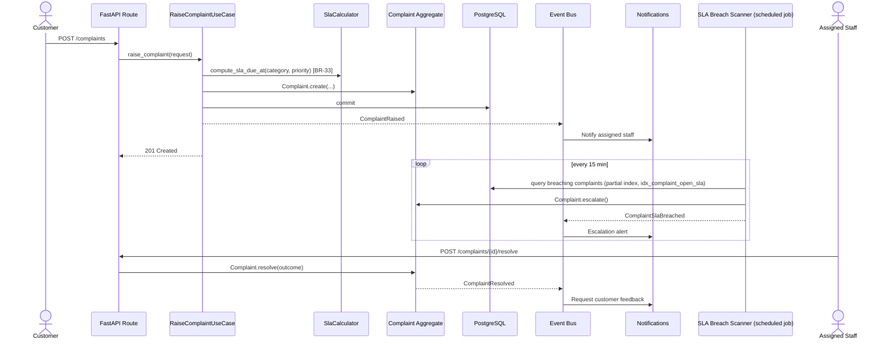

## 11. Notification Flow

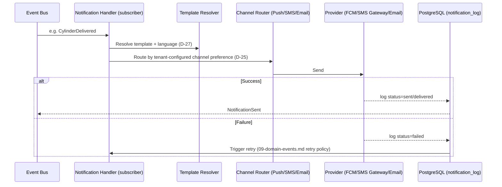

## Best Practices
- Every diagram shows the transaction/commit boundary explicitly (single "commit" per use case), reinforcing BR-29.
- Security-sensitive live permission checks (D-16-style) are shown as distinct steps, never folded silently into "commit."
- Idempotency checks (Redis) are shown explicitly wherever a client-originated action is plausibly retried (Booking, Delivery), matching `09-domain-events.md`'s idempotency-first design principle.

## Risks
- Diagrams simplify by omitting FastAPI dependency-injection wiring and SQLAlchemy session lifecycle details for readability — the actual async session-per-request pattern still applies to every flow shown.

## Alternatives Considered
- One exhaustive UI-to-DB diagram per flow — rejected in favor of the current use-case→aggregate→DB→event abstraction level.

## Future Scalability
- These diagrams remain valid if bounded contexts are later extracted into separate FastAPI services — only the "Event Bus" step changes from in-process `asyncio` to Redis Streams (`09-domain-events.md` Future Scalability).
