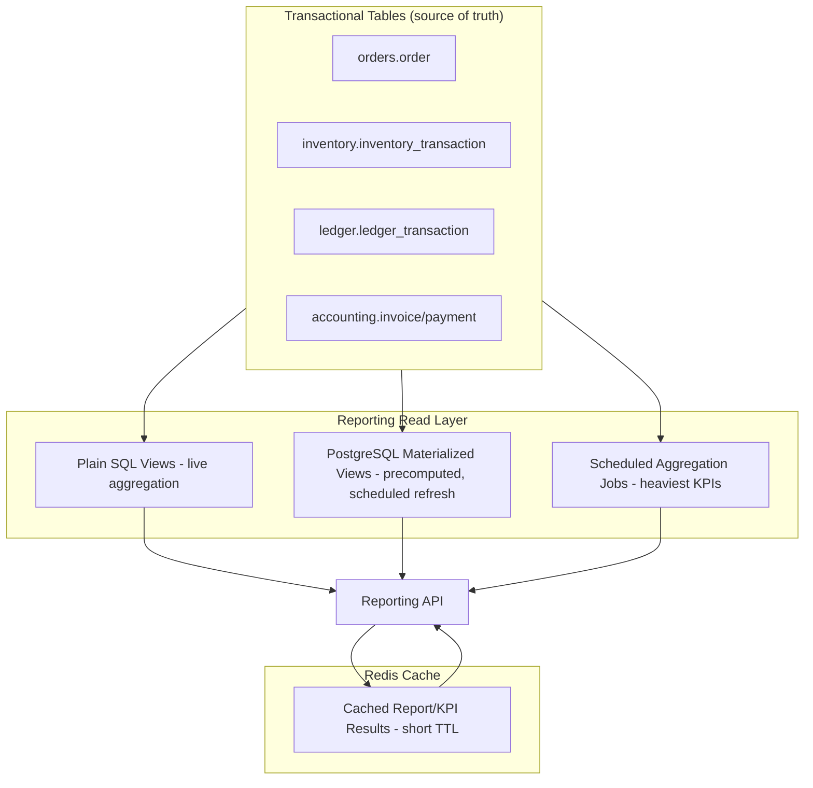

# 15 — Reporting Data Model

## Purpose
Designs the reporting schema/read-model strategy: operational, financial, inventory, customer, driver, audit reports, plus KPI calculations, dashboard metrics, and materialized view usage — for the PostgreSQL/Redis stack.

## Scope
Read-side only — reporting never writes back to transactional aggregates.

## Design Decisions
- **PostgreSQL Materialized Views** (native `CREATE MATERIALIZED VIEW`, `REFRESH MATERIALIZED VIEW CONCURRENTLY`) are the primary mechanism for precomputed reporting aggregates — chosen over a separate data warehouse for Phase 1, since PostgreSQL's materialized views are operationally simple (no new infrastructure) and `REFRESH ... CONCURRENTLY` avoids locking readers during refresh.
- **Redis** caches the *results* of expensive, frequently-requested report queries (e.g., "today's dashboard KPIs") with a short TTL (30–60s) — distinct from materialized views, which precompute the *data*; Redis caches the *query result*, giving a second layer of freshness/performance tuning independent of the materialized view refresh schedule.

## 1. Reporting Architecture

## 2. Operational Reports

### Daily Sales Report
- **Source:** `accounting.invoice` joined to `orders.order`, filtered by `issued_at` date + `tenant_id`/`branch_id`.
- **Materialization:** plain SQL view `rpt.vw_daily_sales`, since invoice volume at Phase 1 scale doesn't yet justify a materialized view — reads directly against the `idx_invoice_tenant_issued_at` index.

### Cylinder Movement Report
- **Source:** `inventory.inventory_transaction` + `ledger.ledger_transaction`, unioned by cylinder type/location, ordered chronologically.
- **Materialization:** plain view, partition-pruned by date range (`19-data-migration.md`).

### Inventory Reconciliation Report
- **Source:** `inventory.reconciliation_record`. **Materialization:** plain view, low volume.

## 3. Financial Reports

### GST Report
- **Source:** `accounting.invoice.tax_amount` broken down by tax-type components (`05-reference-data.md` §13), grouped by filing period.
- **Materialization:** **PostgreSQL Materialized View** `rpt.mv_gst_filing_period`, refreshed nightly via a scheduled job (APScheduler or a Celery-beat-equivalent async task, given the FastAPI/async stack) — GST filing has hard regulatory deadlines that shouldn't depend on live-query performance under load.

### Outstanding Balances Report
- **Source:** `accounting.invoice` where `status IN (issued, partially_paid)`, aggregated per customer.
- **Materialization:** plain SQL view, backing the same query used by `CreditLimitEvaluator` at booking time (BR-19) — **one definition, two consumers**, avoiding drift between the report and the enforcement logic. **Never** materialized/cached, since this must always reflect the true current state for credit-limit enforcement to be correct.

## 4. Inventory Reports
### Stock Availability Report
- **Source:** `inventory.inventory_balance` (already a real-time materialized projection at the transactional layer, per `03-database-schema.md`) — direct read, no additional reporting-layer materialization needed.

## 5. Customer Reports

### Customer Consumption Analysis
- **Source:** `ledger.ledger_transaction` (Exchange transactions), grouped per customer by interval.
- **KPI Calculation:** **Average Refill Interval (days)** = average of the day-differences between consecutive `exchange`-type transactions per customer — this is also the exact input to the Refill Reminder scheduled job (D-26).
- **Materialization:** `rpt.mv_customer_consumption`, refreshed nightly, since it directly feeds the reminder job and doesn't need per-request freshness.

## 6. Driver Reports

### Driver Performance Report
- **Source:** `delivery.route`/`route_stop` (on-time %), `delivery.vehicle_shift_reconciliation` (cash accuracy), `accounting.payment.collected_by` (collection accuracy).
- **KPI Calculations:**
  - **On-time Delivery %** = `count(route_stop WHERE delivered AND delivered_at <= promised_window) / count(route_stop WHERE status IN (delivered, failed))`
  - **Average Delivery Time** = average of `(proof_of_delivery.delivered_at - route_stop assignment time)`
  - **Cash Accuracy** = `1 - (abs(actual_cash - expected_cash) / expected_cash)`, averaged over the period
- **Materialization:** `rpt.mv_driver_performance_daily`, refreshed nightly.

## 7. Audit Reports
- **Source:** `audit.audit_log`, filterable by entity, actor, date range, action type.
- **Materialization:** plain view, partition-pruned — audit queries are investigative/ad-hoc, not a fixed daily aggregate.

## 8. Dashboard KPI Set / Metrics (Real-Time-ish)
Per BR-25 / D-29: On-time Delivery %, Average Delivery Time, Driver Productivity, Revenue, Inventory Accuracy, Customer Satisfaction, Outstanding Collections.

- **Revenue, Outstanding Collections, Inventory Accuracy**: computed from plain views, results cached in **Redis with a 30–60s TTL** — "real-time enough" for a dashboard tile without hammering PostgreSQL on every Dashboard page load/refresh.
- **On-time %, Avg Delivery Time, Driver Productivity**: served from `rpt.mv_driver_performance_daily` (nightly refresh) — the Dashboard KPI tile combines this trailing daily figure with a live count of "orders today" queried directly, giving a hybrid of true-real-time (today's counts) and daily-refreshed (trailing performance %) that matches how these numbers are actually consumed operationally.
- **Customer Satisfaction**: aggregated from `complaints.complaint_feedback.satisfaction_rating`, plain view (low volume), Redis-cached.

## 9. Materialized Views / Caching — Usage Summary

| View/Aggregate | Type | Refresh | Rationale |
|---|---|---|---|
| `rpt.vw_daily_sales` | Plain SQL view | Live | Moderate volume, needs to be current |
| `rpt.vw_outstanding_balances` | Plain SQL view, **never cached** | Live | Shared with BR-19 enforcement — must never be stale |
| `rpt.mv_gst_filing_period` | PostgreSQL Materialized View | Nightly | Regulatory deadline-driven, expensive to compute live |
| `rpt.mv_customer_consumption` | PostgreSQL Materialized View | Nightly | Feeds the Reminder job; no per-request freshness need |
| `rpt.mv_driver_performance_daily` | PostgreSQL Materialized View | Nightly | Period-based KPI, expensive to compute live |
| Dashboard KPI tile results | Redis cache (wraps plain views) | 30–60s TTL | Balances "real-time feel" against read load |
| `inventory.inventory_balance` | Already-materialized (transactional layer) | Real-time (same-transaction) | Reused directly, not duplicated in the reporting layer |

## Best Practices
- Reporting never queries `ledger_transaction`/`inventory_transaction` raw history for anything that has a materialized balance/aggregate already available.
- Every reporting KPI formula is defined **exactly once** in this document and referenced (not redefined) by the Dashboard, scheduled jobs, and any future BI tool integration.
- Materialized view refreshes always use `REFRESH MATERIALIZED VIEW CONCURRENTLY` (requires a unique index on the MV) so refreshes never block concurrent report reads.

## Risks
- **Live-view load on the transactional database**: mitigated by the escalation path to a read-replica if report query load genuinely competes with OLTP traffic (a documented future option, not built at Phase 1).
- **Redis cache staleness for dashboard KPIs**: acceptable within the 30–60s TTL by design; would be a real risk if applied to Outstanding Balances (which is why that one is explicitly never cached, §3).
- **Materialized view refresh job failure**: monitored; a failed nightly refresh means yesterday's data shows for driver performance/consumption — treated as a Medium-severity operational alert, not silently ignored.

## Alternatives Considered
- Separate physical data warehouse (star schema) for reporting — deferred for Phase 1; the platform's report set doesn't yet need dimensional modeling complexity; revisit if BI/analytics needs grow (Phase 2 "BI dashboards").
- Redis as the sole reporting cache with no PostgreSQL materialized views — rejected; Redis alone isn't durable/queryable enough for complex aggregations (GST filing periods, consumption intervals) that benefit from SQL's native `GROUP BY`/window-function capabilities.

## Future Scalability
- A dedicated read-replica or, eventually, a lightweight data warehouse (e.g., via `pg_analytics`/columnar extensions, or a separate OLAP store) become the natural next steps as reporting query volume grows — the KPI formulas and materialization boundaries defined here transfer directly to either evolution.
