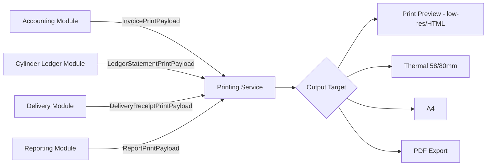

# 16 — Printing Data Model

## Purpose
Defines data contracts for every print/receipt document: Invoice, Delivery Receipt, Cash Receipt, Thermal Receipt, Customer Ledger, GST Reports, Barcode Labels, QR Labels, Receipt Templates, Print Preview.

## Scope
Data contracts only — no rendering implementation.

## Design Decisions
- Every printable document is rendered from a **PrintPayload** — a read-only, fully-resolved Pydantic model assembled by the owning module's use case (Accounting, Delivery, Ledger, Reporting) — the Printing service never queries source tables directly, only ever receives an already-assembled payload, keeping it a pure presentation concern.
- **Print Preview** is not a separate data contract — it's the *same* PrintPayload rendered at lower resolution/DPI or to an HTML/lightweight-PDF target instead of the final format, so preview and final output can never drift from each other's underlying data.

## 1. Print Document Data Flow

## 2. Invoice Print Payload
| Field | Meaning | Source |
|---|---|---|
| `invoice_number` | Display invoice number | `accounting.invoice.id` (formatted) |
| `tenant_header` | Agency name/logo/address | `tenant.tenant`, tenant branding config |
| `customer` | Name, Consumer Number, address | `customer.customer`, `customer_address` |
| `line_items` | Cylinder type, qty, unit price, amount | `orders.order_line` + `tenant.cylinder_type` |
| `tax_breakdown` | CGST/SGST/IGST amounts | `accounting.invoice.tax_amount` + tax rate snapshot at issuance |
| `total_amount` | Grand total | `accounting.invoice.total_amount` |
| `payment_status` | Paid/Partial/Outstanding | `accounting.invoice.status` |
| `qr_code` | Payment QR (if outstanding) or verification QR | Generated at render time from `invoice_id` |
| `issued_at` | Issue timestamp (localized) | `accounting.invoice.issued_at` |

**Business Rule:** GST/tax breakdown fields are mandatory, non-removable blocks in any tenant template customization.

## 3. Thermal Receipt Payload (58mm/80mm)
Condensed subset of the Invoice payload:
| Field | Included? |
|---|---|
| `tenant_header` | Abbreviated (name only) |
| `customer.name` | Yes |
| `line_items` | Yes, condensed |
| `total_amount` | Yes |
| `barcode` | Yes — encodes `invoice_number` |

## 4. Cash Receipt Payload
| Field | Meaning | Source |
|---|---|---|
| `receipt_number` | Display number | `accounting.payment.id` |
| `customer` | Name, Consumer Number | `customer.customer` |
| `amount_received` | Amount | `accounting.payment.amount` |
| `payment_method` | Cash/UPI/Card | `accounting.payment.method` |
| `collected_by` | Driver/staff name | `payment.collected_by` → `identity.identity_user` |
| `related_invoice_number` | Cross-reference | `payment.invoice_id` |

## 5. Delivery Receipt Payload
| Field | Meaning | Source |
|---|---|---|
| `order_number` | Display order number | `orders.order.id` |
| `customer` | Name, address | `customer.customer`, `customer_address` |
| `delivered_lines` | Cylinder type, qty delivered, qty collected empty | `orders.order_line` |
| `proof_of_delivery` | OTP-verified flag, delivered timestamp | `delivery.proof_of_delivery` (signature/photo referenced by ID, not embedded — images, not print-layout text) |
| `driver_name` | Delivering driver | `delivery.driver` → `identity_user` |

## 6. Customer Ledger (Statement) Payload
| Field | Meaning | Source |
|---|---|---|
| `customer` | Name, Consumer Number | `customer.customer` |
| `opening_balance` | Filled/Empty at period start | Computed from `ledger.ledger_transaction` history (point-in-time reconstruction) |
| `transactions` | Date, type, deltas, running balance | `ledger.ledger_transaction`, ordered chronologically |
| `closing_balance` | Filled/Empty at period end | `ledger.ledger_balance` (if period end = now) or reconstructed |

## 7. GST Report Payload
| Field | Meaning | Source |
|---|---|---|
| `filing_period` | Month/quarter | Report parameter |
| `tax_summary` | CGST/SGST/IGST totals | `rpt.mv_gst_filing_period` (`15-reporting-data-model.md` §3) |
| `invoice_line_items` | Per-invoice breakdown for the period | `accounting.invoice` filtered by `issued_at` range |

## 8. Barcode & QR Label Payload
| Field | Meaning | Source |
|---|---|---|
| `label_type` | invoice_reference / cylinder_identity (Phase 2) | — |
| `encoded_value` | The string encoded | Source entity ID (e.g., `invoice_id`, future `cylinder_serial_number`) |
| `display_text` | Human-readable text below the code | Formatted reference number |

**Forward-compatibility:** `cylinder_serial_number`-encoding label type is a **data contract placeholder** for Phase 2's individual cylinder tracking (D-36) — the printing model doesn't need to change when that feature ships, only a new payload field populates.

## 9. Print Template Metadata
| Field | Meaning |
|---|---|
| `document_type` | invoice / thermal_receipt / cash_receipt / delivery_receipt / customer_ledger / gst_report / etc. |
| `tenant_id` | Owning tenant (templates are tenant-scoped, BR-31) |
| `block_composition` | Ordered list of blocks (Header, CustomerDetails, LineItemsTable, TaxBreakdown, Totals, Footer, BarcodeBlock, SignatureBlock) |
| `mandatory_blocks` | Blocks the tenant cannot remove (TaxBreakdown for Invoice/GST documents) |
| `output_formats` | Which formats this template supports: thermal_58/thermal_80/a4/pdf |

## Best Practices
- Every print payload is a flat, pre-resolved Pydantic model — no lazy-loading or further database queries once handed to the Printing service.
- Currency/date formatting is locale-aware based on the tenant's configured language (D-27) and currency (`05-reference-data.md` §17), resolved once when the payload is assembled.

## Risks
- **Payload/template field mismatch**: mitigated by payload schemas versioned alongside `document_type` definitions, validated in CI against the template block library.
- **Tenant customization removing legally-required fields**: mitigated by `mandatory_blocks` enforcement.

## Alternatives Considered
- Direct database queries from within the Printing service — rejected; violates the "printing is a pure presentation concern" principle, and would couple the service to every module's schema.

## Future Scalability
- The `cylinder_serial_number` placeholder and block-based template model mean Phase 2's QR/barcode cylinder-level tracking requires no printing-layer redesign — only new payload population and a new block type.
