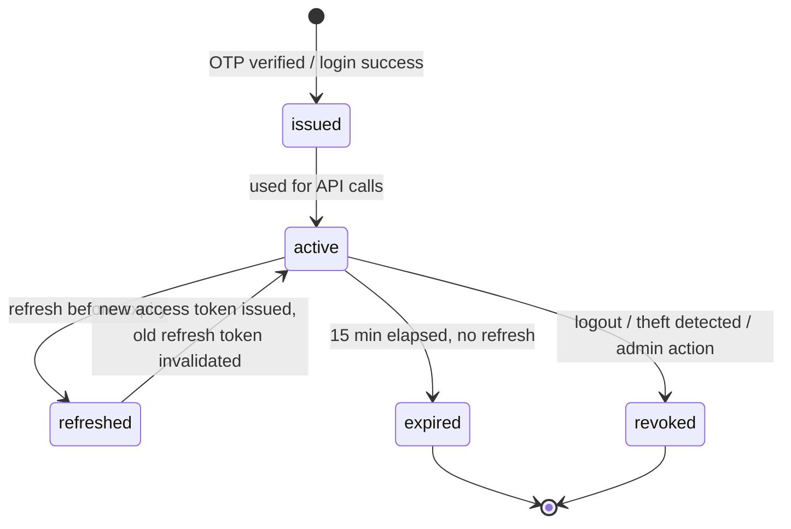

# 17 — API Security

## Purpose
Defines API-layer security: JWT authentication, refresh tokens, RBAC, permission matrix, token lifecycle, scopes, rate limiting, encryption, PII handling, audit logging, and OWASP API Security Top 10 compliance.

## Scope
Applies to every endpoint in `11-api-contracts.md`, for the FastAPI/PostgreSQL/Redis stack.

## Design Decisions
- **`pyjwt[crypto]`** for JWT signing (RS256, asymmetric — private key held only by the auth-issuing service, public key distributable for verification if the API is ever split into multiple services). Confirmed in Phase 6 — **ADR-035**; resolves this section's earlier "python-jose or PyJWT-equivalent" open choice.
- **Argon2id (`argon2-cffi`)** for password hashing, cost parameters configurable via `Settings` rather than hardcoded — **ADR-035**.
- **Redis** is the token/session-adjacent store: OTP codes, rate-limit counters, refresh-token-rotation tracking, and idempotency keys all live in Redis with appropriate TTLs — PostgreSQL remains the durable system of record for `identity_user` and `audit_log` only.

## 1. JWT Structure
```json
{
  "sub": "user-uuid",
  "tenant_id": "tenant-uuid",
  "branch_id": "branch-uuid",
  "role": "dispatcher",
  "scope": "orders:read orders:assign routes:write",
  "exp": 1234567890,
  "iat": 1234567000
}
```
- `tenant_id` is the **sole** source of tenant scoping — never trusted from a request body, query parameter, or header (BR-30).
- Access token lifetime: **15 minutes**, signed RS256.

## 2. Refresh Tokens
- Long-lived (30 days), stored hashed in PostgreSQL (`identity.refresh_token` table — durable, since session continuity matters even across a Redis flush/restart), **rotated on every use**.
- Reuse of an already-rotated refresh token is treated as a theft signal → full session revocation for that user.
- Delivered via `HttpOnly`, `Secure`, `SameSite=Strict` cookie (Dashboard) or platform secure storage (Flutter `flutter_secure_storage`) — never browser `localStorage`.

## 3. Token Lifecycle



## 4. Scopes / Permission Model
Scopes map 1:1 to the permission catalog (`05-reference-data.md` §9) — `orders:read`, `inventory:adjust`, `reconciliation:approve`, etc. Embedded in the JWT `scope` claim for fast, no-database-round-trip authorization on standard endpoints; a FastAPI dependency (`Depends(require_scope("orders:read"))`) enforces this declaratively per route.

## 5. RBAC — Confirmed Role Set (D-38)
`super_admin`, `agency_admin`, `manager`, `warehouse_staff`, `dispatcher`, `accountant`, `driver`, `customer`.

## 6. Permission Matrix (Representative Excerpt)

| Permission | super_admin | agency_admin | manager | warehouse_staff | dispatcher | accountant | driver | customer |
|---|---|---|---|---|---|---|---|---|
| `customers:create` | — | ✅ | ✅ | — | ✅ | — | — | ✅ (self) |
| `orders:create` | — | ✅ | ✅ | — | ✅ | — | — | ✅ (self) |
| `orders:cancel_approve` | — | ✅ | ✅ | — | — | — | — | — |
| `orders:deliver` | — | — | — | — | — | — | ✅ (own) | — |
| `inventory:adjust` | — | ✅ | ✅ | ✅ | — | — | — | — |
| `reconciliation:approve` | — | ✅ | — | ✅ | — | — | — | — |
| `credit_notes:approve` | — | ✅ | ✅ | — | — | — | — | — |
| `ledger:read` | — | ✅ | ✅ | — | — | ✅ | — | ✅ (self) |
| `tenant:configure` | ✅ | ✅ | — | — | — | — | — | — |

Full matrix maintained in `identity.role_permission` (single source of truth); this table is illustrative, not exhaustive.

## 7. Live (Non-Claim-Based) Permission Checks
High-sensitivity actions **re-verify against PostgreSQL**, not JWT claims alone, since claim staleness (up to 15 minutes) is unacceptable for these: `reconciliation:approve` (D-16), `credit_notes:approve` (D-17), `orders:cancel_approve` (D-19), any `super_admin` cross-tenant action.

## 8. Rate Limiting
- **Redis-backed sliding-window** rate limiting via a FastAPI middleware/dependency — per-tenant and per-user, tuned separately for OTP-request endpoints (aggressive), standard CRUD (generous), bulk/export endpoints (strict).
- Fails **open** (allows the request) if Redis is briefly unreachable, rather than blocking all traffic on a cache outage — a deliberate availability-over-strictness trade-off for rate limiting specifically (unlike idempotency keys, where a Redis outage should fail the specific retried request, not silently double-apply it).

## 9. Encryption
| Layer | Mechanism |
|---|---|
| Transport | TLS 1.2+ everywhere |
| Database at rest | Encryption at rest provided by the managed PostgreSQL platform (Supabase, ADR-027), plus `pgcrypto` for column-level encryption of specific high-sensitivity fields |
| KYC documents | Application-layer envelope encryption (Key Vault-managed key) before Blob upload, in addition to Storage Service Encryption |
| Payment data | Never stored directly — tokenized via PCI-DSS-compliant gateway |
| JWT payload | No sensitive PII beyond operational claims — never embeds KYC/payment details |
| Redis | TLS-enabled connection to the managed Redis instance, no PII stored beyond transient OTP hashes and idempotency keys (both short-TTL, non-reversible where possible — OTPs stored as a salted hash, not plaintext) |

## 10. PII Handling
- KYC documents, addresses, phone numbers are PII — access restricted by permission (`kyc:read` distinct from general `customers:read`), logged on every access, never included in application logs (structured logging with a field-masking processor for known PII field names).
- API responses never include another customer's PII beyond what the requesting role's permission explicitly allows.

## 11. Audit Logging (API-Facing)
- Every mutating endpoint call, every `403`, and every authentication event (success/failure) writes to `audit.audit_log` (BR-28, D-39).
- `403` responses logged with extra scrutiny — a spike in `403`s from one user/IP is a probing/misconfiguration signal.

## 12. OWASP API Security Top 10 Compliance

| Risk | API-Layer Mitigation |
|---|---|
| API1 Broken Object Level Authorization | Every resource lookup scoped by tenant_id + ownership check (repository layer never trusts a bare ID) |
| API2 Broken Authentication | OTP rate limiting, refresh rotation, account lockout, RS256-signed JWTs |
| API3 Broken Object Property Level Authorization | Request/Response Pydantic models never expose fields beyond what the caller's role should see (e.g., a Driver's Order view excludes full customer profile fields) |
| API4 Unrestricted Resource Consumption | Rate limiting (§8), bulk-operation thresholds (`10-api-design-guidelines.md` §8), pagination caps |
| API5 Broken Function Level Authorization | Scope/permission-based route dependencies (§4), live re-checks for high-sensitivity actions (§7) |
| API6 Unrestricted Access to Sensitive Business Flows | Rate limiting + anomaly-worthy audit logging on booking/payment/refund flows specifically |
| API7 Server Side Request Forgery | Outbound calls restricted to an allow-list of known integration hosts (`20-integration-contracts.md`) |
| API8 Security Misconfiguration | IaC-provisioned environments, no manual config drift, FastAPI debug mode never enabled in production |
| API9 Improper Inventory Management | OpenAPI spec versioning (`12-openapi-specification.md`) keeps every live endpoint documented; deprecated versions have a defined sunset |
| API10 Unsafe Consumption of APIs | Integration adapters (`20-integration-contracts.md`) validate/sanitize all inbound webhook payloads from third parties before they reach domain logic |

## 13. API Security Headers
| Header | Value | Purpose |
|---|---|---|
| `Strict-Transport-Security` | `max-age=63072000; includeSubDomains` | Force HTTPS |
| `X-Content-Type-Options` | `nosniff` | Prevent MIME sniffing |
| `Content-Security-Policy` | restrictive, Dashboard-specific | XSS mitigation |
| `X-Frame-Options` | `DENY` | Clickjacking mitigation |
| `Referrer-Policy` | `strict-origin-when-cross-origin` | Limit referrer leakage |
| `Cache-Control` | `no-store` on PII/financial responses | Prevent caching of sensitive data |

## Best Practices
- Principle of least privilege: every role starts from zero permissions and gains them explicitly.
- Every `403` is logged for security monitoring, not just silently returned.

## Risks
- **JWT claim staleness**: mitigated by short access-token lifetime + live re-check for high-sensitivity actions.
- **Refresh token theft**: mitigated by rotation + reuse detection.
- **Redis availability coupling**: rate limiting fails open (§8); idempotency-key checks failing during a Redis outage are a documented, accepted risk window (a retried request could theoretically double-apply if Redis is down at the exact retry moment) — mitigated by Redis being deployed as a managed, highly-available instance with automatic failover, making this a low-probability edge case, not an unaddressed gap.

## Alternatives Considered
- Session-based auth instead of JWT — rejected; JWT better supports the stateless, horizontally-scaled async FastAPI deployment and offline-first mobile requirement.
- Storing JWT in `localStorage` — rejected due to XSS exposure.

## Future Scalability
- Mandatory MFA rollout beyond Super Admin as the platform scales.
- Formal SOC 2 / ISO 27001 readiness assessment once the platform reaches broader multi-tenant commercial scale.
