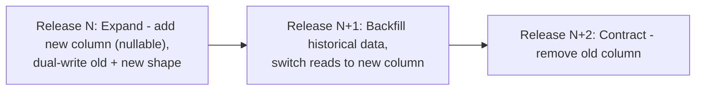
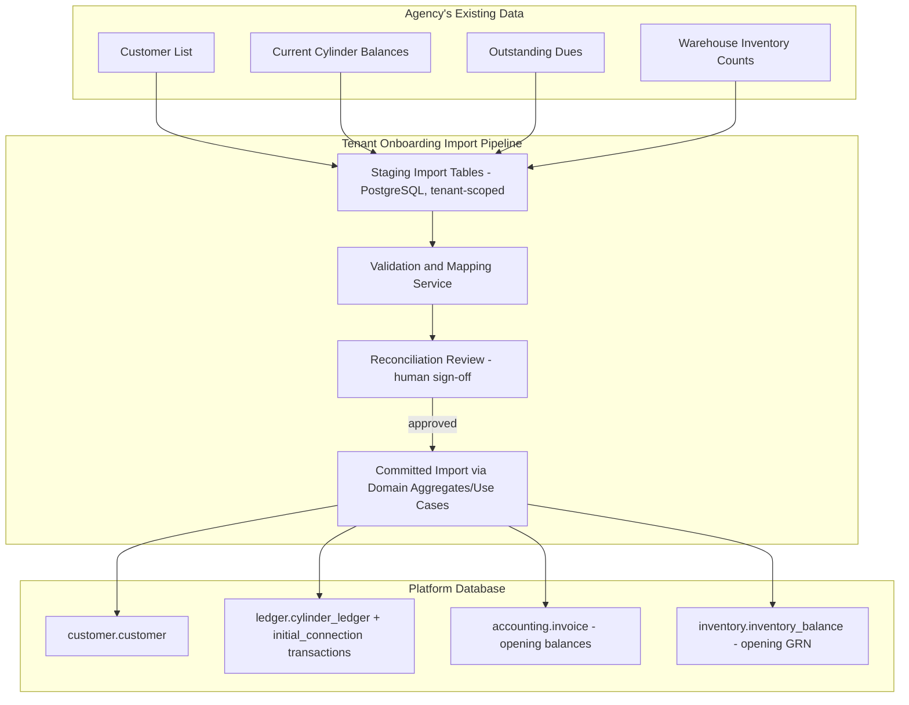

# 19 — Data Migration Strategy

## Purpose
Describes the complete migration strategy: Alembic versioning/rollback, seed/reference data, tenant migration, archive strategy, backup strategy.

## Scope
Covers ongoing PostgreSQL schema evolution (via Alembic) and the recurring, business-critical process of onboarding new agencies' historical data.

## Design Decisions
- **Alembic** is the sole schema-migration tool — autogenerate is used only as a starting draft; every autogenerated migration is manually reviewed and edited before commit, since Alembic's diff detection can miss or mis-detect certain PostgreSQL-specific constructs (partial indexes, RLS policies, CHECK constraints referencing functions) that must be added by hand.

## 1. Alembic Versioning

- Every migration is a linear-history revision file (`alembic/versions/<revision>_<slug>.py`), applied in strict sequence per environment (Dev → QA → Staging → Production).
- **Expand/Contract pattern** for zero-downtime deploys:

- RLS policies, partial indexes, and CHECK constraints are **always hand-written** in the migration file (not relied upon from autogenerate), reviewed with the same rigor as the table definition itself, since these are exactly the constructs enforcing BR-30 (tenant isolation) and other Critical-priority business rules.

## 2. Rollback Strategy
- Every migration ships with a tested `downgrade()` function, validated in Staging before Production promotion.
- Rollback is only safe for the **Expand** phase (adding nullable columns/tables) — once a **Contract** phase migration has run, rollback requires restoring from backup (§7) rather than a reverse migration, since the old structure's data is genuinely gone. Contract-phase migrations get extra pre-release scrutiny for this reason.
- Rollback decision authority follows the same manual-gated production deployment approval as forward deploys.

## 3. Seed Data
Data required for the platform to function at all, seeded once via a dedicated Alembic data-migration (not application code) at environment provisioning:

| Data | Source |
|---|---|
| `identity.role` (8 roles) | Fixed seed, D-38 |
| `identity.permission` catalog | Fixed seed, versioned with releases |
| `identity.role_permission` default mapping | Fixed seed |

## 4. Reference Data

**Master data (Platform-Global):** Order/Delivery/Invoice/Complaint status enums, Cylinder Status (7-state), Countries, Currencies, Languages — fixed, seeded via Alembic data-migration, rarely changed thereafter.

**Reference data (Tenant-Scoped):** seeded automatically at **tenant provisioning** with sensible defaults (Cylinder Types, Complaint Categories, Tax Types, `tenant_configuration` defaults for GST rate/cylinder cap/credit limit/cancellation charge %/reminder interval), then independently editable per tenant with no engineering involvement.

## 5. Tenant Migration (New Agency Onboarding)

The recurring, business-critical scenario: an agency currently on paper/Excel/legacy systems needs its customers, cylinder balances, and outstanding dues imported before go-live.

**Process:**
1. **Extract** — agency exports data via a versioned CSV/Excel template.
2. **Stage** — raw data loaded to tenant-scoped staging tables, no validation applied yet, original import preserved for audit.
3. **Validate & Map** — automated checks (required fields, phone format, duplicates) plus manual field-mapping for non-standard legacy exports.
4. **Reconciliation Review** — human-reviewable summary (customer count, opening balances, outstanding dues total); no commit without explicit sign-off.
5. **Commit** — creates `customer` records, an `initial_connection` ledger transaction per customer (BR-01), opening-balance `invoice` records, and an opening-stock `goods_receipt_note` (D-15) — all via the same async use cases/domain aggregates as live operations, never raw `INSERT` statements.
6. **Post-migration verification** — automated reconciliation comparing imported totals against source one more time; standard reconciliation/audit trail applies from that point forward exactly as for organically-created data.

**Critical principle:** migrated data enters through the **same domain aggregates and business rules as live operations** — an imported customer's opening balance is a real, auditable `ledger_transaction`, never a raw SQL insert bypassing domain invariants (BR-01–BR-34).

## 6. Migration Tooling
- A dedicated **Tenant Onboarding Service** (a FastAPI-adjacent async CLI/worker using the same Application/Domain layers as the main API), not raw SQL scripts.
- Import runs are logged and resumable (idempotent per source row).

## 7. Archive Strategy

- **Native PostgreSQL declarative partitioning** (`PARTITION BY RANGE (performed_at)`) for `ledger_transaction`, `inventory_transaction`, and `audit_log` — monthly partitions, auto-created in advance via a scheduled job (never reactively).
- **Hot data** (current + prior 12 months, configurable): remains in the primary partitioned tables, fully indexed.
- **Warm/Cold data**: older partitions detached and moved to a same-schema archive tablespace/database (lower-cost storage tier), with Reporting transparently querying across hot+archive via a partitioned view for long-range historical reports.
- `audit_log` archival respects statutory retention requirements (final duration pending legal/finance confirmation) — archival moves data to cheaper storage but never deletes before the retention period expires.
- **Right-to-erasure handling**: Customer records are never hard-deleted (FR-CM-07); erasure requests are handled via **anonymization** (scrubbing PII while retaining the transactional/financial skeleton for audit integrity), formalized with legal counsel given the confirmed India/DPDP-relevant jurisdiction.

## 8. Backup Strategy
- **Azure Database for PostgreSQL** automated backups: full + continuous WAL archiving, enabling **Point-in-Time Restore (PITR)** within the retention window.
- **Geo-redundant backups** to the paired Azure region for Disaster Recovery.
- **Long-Term Retention** for statutory/GST record-keeping.
- Redis is treated as **ephemeral/cache-tier** — no backup strategy needed for Redis itself (rate-limit counters, idempotency keys, OTP codes are all safely regenerable/re-derivable or short-lived by design); PostgreSQL remains the sole durable system of record.
- Backup job failure is a **Critical** alert — never silently degraded.

## Best Practices
- Never migrate directly into production tables via bulk INSERT — always through the validated, domain-rule-respecting import pipeline (§5–6).
- Every tenant onboarding preceded by a Staging dry run using the agency's actual export data.
- Every Alembic migration reviewed by a second engineer, with RLS/partial-index/CHECK-constraint additions receiving explicit sign-off given their BR-30-adjacent criticality.

## Risks
- **Legacy data quality**: mitigated by the mandatory Reconciliation Review (§5.4).
- **Large onboarding batches straining the live system**: mitigated by running via background-worker infrastructure during low-traffic windows.
- **Contract-phase migration irreversibility**: mitigated by extra pre-release scrutiny and backup-based recovery as the documented fallback.
- **Alembic autogenerate missing PostgreSQL-specific constructs**: mitigated by the mandatory manual-review policy (Design Decisions above).

## Alternatives Considered
- Direct bulk SQL import bypassing the domain layer — rejected; would create migrated-tenant data unvalidated against BR-01–BR-34.
- Tenant self-service CSV upload with no human review — rejected for this platform maturity stage given financial/inventory stakes.

## Future Scalability
- As onboarding volume grows, the manual Reconciliation Review is the natural next automation target — e.g., auto-approving low-risk imports while requiring human review for large/high-stakes onboardings.
- Native PostgreSQL partitioning (§7) and Azure's managed elastic scaling together take the platform from launch state toward supporting thousands of agencies without a schema rewrite — only partition-boundary management and storage-tier changes.
