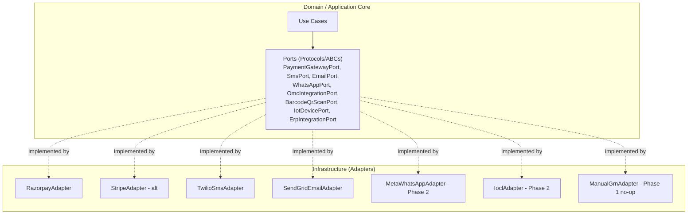

# 20 — Integration Contracts (Ports & Adapters)

## Purpose
Designs abstract, provider-agnostic contracts for every future external integration, using **Ports & Adapters (Hexagonal Architecture)** so a specific provider can be swapped without touching domain logic.

## Scope
WhatsApp, SMS, Email, Payment Gateway, Government LPG APIs (OMC), Barcode Scanners, QR Scanners, IoT Devices, ERP Systems.

## Design Decisions
- **Ports** are abstract interfaces (Python `Protocol` classes or `ABC`s) defined in the Application layer — they describe *what* the domain needs from the outside world, in the domain's own language, never in a vendor's terminology.
- **Adapters** are concrete implementations in the Infrastructure layer, one per provider, translating between the Port's abstract contract and a specific vendor's SDK/API/webhook shape.
- This is a direct application of Clean Architecture's Dependency Inversion Principle: the Domain/Application layers depend on the Port interface; Infrastructure depends on (implements) the Port — dependencies point inward, exactly as in the rest of the backend architecture.

## 1. Hexagonal Architecture Diagram



Each Port is designed so that switching providers is an **Infrastructure-layer-only change**, wired via FastAPI's dependency-injection system (`Depends()` resolving to a concrete adapter based on tenant configuration) — no Domain or Application code references a specific vendor's SDK, request shape, or terminology.

## 2. WhatsApp (Phase 2 — Booking & Notifications)

**Port:** `WhatsAppPort`
```
async def send_message(recipient_phone: str, template_key: str, template_params: list[str]) -> MessageResult
async def receive_inbound_message(webhook_payload: dict) -> ParsedInboundMessage
```
- **Abstraction principle:** `template_key` maps to the platform's own notification template catalog (`05-reference-data.md` §10), translated to the provider's specific template ID inside the adapter — the Application layer never references a WhatsApp Business API template ID directly.
- **Retry/Failure:** same policy as `09-domain-events.md`'s general notification retry.

## 3. SMS

**Port:** `SmsPort`
```
async def send_sms(recipient_phone: str, message: str) -> SmsResult
```
- Used for OTP delivery and critical notification fallback (D-25).
- **Abstraction principle:** OTP generation/validation logic lives entirely in the platform (Redis-backed, `17-api-security.md`) — the SMS adapter only ever receives a pre-composed message string, never generates or validates the OTP itself, keeping OTP security logic provider-independent.

## 4. Email

**Port:** `EmailPort`
```
async def send_email(recipient_email: str, template_key: str, template_params: list[str], attachments: list[Attachment]) -> EmailResult
```
- Used for staff password reset, invoice delivery, scheduled report delivery (D-28).

## 5. Payment Gateway

**Port:** `PaymentGatewayPort`
```
async def initiate_payment(amount: Money, order_reference: str) -> PaymentSession
async def verify_payment(gateway_transaction_ref: str) -> PaymentVerificationResult
async def initiate_refund(gateway_transaction_ref: str, amount: Money) -> RefundResult
```
- **Abstraction principle:** the `Money` value object (`01-domain-model.md`) is the only amount representation crossing the Port boundary — currency-handling quirks of a specific gateway are absorbed entirely in the adapter.
- **Security:** the platform never receives or stores raw card data — only `gateway_transaction_ref` (`17-api-security.md` §9); PCI-DSS scope stays entirely with the provider.
- **Webhook verification:** every provider's webhook signature-verification logic lives in its adapter, translated to a normalized `PaymentVerificationResult` before reaching Application code.

## 6. Government LPG APIs (OMC — IOCL/BPCL/HPCL, Phase 2)

**Port:** `OmcIntegrationPort`
```
async def submit_refill_request(warehouse_id: UUID, cylinder_type_id: UUID, quantity: int) -> OmcRequestResult
async def check_refill_status(reference_number: str) -> OmcStatusResult
async def receive_stock_confirmation(webhook_payload: dict) -> ParsedGrnConfirmation
```
- **Phase 1 state:** this Port exists as a documented interface with **no live external implementation** — Phase 1 uses the manual GRN process (D-15), implemented as a `ManualGrnAdapter` that simply requires human data entry rather than calling any external API. This is the same Port, satisfied by a different Adapter — exactly the Hexagonal Architecture pattern doing its job: the eventual real IOCL/BPCL/HPCL adapters slot in later without changing `goods_receipt_note`'s domain meaning or any Application-layer code.
- **Abstraction principle:** each OMC (IOCL, BPCL, HPCL) likely has a distinct real-world API shape — each gets its own adapter implementing the same `OmcIntegrationPort`, so a tenant's choice of primary OMC is an Infrastructure-layer configuration (resolved per-tenant via `tenant_configuration`), not a Domain-layer branch.

## 7. Barcode Scanners (Phase 2 — Cylinder-Level Tracking, D-36)

**Port:** `BarcodeQrScanPort`
```
async def decode_scan(raw_scan_data: bytes) -> DecodedCode
```
- **Abstraction principle:** intentionally minimal — hardware/SDK specifics (camera-based scanning on Flutter mobile vs. a dedicated handheld scanner peripheral) are entirely an Infrastructure/mobile-app concern; the Application layer only ever receives a decoded string value, matching the `cylinder_serial_number` placeholder already reserved in `16-printing-data-model.md` §8.

## 8. QR Scanners
Same Port as §7 (`BarcodeQrScanPort` handles both barcode and QR — a `code_type` field on `DecodedCode` discriminates), since both resolve to the same "decoded string" abstraction from the Application layer's point of view.

## 9. IoT Devices (Future — e.g., Smart Cylinder Sensors, Vehicle GPS Trackers)

**Port:** `IotDevicePort`
```
async def subscribe_to_device_events(device_id: str, event_types: list[str]) -> Subscription
async def receive_device_event(payload: dict) -> NormalizedIotEvent
```
- **Abstraction principle:** not scoped to any specific IoT protocol (MQTT, LoRaWAN, proprietary vendor webhook) — the adapter normalizes whatever the specific device/vendor sends into `NormalizedIotEvent`, which could plausibly feed `InventoryAdjusted` (e.g., a smart-cylinder sensor detecting a fill-level change) in a future phase without any change to the Inventory domain model itself.
- **Status:** purely speculative/future-facing — no specific device type is committed to in this design; the Port exists to demonstrate the platform's extension point, not as a near-term deliverable.

## 10. ERP Systems (Future — Tenant's External Accounting/ERP)

**Port:** `ErpIntegrationPort`
```
async def export_invoices(from_date: date, to_date: date) -> ErpExportBatch
async def export_inventory_movements(from_date: date, to_date: date) -> ErpExportBatch
async def sync_status(batch_id: UUID) -> ErpSyncStatus
```
- **Abstraction principle:** a generic export/sync Port rather than one tied to a specific ERP (Tally, SAP, Zoho Books) — each tenant's specific ERP gets its own adapter; the Application layer only assembles export batches from its own data (Invoice, InventoryTransaction), never reaching into a specific ERP's data model.

## 11. Integration Governance

| Principle | Detail |
|---|---|
| Port ownership | Application layer defines every Port (`Protocol`/`ABC`); Infrastructure implements Adapters |
| No vendor leakage | Domain/Application code never imports a vendor SDK, references a vendor-specific error code, or uses vendor terminology |
| Configuration | Which adapter is active per tenant/integration is `tenant_configuration` (BR-31) — swappable without redeployment where the adapter itself is already deployed |
| Failure isolation | An integration provider outage never blocks the core transactional flow it's attached to (e.g., SMS provider down → notification queued for retry, but the underlying `CylinderDelivered`'s Ledger/Inventory effects already committed per BR-29) |
| Security | Outbound calls restricted to an allow-list of known integration hosts (`17-api-security.md` §12, SSRF mitigation) |
| Testability | Every Port has a corresponding in-memory/fake Adapter used in tests, so Application-layer use cases are fully testable without any real network call — a direct testability benefit of the Ports & Adapters pattern |

## Best Practices
- Every new integration is designed Port-first (interface defined and reviewed) before any specific Adapter is built.
- Adapters are the only place vendor-specific error handling/retry-quirks live — the Application layer's retry policy (`09-domain-events.md`) is uniform regardless of provider.
- Adapter selection is resolved via FastAPI's dependency-injection container at request time, based on `tenant_configuration`, not hardcoded per-environment.

## Risks
- **Port too narrow for a future provider's capabilities**: mitigated by keeping Ports intentionally minimal (lowest common denominator) rather than modeling one provider's full feature set.
- **OMC integration complexity underestimated**: each of IOCL/BPCL/HPCL likely has meaningfully different real-world API maturity — flagged as a Phase 2 planning risk, not resolved here.

## Alternatives Considered
- **Direct vendor SDK usage throughout the codebase** — rejected; would make provider switching a cross-cutting Domain/Application change instead of an isolated Infrastructure change, violating Dependency Inversion and defeating the purpose of Hexagonal Architecture.

## Future Scalability
- New integrations (beyond the 8 listed) follow the same Port-first, Application-owned-interface pattern without any change to this document's governing principles (§11) — only a new Port and Adapter are added.
- As bounded contexts are potentially extracted into separately deployed FastAPI services, the same Ports remain valid — only the Adapter's transport (in-process call vs. HTTP call to another internal service) changes, never the Port's contract.
