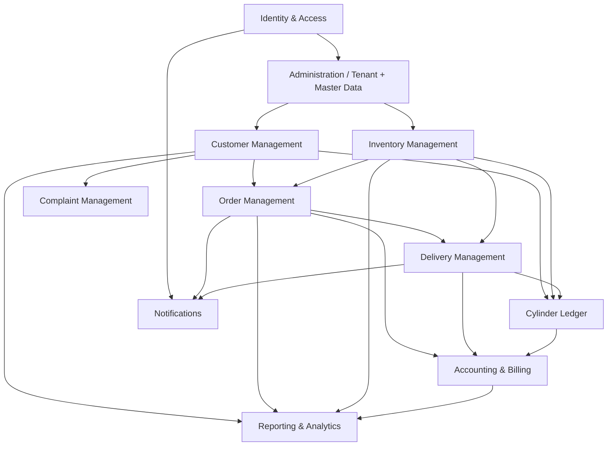

# Module Implementation Plan

Per-bounded-context breakdown: what each module owns, what it depends on, and the order in which its components are built.

**Scope of this document:** the shape of the work per module. Detailed requirements live in `docs/business/`, `docs/srs/`, and `docs/data/`; the delivery order lives in [`roadmap.md`](./roadmap.md); what is actually being worked on right now lives in [`planning/current_phase.md`](../../planning/current_phase.md).

> Created in Phase 0 (2026-08-09), resolving a dangling link in `docs/implementation/README.md`.

---

## 1. Standard Implementation Order Within a Module

Every module is built in the same order, and the order is not optional — each step depends on the one before it.

```
Domain           aggregates, entities, value objects, invariants, domain events, state machines
   ↓
Application      use cases, commands, queries, ports, DTOs
   ↓
Infrastructure   ORM models, mappers, repositories, migrations (incl. RLS policies)
   ↓
API              routers, Pydantic schemas, permission dependencies, OpenAPI metadata
   ↓
Tests            domain unit → application unit → integration → API → tenant isolation
   ↓
Frontend         models → generated client → state → components → pages → routing → tests
   ↓
Mobile           only after the backend APIs exist
```

**Backend before frontend, always** (`.rules/feature-development.md`). A frontend built against an imagined API is rework waiting to happen.

**Domain first within the backend.** The domain layer is where business invariants live, and it is the only layer that can be fully tested without infrastructure. Starting anywhere else means the invariants get written last, or not at all.

## 2. Module Dependency Graph



Never implement a module before its prerequisites are complete (`knowledge/10-feature-map.md`).

## 3. Modules

Each module owns its data (`knowledge/04-data-summary.md`) and its schema (`docs/data/03-database-schema.md`). Cross-module access is via application services, never direct database reads into another context's tables.

### Identity & Access — `identity`

| | |
|---|---|
| **Owns** | Users, roles, permissions, refresh tokens, sessions |
| **Aggregates** | User, Role |
| **Depends on** | Nothing |
| **Key decisions** | D-37 (authentication), D-38 (RBAC role list) |
| **Notable** | Every other module depends on this. Tenant resolution and the RLS session variable originate here (`docs/architecture/06-database-architecture.md` §2). `identity_user.tenant_id` is nullable for Super Admin — the one documented exception to the tenant rule. |
| **Residual question** | Warehouse Staff vs Warehouse Manager — same role renamed, or two tiers? (D-38 residual) |

### Administration / Tenant & Master Data — `tenant`

| | |
|---|---|
| **Owns** | Tenant, branch, warehouse, cylinder type, pricing, tax config, feature flags |
| **Aggregates** | Tenant |
| **Depends on** | Identity |
| **Key decisions** | D-02 (multi-branch/warehouse), D-04 (configurable cylinder types), D-42 (configurability), BR-31 |
| **Notable** | Sequenced **before** Customer Management, deviating from `knowledge/10-feature-map.md`. Customer, Inventory, and Orders all reference master data; building them first means building them twice. Tenant configuration is read at runtime, never hardcoded. |

### Customer Management — `customer`

| | |
|---|---|
| **Owns** | Customer, addresses, KYC documents, LPG connections |
| **Aggregates** | Customer |
| **Depends on** | Administration |
| **Key decisions** | D-03 (four customer types), D-21 (connection closure settlement) |
| **Notable** | Customer records are never hard-deleted (FR-CM-07). Customer type drives pricing, cylinder limits, taxes, and payment terms — it is not a label. Full-text search uses PostgreSQL GIN/`tsvector`. |
| **Blocked by** | KYC document types pending business/legal (A-20) |

### Inventory Management — `inventory`

| | |
|---|---|
| **Owns** | Inventory locations, inventory transactions, GRN, reconciliation records |
| **Aggregates** | InventoryLocation |
| **Depends on** | Administration |
| **Key decisions** | D-04 + D-14 (cylinder type × 7 statuses × location), D-15 (manual GRN in Phase 1), D-16 (reconciliation authority), D-30, D-31 |
| **Notable** | **Inventory can never go negative** — a domain invariant enforced in the aggregate, with a database check constraint as backstop. `inventory_transaction` is append-only. The counter granularity (type × status × location) is a large matrix; see the residual question below. |
| **Residual question** | Can Quarantine and Damaged be merged for Phase 1? (D-04/D-14 residual) |

### Order Management — `orders`

| | |
|---|---|
| **Owns** | Booking, order, order lines, status history, cancellation records |
| **Aggregates** | Order |
| **Depends on** | Customer, Inventory |
| **Key decisions** | D-05 (four booking channels), D-07 (order state model), D-08 (partial fulfilment), D-19 (cancellation) |
| **Notable** | State transitions follow `docs/data/08-state-machines.md` strictly — illegal transitions are rejected by the aggregate, not by the UI. Every order stores a Booking Source. Order creation supports idempotency keys for retry-safe mobile submission. |
| **Residual question** | Cancellation fee amount and tenant-configurability (D-19 residual) |

### Delivery Management — `delivery`

| | |
|---|---|
| **Owns** | Routes, route stops, vehicle load events, shift reconciliation, proof of delivery |
| **Aggregates** | Route, Delivery |
| **Depends on** | Orders, Inventory |
| **Key decisions** | D-22 (one driver + vehicle + route per shift), D-23 (fleet ownership models), D-12 (failed delivery), D-13 (payment refusal), D-24 (offline-first) |
| **Notable** | The most complex module. Delivery confirmation atomically updates Order, Cylinder Ledger, and Inventory in **one transaction** (BR-29) — this is the canonical example in `docs/architecture/01-system-architecture.md` §4. Every mutating endpoint must be idempotent, because the offline Driver App will retry. |

### Cylinder Ledger — `ledger`

| | |
|---|---|
| **Owns** | Customer cylinder ledger, ledger transactions |
| **Aggregates** | CylinderLedger |
| **Depends on** | Customer, Inventory, Delivery |
| **Key decisions** | D-09 (exchange vs purchase), D-14 (cylinder statuses), D-21 (closure settlement) |
| **Notable** | `ledger_transaction` is **append-only**; corrections are offsetting rows, never edits (BR-06), enforced by revoked database privileges. The ledger must always balance — the invariant the whole platform exists to protect. Point-in-time reconstruction must be possible from the transaction log. This module is the standing candidate for future event sourcing (ADR-004's surviving reasoning). |

### Accounting & Billing — `accounting`

| | |
|---|---|
| **Owns** | Invoices, payments, credit notes, cash handovers |
| **Aggregates** | Invoice, Payment |
| **Depends on** | Orders, Delivery, Customer, Ledger |
| **Key decisions** | D-10 (one invoice per delivered order), D-11 (partial payment), D-17 (refund workflow), D-18 (cash shortfall), D-32 (UPI/card devices), D-33 (collections) |
| **Notable** | Invoices lock in the price at transaction time; historical invoices never change when pricing changes. Financial records are immutable after reconciliation. GST is tenant-configurable (D-06, BR-31). Payment endpoints require idempotency keys. |

### Complaint Management — `complaints`

| | |
|---|---|
| **Owns** | Complaints, assignments, resolutions, feedback |
| **Aggregates** | Complaint |
| **Depends on** | Customer |
| **Key decisions** | D-20 (scope, SLA) |
| **Notable** | SLA breach detection runs as a scheduled job every 15 minutes. That job failing silently is itself an incident — it protects a customer-facing guarantee (`docs/architecture/12-observability.md` §5). |

### Notifications

| | |
|---|---|
| **Owns** | Notification templates, delivery log, scheduling |
| **Depends on** | Identity, Orders, Delivery, Accounting, Complaints |
| **Key decisions** | D-25 (channels), D-26 (reminder triggers) |
| **Notable** | Subscribes to domain events rather than being called directly by other modules — this is what keeps it decoupled enough to extract later. Sends are retried; failures are logged, never silently dropped. Distinct from real-time push (`docs/architecture/16-realtime-architecture.md`), which serves connected clients; notifications reach users who are not. |

### Reporting & Analytics

| | |
|---|---|
| **Owns** | Read models and projections |
| **Depends on** | All operational modules |
| **Key decisions** | D-28 (scheduling), D-29 (KPI definitions) |
| **Notable** | Read-only. Queries optimized read paths, never loads aggregates (`docs/architecture/03-backend-architecture.md` §2). Reports must meet the 10-second ceiling (D-34); long-running generation runs as a background job. A natural first candidate for extraction into a separate service. |

## 4. Cross-Cutting Capabilities

Built once in Phase 3 (Shared Infrastructure), consumed by every module. Never re-implemented per module:

| Capability | Reference |
|---|---|
| Tenant context + RLS session scoping | `06-database-architecture.md` §2 |
| Unit of Work + base repository | `03-backend-architecture.md` §4 |
| Audit logging | `03-backend-architecture.md` §3, `06-database-architecture.md` §6 |
| Domain event dispatcher | `03-backend-architecture.md` §6 |
| Idempotency store | `07-api-architecture.md` |
| Caching | `10-performance-strategy.md` §2 |
| Background worker | `03-backend-architecture.md` §7 |
| Real-time publisher | `16-realtime-architecture.md` |
| File storage | D-40 |
| Rate limiting | `08-security-architecture.md` |
| Printing engine | `09-printing-architecture.md` |
| RFC 7807 error handling | ADR-021, `docs/data/18-error-catalog.md` |

## 5. Per-Module Definition of Done

Beyond the general Definition of Done in `AGENTS.md`:

- Domain invariants tested in isolation, without a database.
- **Tenant isolation tested** — a cross-tenant read attempt returns nothing.
- Every mutating endpoint that a mobile client may retry accepts an idempotency key.
- Every state transition matches `docs/data/08-state-machines.md`.
- Every audited action (per D-39) writes an audit record.
- API endpoints documented in OpenAPI with request/response models, error responses, and examples; the committed spec regenerated (ADR-026).
- Frontend components use design tokens and shared UI components; axe-core passes.
- Domain events published match `docs/data/09-domain-events.md`.
