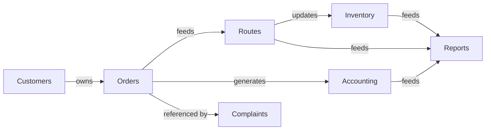

# 04 — Information Architecture

## Purpose
Defines the Dashboard's navigation hierarchy, module relationships, screen hierarchy, and the platform-wide patterns for global navigation, command palette, search, quick actions, favorites, recent items, and breadcrumbs.

## 1. Navigation Hierarchy (Agency Web Dashboard)

```mermaid
flowchart TB
    Root[Dashboard Root] --> Home[Home / KPI Overview]
    Root --> Orders[Orders]
    Root --> Routes[Delivery / Routes]
    Root --> Inventory[Inventory]
    Root --> Customers[Customers]
    Root --> Accounting[Accounting]
    Root --> Complaints[Complaints]
    Root --> Reports[Reports]
    Root --> Admin[Administration]

    Orders --> OrderQueue[Order Queue]
    Orders --> OrderDetail[Order Detail]
    Routes --> RoutePlanning[Route Planning]
    Routes --> LiveTracking[Live Delivery Tracking]
    Inventory --> StockOverview[Stock Overview]
    Inventory --> GRN[Goods Receipt]
    Inventory --> Reconciliation[Reconciliation]
    Customers --> CustomerList[Customer List]
    Customers --> CustomerDetail[Customer Detail + Ledger]
    Accounting --> Invoices[Invoices]
    Accounting --> Payments[Payments]
    Accounting --> CreditNotes[Credit Notes]
    Complaints --> ComplaintQueue[Complaint Queue]
    Reports --> ReportCatalog[Report Catalog]
    Admin --> TenantConfig[Tenant Configuration]
    Admin --> StaffMgmt[Staff & Roles]
    Admin --> BranchMgmt[Branches & Warehouses]
    Admin --> ReferenceData[Reference Data]
```

Navigation is **role-filtered at render time** — a Driver's mobile-web fallback, if ever needed, or a Warehouse Staff's Dashboard login shows only the modules their permission set includes (`docs/data/17-api-security.md` §6 permission matrix), rather than showing-then-disabling inaccessible modules. Hidden, not grayed out — reduces visual noise per persona (`01-product-principles.md` principle 6).

## 2. Module Relationships

Cross-module navigation is always **contextual, not just via the sidebar** — e.g., from an Order Detail screen, a single click opens the linked Invoice, the linked Route, or the Customer's full Ledger, without forcing a detour through the top-level module list.

## 3. Screen Hierarchy Pattern (Applied Consistently Across Modules)

Every module follows the same three-tier pattern:
1. **List/Queue view** (Data Grid, filterable/sortable) — e.g., Order Queue, Customer List.
2. **Detail view** (single record, full context, related-record links) — e.g., Order Detail, Customer Detail.
3. **Action view/drawer** (create, edit, or perform a specific action — e.g., "Assign Driver," "Record Payment") — opened as a Drawer or Dialog over the List/Detail view, never a full page navigation, to preserve context.

## 4. Global Navigation

- **Persistent left Sidebar** (collapsible) — top-level modules (§1), with the Command Palette trigger and global Search pinned above it.
- **Top Bar** — breadcrumb trail (§8), tenant/branch switcher (for multi-branch Agency Admins), notifications bell, profile menu.
- Full layout detail: `06-dashboard-layout.md`.

## 5. Command Palette (Ctrl+K)

A single, universal entry point for **navigation** ("go to Orders"), **action** ("create new order," "raise complaint"), and **search** ("find customer Ramesh Patil") — merging all three into one keyboard-driven surface, consistent with the Linear/GitHub/Vercel benchmark products named in the design philosophy.

- Fuzzy-matches against: module names, recent items (§7), and a live search of Customers/Orders/Invoices by key fields (consumer number, order ID, invoice number).
- Every command palette result shows its keyboard shortcut (if one exists) inline, teaching shortcuts passively over time.
- Results are permission-filtered — a result never appears for an action the current user can't perform.

## 6. Search Strategy

- **Global search** (via Command Palette or a dedicated search field) spans Customers (name, phone, consumer number), Orders (order ID), Invoices (invoice number) — backed by PostgreSQL full-text search (`docs/data/04-database-indexing.md` §6).
- **In-module search/filter** (within a Data Grid) is scoped to that module's fields only, always visible above the grid, never hidden behind an extra click.
- Search results are grouped by entity type with a clear section header ("Customers," "Orders") when the global search returns mixed-type results.

## 7. Quick Actions, Favorites, Recent Items

- **Quick Actions**: a small, role-specific set of one-click shortcuts surfaced on the Home screen (e.g., Dispatcher sees "Plan Today's Routes"; Accountant sees "Review Pending Refunds") — configurable per role by default, not user-customizable in Phase 1 (reduces onboarding decisions).
- **Favorites**: users can pin specific saved Data Grid views (`14-data-grid-guidelines.md` §8) or frequently-visited detail records (e.g., a Manager pinning a specific high-volume customer) — appears in the Sidebar under a "Favorites" section.
- **Recent Items**: the last 10 detail records visited (Orders, Customers, Invoices), surfaced in the Command Palette and optionally in a Sidebar "Recent" section — cleared on logout for shared-terminal environments (relevant for Warehouse Staff persona).

## 8. Breadcrumbs

- Always present on Detail and Action views, never on top-level List views (redundant there).
- Pattern: `Module > List Context (if filtered) > Record Identifier` — e.g., `Orders > Pending > #ORD-10432`.
- Breadcrumb segments are clickable and keyboard-focusable, restoring the exact prior list state (filters/sort/page) when clicked back.

## Best Practices
- The three-tier screen hierarchy (§3) means a new module added post-launch (e.g., a future Fleet Maintenance module) can be designed by following the existing pattern, not inventing a new one.
- Command Palette and Search share the same backend query logic — never two different "find a customer" implementations that could return different results.

## Risks
- Role-filtered navigation risks confusing a user who expects to see a module they don't have permission for — mitigated by a clear, non-alarming "Contact your administrator for access" state reachable via Search/Command Palette even for hidden modules, rather than the module silently not existing.

## Future Scalability
- The module relationship graph (§2) is designed to accommodate Phase 2 additions (BI Dashboards, OMC Integration status) as new nodes without restructuring existing relationships.
