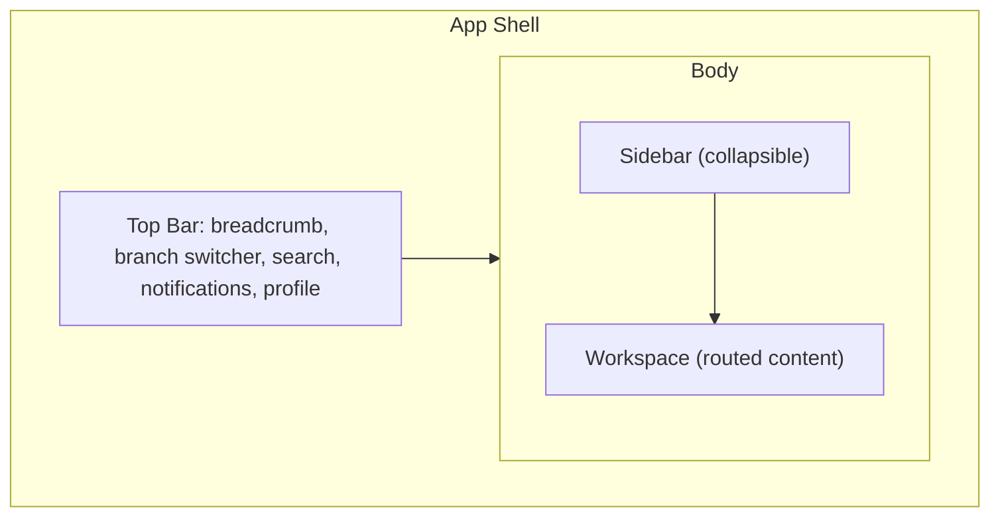
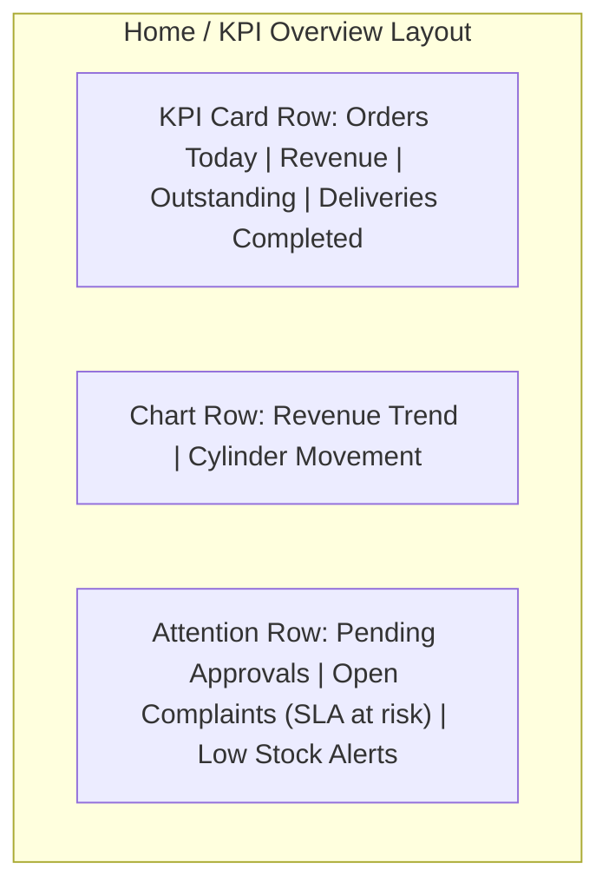

# 06 — Dashboard Layout

## Purpose
Defines the Agency Web Dashboard's structural layout: sidebar, top navigation, workspace, widgets/cards, KPI dashboard, quick actions, notifications, search, profile, settings, and responsive behavior.

## 1. Overall Layout Structure



- **Sidebar**: fixed-width (240px expanded / 64px collapsed, per spacing tokens in `09-design-tokens.md`), persists across navigation, collapse state remembered per user (localStorage-equivalent preference, not a server round-trip).
- **Top Bar**: 56px height, contains breadcrumb (left), global search + Command Palette trigger (center-left), notifications + branch switcher + profile (right).
- **Workspace**: the routed content area; uses a consistent page-header pattern (title, primary action button top-right, filters below) across every module for muscle-memory consistency.

## 2. Sidebar

- Top-level modules (`04-information-architecture.md` §1), role-filtered.
- Each item: icon + label (label hidden when collapsed, icon-only with tooltip).
- Active route highlighted with a left-edge accent bar (not a full background fill, keeping the sidebar visually calm per the Linear/Vercel benchmark).
- Favorites and Recent Items (if any) appear below the main module list, visually separated.
- Bottom-anchored: collapse toggle, Settings shortcut.

## 3. Top Navigation
- **Branch Switcher**: only visible for multi-branch tenants (D-02) and only to roles with cross-branch visibility (AgencyAdmin, Manager); a Dispatcher/WarehouseStaff scoped to one branch doesn't see it.
- **Global Search**: a persistent, always-visible search input (not hidden behind an icon) — reinforces that search is a primary, not secondary, navigation method, consistent with the Linear/Notion benchmark.
- **Notifications**: bell icon with unread-count badge, opens a Drawer (not a full page) listing recent notifications.
- **Profile Menu**: avatar/initials, opens a dropdown with Profile, Settings, Theme toggle, Sign Out.

## 4. Workspace — Page Header Pattern

Every module's primary List screen uses this consistent header:

```
[Page Title]                                    [Primary Action Button]
[Filter bar: search, dropdowns, date range]      [Secondary actions: export, columns]
```

## 5. Widgets & Cards (Home / KPI Overview)



- **KPI Cards**: single metric, trend indicator (▲/▼ vs. prior period), click navigates to the underlying detail/report. Never purely decorative — every KPI card is a navigation entry point.
- **Attention Row**: role-specific — a Manager sees "Pending Approvals," a Warehouse Staff sees "Low Stock Alerts" instead, per persona needs (`02-user-personas.md`). This row is the direct UX embodiment of Product Principle 6 ("what needs my attention" over raw data).
- Widget data sourced from the Reporting layer's cached KPI results (`docs/data/15-reporting-data-model.md` §8) — Home screen load time is bounded by that caching strategy, not live aggregation.

## 6. Quick Actions
A row of 2–4 role-specific one-click actions directly below the KPI row (e.g., Dispatcher: "Plan Today's Routes"; Accountant: "Review Pending Refunds") — see `04-information-architecture.md` §7.

## 7. Notifications (In-Layout)
The notification bell + Drawer (§3) is the persistent, always-reachable notification surface; toast notifications (`12-component-library.md`) handle transient, in-the-moment feedback (e.g., "Order created") separately — these are two distinct systems, not one.

## 8. Search
Global search behavior fully specified in `04-information-architecture.md` §6; the Top Bar is its sole persistent entry point in this layout (plus Ctrl+K).

## 9. Profile & Settings
Reachable via the Profile Menu (§3); Settings itself is a dedicated Workspace screen (D-29), not a modal, since it includes enough content (theme, notification preferences, language) to warrant full-page real estate.

## 10. Responsive Behavior

| Breakpoint | Sidebar | Top Bar | Workspace |
|---|---|---|---|
| Desktop (≥1280px) | Expanded by default | Full | Multi-column widgets, full Data Grid |
| Laptop (1024–1279px) | Collapsed by default, expandable | Full | Widgets reflow to 2-column |
| Tablet (768–1023px) | Off-canvas (hamburger-triggered) | Condensed (search icon replaces full field) | Single-column widgets, Data Grid horizontally scrollable |
| Mobile (<768px) | Off-canvas | Condensed | Data Grid converts to card-list pattern (`14-data-grid-guidelines.md` §11); Dashboard is usable but not primary-optimized for this width — staff roles are expected primarily on desktop/tablet |

Full responsive strategy: `19-responsive-design.md`.

## Best Practices
- The page-header pattern (§4) is implemented once as a shared layout component, never rebuilt per module.
- Sidebar collapse state and Command Palette are both keyboard-accessible without requiring the mouse (`16-keyboard-shortcuts.md`).

## Risks
- KPI card click-through depending on cached data (§5) could show a metric slightly out of sync with the detail view it navigates to (up to the cache TTL) — mitigated by the detail view always re-fetching live data on load, so the *destination* is always accurate even if the *summary* was momentarily stale.

## Future Scalability
- The widget-row layout (§5) is data-driven (a configurable list of widget types per role) so new KPIs or Phase 2 BI widgets can be added without a layout redesign.
