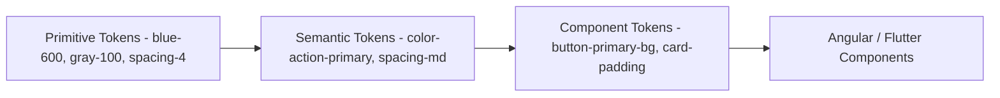

# 09 — Design Tokens

## Purpose
Defines the complete design token system with JSON source, CSS variable output, and Tailwind/Angular/Flutter mappings.

## Design Decisions
- Single platform-neutral JSON source of truth (W3C Design Tokens Community Group format), from which CSS custom properties (Angular/Tailwind) and a Dart token class (Flutter) are both generated — never two independently hand-maintained token sets.
- Three-tier token architecture: Primitive to Semantic to Component. Primitives are raw values with no meaning (blue-600). Semantics assign meaning (color-action-primary). Components reference semantics for their specific need (button-primary-background). Code only ever references Semantic or Component tokens, never Primitives directly.

## 1. Token Architecture



## 2. Primitive Tokens (JSON Example)

```json
{
  "color": {
    "blue": { "50": "#eff6ff", "600": "#2563eb", "900": "#1e3a8a" },
    "gray": { "50": "#f9fafb", "500": "#6b7280", "900": "#111827" },
    "green": { "600": "#16a34a" },
    "red": { "600": "#dc2626" },
    "amber": { "600": "#d97706" }
  },
  "spacing": { "1": "4px", "2": "8px", "3": "12px", "4": "16px", "6": "24px", "8": "32px" },
  "radius": { "sm": "4px", "md": "8px", "lg": "12px" },
  "fontSize": { "xs": "12px", "sm": "14px", "base": "16px", "lg": "18px", "xl": "24px", "2xl": "32px" }
}
```

## 3. Semantic Tokens (JSON Example)

```json
{
  "color": {
    "text": { "primary": "color.gray.900", "secondary": "color.gray.500", "inverse": "color.gray.50" },
    "surface": { "base": "#ffffff", "raised": "color.gray.50" },
    "border": { "default": "color.gray.200" },
    "action": { "primary": "color.blue.600", "primaryHover": "color.blue.700" },
    "status": {
      "success": "color.green.600",
      "warning": "color.amber.600",
      "danger": "color.red.600",
      "info": "color.blue.600"
    }
  },
  "spacing": { "xs": "spacing.1", "sm": "spacing.2", "md": "spacing.4", "lg": "spacing.6", "xl": "spacing.8" }
}
```

## 4. Component Tokens (JSON Example)

```json
{
  "button": {
    "primary": {
      "background": "color.action.primary",
      "backgroundHover": "color.action.primaryHover",
      "text": "color.text.inverse",
      "radius": "radius.md",
      "paddingX": "spacing.md",
      "paddingY": "spacing.sm"
    }
  },
  "card": { "padding": "spacing.lg", "radius": "radius.md", "elevation": "elevation.1" },
  "dataGrid": { "rowHeight": "40px", "headerHeight": "44px", "cellPaddingX": "spacing.sm" }
}
```

## 5. Typography Tokens
```json
{
  "typography": {
    "heading1": { "fontSize": "fontSize.2xl", "fontWeight": "700", "lineHeight": "1.2" },
    "heading2": { "fontSize": "fontSize.xl", "fontWeight": "600", "lineHeight": "1.3" },
    "body": { "fontSize": "fontSize.base", "fontWeight": "400", "lineHeight": "1.5" },
    "caption": { "fontSize": "fontSize.xs", "fontWeight": "400", "lineHeight": "1.4" }
  }
}
```
Full scale detail: `11-typography.md`.

## 6. Elevation / Shadow Tokens
```json
{
  "elevation": {
    "0": "none",
    "1": "0 1px 2px rgba(0,0,0,0.06), 0 1px 3px rgba(0,0,0,0.08)",
    "2": "0 4px 6px rgba(0,0,0,0.08), 0 2px 4px rgba(0,0,0,0.06)",
    "3": "0 12px 24px rgba(0,0,0,0.12), 0 4px 8px rgba(0,0,0,0.08)"
  }
}
```

## 7. Motion Tokens
```json
{
  "motion": {
    "duration": { "micro": "100ms", "small": "150ms", "medium": "250ms", "large": "350ms" },
    "easing": { "standard": "cubic-bezier(0.2, 0, 0, 1)", "decelerate": "cubic-bezier(0, 0, 0, 1)" },
    "reducedMotion": { "duration": { "micro": "0ms", "small": "0ms", "medium": "50ms", "large": "50ms" } }
  }
}
```

## 8. Opacity & Z-Index Tokens
```json
{
  "opacity": { "disabled": "0.5", "overlay": "0.4", "hover": "0.08" },
  "zIndex": { "dropdown": "1000", "sticky": "1100", "drawer": "1200", "modal": "1300", "toast": "1400", "tooltip": "1500" }
}
```

## 9. CSS Variable Output (Generated)
```css
:root {
  --color-text-primary: #111827;
  --color-action-primary: #2563eb;
  --spacing-md: 16px;
  --radius-md: 8px;
  --elevation-1: 0 1px 2px rgba(0,0,0,0.06), 0 1px 3px rgba(0,0,0,0.08);
  --motion-duration-medium: 250ms;
}
[data-theme="dark"] {
  --color-text-primary: #f9fafb;
  --color-action-primary: #3b82f6;
}
[data-theme="high-contrast"] {
  --color-text-primary: #000000;
  --color-action-primary: #0000ee;
}
```

## 10. Tailwind CSS v4 Mapping
```css
/* tailwind theme extension, generated from the same token JSON */
@theme {
  --color-action-primary: var(--color-action-primary);
  --spacing-md: var(--spacing-md);
  --radius-md: var(--radius-md);
}
/* usage: bg-action-primary, p-md, rounded-md - never an arbitrary hardcoded value */
```

## 11. Angular Mapping
- CSS custom properties (§9) consumed directly in component styles.
- A generated TypeScript tokens constant object provides typed access where a token value is needed in component logic (not just CSS), e.g., computing a chart color programmatically.

## 12. Flutter Mapping
- Generated Dart constants (colors, spacing) from the same token JSON, wired into a ThemeExtension so widgets consume theme-scoped values rather than literals — generated, not hand-written, mirroring the Angular/CSS output pipeline.

## Best Practices
- Tokens are generated (via Style Dictionary or an equivalent build-time tool) from the single JSON source into CSS variables, Tailwind config, TypeScript constants, and Dart classes — never hand-authored per platform.
- Any new token must be added at the correct tier (Primitive/Semantic/Component) — a new Semantic token should reference an existing Primitive, never introduce a new raw value inline.

## Risks
- Token sprawl (too many near-duplicate Semantic tokens) — mitigated by a design-system-owner review gate on any new token addition.

## Alternatives Considered
- CSS-in-JS runtime theming — rejected in favor of static CSS custom properties for better performance and simpler Tailwind integration.

## Future Scalability
- The generation pipeline (JSON to CSS/Tailwind/TS/Dart) means adding a fourth platform only requires a new generator target, not a redesign of the token system itself.
