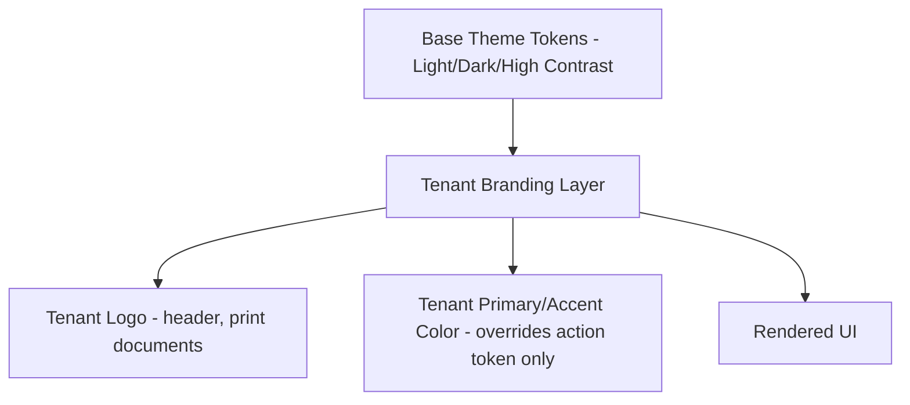

# 10 — Color System

## Purpose
Defines semantic color palettes across Light, Dark, and High Contrast themes, tenant branding support, and accessibility contrast requirements. Colors are never hardcoded — every reference is a semantic token (`09-design-tokens.md`).

## 1. Semantic Color Categories

| Category | Purpose | Example Token |
|---|---|---|
| Text | Primary/secondary/inverse/disabled text | color-text-primary |
| Surface | Background layers (base, raised, overlay) | color-surface-base |
| Border | Dividers, input borders, focus rings | color-border-default |
| Action | Interactive elements (buttons, links) | color-action-primary |
| Status | Success, warning, danger, info | color-status-success |
| Data Visualization | Chart series colors | color-chart-series-1..6 |

## 2. Light Theme (Default)
| Token | Value (approx.) | Contrast Notes |
|---|---|---|
| color-text-primary | near-black (gray-900) | 15:1+ on white surface |
| color-text-secondary | mid-gray (gray-500) | 4.5:1 minimum on white |
| color-surface-base | white | — |
| color-action-primary | blue-600 | 4.5:1+ against white for text use |
| color-status-success | green-600 | AA-compliant against white |
| color-status-danger | red-600 | AA-compliant against white |

## 3. Dark Theme
Not a simple inversion — surface layers use a slightly desaturated dark gray (not pure black, reduces eye strain and halation around light text) with a distinct elevation scale (each elevation level slightly lighter than the last, since shadows are barely visible on dark backgrounds — elevation is communicated primarily through surface lightness in dark mode).
| Token | Value (approx.) | Contrast Notes |
|---|---|---|
| color-text-primary | near-white (gray-50) | 15:1+ on dark surface |
| color-surface-base | gray-950 (not pure black) | — |
| color-action-primary | blue-400 (lightened vs. light theme, for AA contrast on dark surfaces) | 4.5:1+ against dark surface |

## 4. High Contrast Theme (WCAG 2.2 AA, D-35)
- Maximizes contrast ratio (targeting 7:1+ where feasible) for text and interactive elements.
- Removes subtle elevation-via-shadow distinctions in favor of explicit borders — every card/panel gets a visible 1-2px border in this theme, since shadow-based elevation is often imperceptible to low-vision users.
- Status colors shift to maximally distinguishable hues, tested against common color-vision-deficiency simulations (not relying on hue alone — status is always paired with an icon/text label, never color-only).

## 5. Tenant Branding

- Tenants may configure a **primary/accent color** and **logo** (stored in tenant_configuration, BR-31) — this overrides only the color-action-primary semantic token and its derived states (hover, focus-ring), **never** text/surface/status tokens, guaranteeing accessibility contrast and legibility are never compromised by a tenant's brand choice.
- **Contrast enforcement**: when a tenant sets a custom primary color, the system computes its contrast ratio against both light and dark surface tokens; if it fails AA (4.5:1 for text-sized use), the UI automatically falls back to using the custom color only for non-text elements (e.g., button fill with white text, verified separately) or prompts the tenant to choose a compliant shade.
- Logo appears in: Dashboard top bar, Customer/Driver App headers, and all printed documents (`18-printing-ux.md`).

## 6. Accessibility Contrast Requirements (All Themes)
- Body text: minimum 4.5:1 against its background.
- Large text (18px+ bold or 24px+ regular): minimum 3:1.
- Interactive element borders/icons conveying state: minimum 3:1 against adjacent colors.
- Focus indicators: minimum 3:1 against both the element and adjacent background, never relying on color alone.

## 7. Data Visualization Palette
A 6-color categorical palette for charts (`12-component-library.md`), chosen to remain distinguishable under common color-vision deficiencies and to maintain sufficient contrast in both Light and Dark themes — never reused for status meaning.

## Best Practices
- Every new UI surface is designed against all three themes simultaneously, not Light-first-then-ported.
- Status is always communicated by color plus icon plus text label together, never color alone.

## Risks
- Tenant branding color choices are the single highest risk to accessibility consistency across a multi-tenant product — mitigated by the automated contrast-checking fallback (§5).

## Alternatives Considered
- Allowing tenants to fully re-theme (all semantic tokens) — rejected; would make accessibility compliance untestable at the platform level.

## Future Scalability
- The tenant-branding-as-a-layer architecture supports adding more customizable tokens later without restructuring the theming system, as long as any newly-exposed token goes through the same automated contrast-checking gate.
