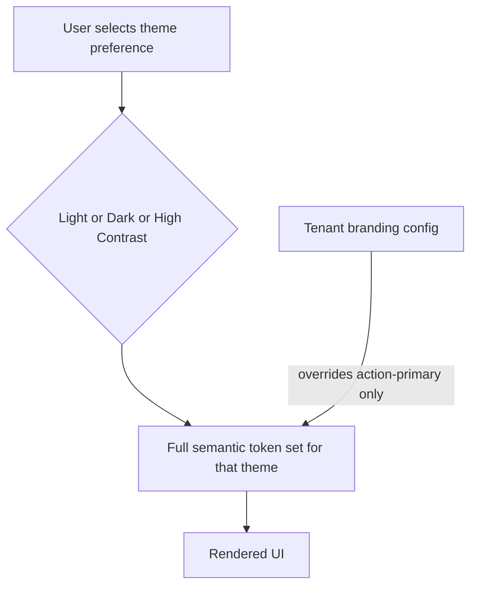

# 22 — Theme System

## Purpose
Designs the platform's Light, Dark, and High Contrast themes, plus tenant branding (custom logo, custom primary color).

## 1. Theme Architecture
Every theme is a complete set of Semantic token values (`09-design-tokens.md` section 3) — Light, Dark, and High Contrast each define their own values for every semantic token, never partially overriding a base theme, since partial overrides risk inconsistent contrast in edge cases. Tenant branding then layers on top of whichever base theme is active (`10-color-system.md` section 5), overriding only the action/primary token.

## 2. Light Theme
Default theme for all three apps. Full palette detail `10-color-system.md` section 2.

## 3. Dark Theme
Available on Dashboard and Customer App (staff and consumer preference); available on Driver App with a caveat — Driver App defaults to Light/high-brightness regardless of system Dark Mode preference by default, since outdoor sunlight visibility (the Driver persona's primary environment, `02-user-personas.md`) is better served by a bright, high-contrast Light theme; Dark theme remains selectable in Driver App Settings for drivers who work night shifts, but isn't the automatic system-preference-following default there as it is on the other two apps.

## 4. High Contrast Theme
WCAG 2.2 AA-targeted theme (`10-color-system.md` section 4), available on all three apps, selectable independently of Light/Dark (i.e. High Contrast Light and High Contrast Dark are both available, not a single combined mode) — respects that a user's need for high contrast is independent of their light/dark preference.

## 5. Theme Selection and Persistence
- Dashboard: theme selector in Profile Menu (`06-dashboard-layout.md` section 3) and Settings screen; also auto-detects OS-level color-scheme preference on first login, with the explicit user choice always taking precedence thereafter.
- Customer/Driver App: theme selector in Settings; Driver App's Light-default behavior (section 3) applies only until the driver makes an explicit choice.
- Theme preference persists per user account (server-stored, follows the user across devices), not per-device only.

## 6. Tenant Branding — Custom Logo
- Uploaded via Tenant Configuration (`05-screen-inventory.md` D-24), stored per the confirmed Blob Storage strategy.
- Appears in: Dashboard top bar (left of breadcrumb), Customer/Driver App headers, all printed documents (`18-printing-ux.md`).
- Logo upload validates aspect ratio/minimum resolution at submission time with an inline preview across all placement contexts (top bar, print header) before the tenant confirms — prevents a tenant uploading a logo that renders poorly in one context without realizing it.

## 7. Tenant Branding — Custom Primary Color
- Single color picker in Tenant Configuration; live preview shows the color applied across representative UI elements (primary button, active nav item, links) before saving.
- Automated contrast validation (`10-color-system.md` section 5) runs at selection time, not just at render time — the color picker itself warns inline if a chosen color would fail AA contrast, before the tenant can save it, rather than silently applying a non-compliant color and catching it only later.

## Best Practices
- Every screen and component is verified against all three base themes during design/review (`26-design-review-checklist.md`), not just Light.
- Tenant branding changes apply instantly across the Dashboard (CSS custom property swap) without requiring a page reload; mobile apps apply on next app-state refresh.

## Risks
- Driver App's non-default Dark Mode behavior is a deliberate deviation from typical follow-system-preference behavior and could surprise a driver who expects their phone's Dark Mode setting to apply automatically — mitigated by clear first-run messaging explaining the choice and how to change it.

## Alternatives Considered
- A single auto theme mode only (always follow OS preference, no manual override) — rejected; the Driver App's outdoor-visibility requirement is a strong enough counter-case that manual override must always be available.

## Future Scalability
- The theme-as-complete-token-set architecture means adding a fourth theme in the future requires only a new complete token set, not changes to any component.
