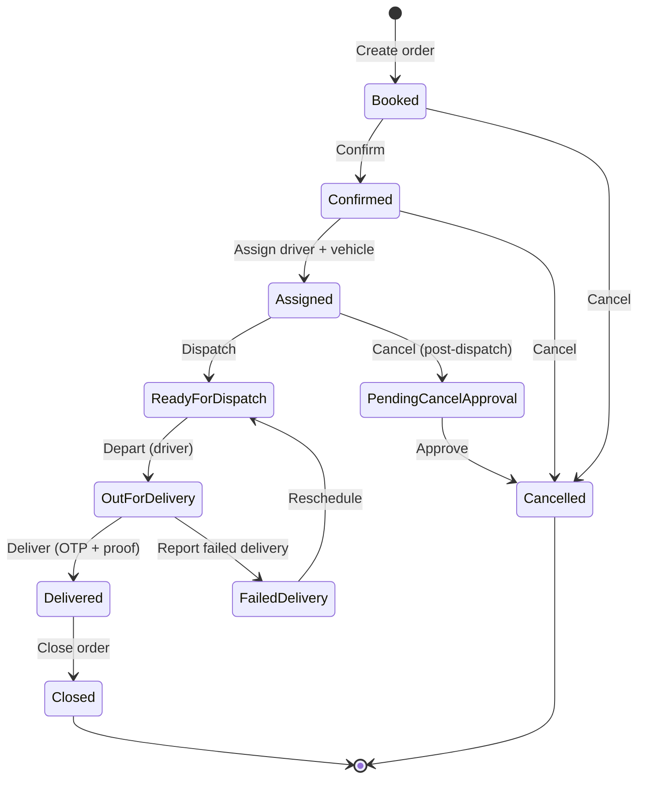

# Order Workflows, Roles & Notifications — As Actually Built

This walks through *who does what* on a real order, end to end — creation
through closure — with a wireframe of the real screen at each step and a
preview of the exact notification/email/SMS content the code sends. It's
grounded in what's actually implemented and running today (verified live
this session), not the original three-app design in `docs/ui/03-user-
journeys.md` — see **Where this differs from the original design** at the
bottom for the gap between the two.

For a click-by-click QA script instead of an explanation, see
`planning/order-to-delivery-e2e-checklist.md`. For the full permission
catalog behind every role mentioned here, see the "Role Permissions"
reference (published separately) or `identity.role_permission`.

---

## 1. The order lifecycle, at a glance



| # | Stage | Who does it | Permission checked | Status after |
|---|---|---|---|---|
| 1 | Create the booking | Agency Admin, Manager, Dispatcher (staff-assisted) — customer self-booking is permission-enabled but has no working UI yet, see the closing section | `orders:create` | `booked` |
| 2 | Confirm — locks in pricing | Agency Admin, Manager, Dispatcher | `orders:confirm` | `confirmed` |
| 3 | Assign driver + vehicle | Agency Admin, Manager, Dispatcher | `orders:assign` | `assigned` |
| 4 | Dispatch | Agency Admin, Manager, Dispatcher | `orders:dispatch` | `ready_for_dispatch` |
| 5 | Load the vehicle + start the route | Agency Admin, Manager, Dispatcher — from the **Dispatch Board**, not the order screen (see the callout in §5) | `routes:manage` | *(route only — order status unchanged)* |
| 6 | Depart | Driver (self, own stop only) | `orders:dispatch` | `out_for_delivery` |
| 7 | Deliver — OTP + signature + photo + GPS | Driver (self, own stop only) | `orders:deliver` | `delivered` |
| 8 | Invoice — automatic, no button | *(system — domain-event handler)* | — | *(invoice created, order status unchanged)* |
| 9 | Close | Agency Admin, Manager | `orders:close` | `closed` |

A cancellation can happen from almost any point before delivery — see §10.

---

## 2. Create the booking

**Who:** Agency Admin, Manager, or Dispatcher, on behalf of a customer who called, walked in, or booked by another channel. All three roles hold `orders:create`; nobody else does.

```
┌─ Orders ──────────────────────────────────────── + New Booking ─┐
│ Status: [ All statuses ▾ ]                                      │
├───────────────────────────────────────────────────────────────┤
│ Order #     Status              Source   Requested      Total  │
│ ORD000033   ● Out for delivery  Staff    8/25, 6:10 PM  ₹905.50│
│ ORD000032   ● Ready for dispatch Staff   8/25, 5:30 PM  ₹905.50│
│ ORD000027   ● Delivered         Staff    8/25, 5:10 PM  ₹905.50│
└───────────────────────────────────────────────────────────────┘
```

Clicking **New Booking** opens a drawer — one screen, every field visible
at once (staff move faster with nothing hidden behind a multi-step wizard):

```
┌─ Create Booking ──────────────────────────────────────── ✕ ─┐
│ Book a new cylinder delivery order                          │
│                                                               │
│ Customer          [ Meena Iyer · +919848012002        ▾]    │
│ Delivery Address   [ 709-88, Basheerbagh               ▾]    │
│ Booking Source      [ Staff                             ▾]    │
│ Requested Delivery Date   [ 25-08-2026 18:14          📅]    │
│                                                               │
│ Cylinders                                     + Add line     │
│ [ Domestic 14.2kg              ▾]   Qty [ 1 ]  🗑             │
│                                                               │
│                                    [ Cancel ]  [ Create Booking ] │
└───────────────────────────────────────────────────────────┘
```

**On submit:** status → **Booked**. Total shows "Not confirmed yet" —
pricing isn't locked in until the next step.

> No notification fires yet. `BookingConfirmed` — the event that actually
> triggers the "Order Confirmed" message — doesn't record until **Confirm**
> (next section), because that's the step that locks in a price.

---

## 3. Confirm

**Who:** Agency Admin, Manager, or Dispatcher. One click from the Order Detail screen.

```
┌─ Order ──────────────────────────────────────────────────────┐
│ ORD000034                                    [ Booked ]      │
│                                                                │
│ [ ← Back ]                          [ ✓ Confirm ] [ ✕ Cancel Order ] │
│                                                                │
│ Booking Source: Staff      Requested: Aug 25, 6:14 PM         │
│ Delivery Address: 709-88, Basheerbagh                         │
│ Total Amount: Not confirmed yet                               │
└────────────────────────────────────────────────────────────┘
```

Clicking **Confirm** prices every line against the customer's active price
list, locks the total, and fires `BookingConfirmed`.

### 📩 Notification: `booking_confirmed`

Goes to the **customer** (via their linked login, if the account has one —
see the caveat in the closing section). Created in-app always; also queued for email and SMS.

```
 ╭──────────────────────────────────────────────╮
 │  🔔  Order Confirmed                          │
 │                                                │
 │  Your order #A1B2C3D4 has been confirmed.      │
 │                                                │
 │  · · · · · · · · · · · · · · · · · · · · · ·  │
 │  In-app  ✓        Email  ✓        SMS  ✓       │
 ╰──────────────────────────────────────────────╯
```

> **What's real vs. simulated:** the in-app notification above is exactly
> what lands in the Notifications page/bell today — verified live. Email
> and SMS use the *same* subject/body text, but the channels themselves
> are stubs (`StubEmailChannel`/`StubSmsChannel`, `infrastructure/
> channels/`) — they log the send and mark it "sent," but nothing actually
> reaches an inbox or a phone yet. No branded HTML email template exists;
> today's "email" is this same plain-text line. See
> `planning/notifications-sms-email-whatsapp-plan.md` for the plan to wire
> up real providers.

---

## 4. Assign driver & vehicle

**Who:** Agency Admin, Manager, or Dispatcher.

```
┌─ Assign Driver & Vehicle ───────────────────────────── ✕ ─┐
│                                                              │
│ Driver     [ EMP-1003 — Imran Shaikh                   ▾]   │
│ Vehicle    [ TS07UB4412                                 ▾]   │
│                                                              │
│                                    [ Close ]   [ Assign ]    │
└────────────────────────────────────────────────────────────┘
```

Assigning finds the driver's already-open ("planned") route for that
vehicle/day, or plans a new one, and adds this order as a stop on it. Status
→ **Assigned**.

### 📩 Notification: `driver_assigned`

Goes to the **driver**, not the customer — resolved through the order's
route stop → route → driver's own login. Created in-app; also queued for SMS
(not email — a driver checking email mid-route isn't the design intent).

```
 ╭──────────────────────────────────────────────╮
 │  🔔  New Delivery Assigned                    │
 │                                                │
 │  You've been assigned to deliver order         │
 │  #A1B2C3D4.                                     │
 │                                                │
 │  · · · · · · · · · · · · · · · · · · · · · ·  │
 │  In-app  ✓        Email  ✗        SMS  ✓       │
 ╰──────────────────────────────────────────────╯
```

This is the exact notification verified live this session, sitting in the
driver's own **Notifications** page after a real assignment:

```
┌─ Notifications ───────────────────────────────────── Mark All as Read ─┐
│ Title                Message                              Date        │
│ New Delivery Assign…  You've been assigned to deliver o…   8/25/2026   │
└─────────────────────────────────────────────────────────────────────┘
```

---

## 5. Dispatch

**Who:** Agency Admin, Manager, or Dispatcher. One click on the Order Detail
screen — status → **Ready for Dispatch**.

> **The step the Order screen doesn't tell you about.** Clicking Dispatch
> only advances the *order's* status. The *route* the order's stop landed on
> (§4) is still sitting at "planned" — nothing on it has actually been
> loaded or started. A driver cannot record a delivery against a route
> that's still "planned" (`Route.record_proof_of_delivery` rejects it with
> `INVARIANT_VIOLATION: route is in status 'planned'`, confirmed live this
> session). The two extra steps below happen on the **Dispatch Board**, a
> separate screen, and nothing in the Order Detail UI hints they're still
> required.

```
┌─ Dispatch Board ───────────────────────────── + Plan Route ─┐
│ Planned (2)          │ Loaded (0)     │ In Progress (3)      │
│ ┌───────────────────┐│ No routes.     │ ┌───────────────────┐│
│ │ Aug 25 · Planned   ││                │ │ Aug 25 · In Prog. ││
│ │ 👤 Imran Shaikh    ││                │ │ 👤 E2E Driver     ││
│ │ 🚚 TS07UB4412      ││                │ │ 🚚 TS07UB4412     ││
│ │ 📍 7 stop(s)       ││                │ │ 📍 4 stop(s)      ││
│ └───────────────────┘│                │ └───────────────────┘│
└──────────────────────┴────────────────┴───────────────────────┘
```

Opening the planned route's card, then **Load Vehicle** (records what's
physically on the truck) and **Start Route** (flips the route to
`in_progress`, the state delivery actually requires):

```
┌─ Route Detail ─────────────────────────────────────────── ✕ ─┐
│ Status: Planned          Driver: Imran Shaikh                │
│ [ 📥 Load Vehicle ]  [ ▶ Start Route ]  [ ✕ Cancel Route ]    │
│                                                                │
│ Stops                                                          │
│  #1  Order ORD000028   pending                                │
│  #2  Order ORD000029   pending                                │
│  ⋮                                                             │
└──────────────────────────────────────────────────────────────┘
```

No notification fires from either of these two actions today — only order
and route *status* changes trigger the notification pipeline, and neither
Load nor Start touches the order's own status.

---

## 6. Depart

**Who:** the **driver**, and only for their own stop — `orders:dispatch`
plus an ownership check (`_require_own_driver_order`) that 404s if this
driver isn't the one the route stop belongs to.

```
┌─ Order ────────────────────────────────────────────────────┐
│ ORD000034                          [ Ready For Dispatch ]   │
│                                                                │
│ [ ← Back ]                                    [ 🚚 Depart ]  │
└──────────────────────────────────────────────────────────────┘
```

Clicking **Depart** → status **Out For Delivery**, and generates a
one-time delivery OTP for the customer.

### 📩 "Out for delivery" — the one notification that doesn't fire yet

Per the reference data catalog (`docs/data/05-reference-data.md` §10),
`out_for_delivery` is a defined notification type — but the handler for it
(`_on_route_status_changed` in `notification_handlers.py`) is a literal
`pass  # TODO` today. Departing an order does **not** currently notify the
customer, in-app or otherwise. This is the one gap in an otherwise working
notification chain — worth picking up alongside the other items in
`planning/notifications-sms-email-whatsapp-plan.md`.

The OTP itself isn't a "notification" in the in-app sense — it's delivered
straight to the customer's phone by SMS (in dev, only logged, retrievable
via a dev-only endpoint):

```
 ╭──────────────────────────────────────────────╮
 │  SMS from LPG Agency                          │
 │                                                │
 │  Your delivery OTP is 328807. Share this        │
 │  with your driver to confirm delivery.          │
 ╰──────────────────────────────────────────────╯
```

---

## 7. Deliver — Proof of Delivery

**Who:** the driver, same ownership scoping as Depart.

```
┌─ Record Delivery ─────────────────────────────────────── ✕ ─┐
│ Delivery OTP            [ 328807                        ]    │
│                                                                │
│ Domestic 14.2kg                                               │
│  Delivered          [ 1 ]      Empties collected   [ 0 ]      │
│                                                                │
│ Payment Method       [ Cash                              ▾]  │
│ Amount Collected  ₹  [ 905.50                            ]   │
│                                                                │
│ Proof of Delivery                                              │
│  Signature   ┌──────────────────────┐   [Clear] [Save Signature] ✓Saved │
│              │        ✍              │                        │
│              └──────────────────────┘                          │
│  Delivery Photo   [ Choose File ]  ✓ Uploaded                  │
│  📍 [ Use Current Location ]  ✓ 17.4058, 78.4890               │
│                                                                │
│                                [ Close ]   [ Confirm Delivery ] │
└──────────────────────────────────────────────────────────────┘
```

All four proof-of-delivery items — OTP, signature, photo, GPS — must be
green before **Confirm Delivery** enables. On submit: status → **Delivered**.

### 📩 Notification: `delivery_confirmed`

Goes to the customer. In-app always; also queued for email and SMS.

```
 ╭──────────────────────────────────────────────╮
 │  🔔  Delivery Confirmed                       │
 │                                                │
 │  Your order #A1B2C3D4 has been delivered        │
 │  successfully.                                  │
 │                                                │
 │  · · · · · · · · · · · · · · · · · · · · · ·  │
 │  In-app  ✓        Email  ✓        SMS  ✓       │
 ╰──────────────────────────────────────────────╯
```

---

## 8. Invoice — automatic

**Who:** nobody clicks anything. `CylinderDelivered` (the domain event the
Deliver step records) triggers `GenerateInvoiceForOrderUseCase` directly as
an event handler — there is no manual "create invoice" action anywhere in
the product.

```
┌─ Invoices ───────────────────────────────────────────────────┐
│ Invoice #        Date        Customer        Total     Status│
│ INV-2026-000009  8/25/2026   Meena Iyer      ₹905.50   Issued│
└────────────────────────────────────────────────────────────┘
```

### 📩 Notification: `invoice_generated`

Goes to the customer. In-app + email (not SMS — an invoice isn't
time-critical the way a delivery status is).

```
 ╭──────────────────────────────────────────────╮
 │  🔔  Invoice Generated                        │
 │                                                │
 │  An invoice has been generated for your        │
 │  order #A1B2C3D4.                               │
 │                                                │
 │  · · · · · · · · · · · · · · · · · · · · · ·  │
 │  In-app  ✓        Email  ✓        SMS  ✗       │
 ╰──────────────────────────────────────────────╯
```

> **In practice, this one often has nowhere to go.** The recipient is
> resolved via the order's `customer_id` → that customer's linked login —
> and most of the demo customer records were created without one (no
> consumer app exists yet for a customer to have registered through, see
> §9). The job logs `no_recipients_found` and moves on rather than erroring
> — verified directly this session — so this is a silent no-op for most
> orders today, not a bug, just a consequence of the consumer side of the
> platform not being built yet.

---

## 9. Close

**Who:** Agency Admin or Manager only — not Dispatcher, and not the driver.

```
┌─ Order ────────────────────────────────────────────────────┐
│ ORD000034                                    [ Delivered ]  │
│ [ ← Back ]                              [ ✓ Close Order ]   │
└──────────────────────────────────────────────────────────────┘
```

Status → **Closed**, terminal. No notification fires on Close.

---

## 10. Cancellation & refund

Cancellation isn't a single action — where the order is in the lifecycle
decides whether it's immediate or needs sign-off.

| Order status when cancelled | Who can request it | Result |
|---|---|---|
| `booked` or `confirmed` (not yet dispatched) | Agency Admin, Manager, Dispatcher, **or the customer themselves** | Cancels immediately |
| `assigned` or later (already dispatched) | Same requesters | Goes **pending approval** — a driver/vehicle is already committed, so this needs sign-off |
| *(approving a pending cancellation)* | **Agency Admin or Manager only** | Cancels |

The approval endpoint (`orders:cancel_approve`) is checked live against the
database on every call rather than against the cached token — the one
permission in this whole flow that isn't just read off the JWT — since
approving a cancellation is consequential enough to want an up-to-the-second
permission check, not one that's up to an hour stale.

A refund, if money changed hands, is a separate step from cancellation
itself: the Accountant *requests* a credit note (`credit_notes:request`),
and the Agency Admin or Manager gives final *approval*
(`credit_notes:approve`) — the same request/approve split as cancellation,
consistently kept away from the same person on both ends.

---

## 11. Complaints — the other place a customer reaches staff

**Who:** any of Agency Admin, Manager, or Dispatcher can raise, assign, or
resolve a complaint — all three gate on one combined permission,
`complaints.manage`, rather than separate create/assign/resolve codes. The
customer holds the same permission code, scoped to their own complaints
only, so they can raise and track theirs the same way staff do internally.

```
┌─ Complaints ──────────────────────────────────── + New Complaint ─┐
│ Complaint #    Customer      Category      Priority   Status      │
│ CMP-000012     Meena Iyer    Late Delivery High        Assigned   │
└───────────────────────────────────────────────────────────────┘
```

Warehouse Staff and Accountant have no complaint permissions at all —
neither role's job touches customer-facing service.

`complaint_status_changed` is a defined notification type in the reference
catalog, same as `out_for_delivery` — but, also like it, has no wired-up
handler yet. A customer isn't currently notified when their complaint moves
through the queue; they'd need to check back on the Complaints page itself.

---

## 12. Cash reconciliation

**Who:** the driver declares it; a Warehouse Staff, Manager, or Agency Admin
approves it (`reconciliation:approve`). Not part of the Order state machine
at all — nothing blocks Close if a driver's shift reconciliation is still
pending.

Reached from the Dispatch Board once a route is `completed`:

```
┌─ Declare Cash Handover ────────────────────────────────── ✕ ─┐
│ Expected (from proof-of-delivery cash records)   ₹4,230.00   │
│ Cash Amount Handed Over                    ₹ [ 4,230.00   ]  │
│                                                                │
│                                    [ Cancel ]  [ Declare ]    │
└──────────────────────────────────────────────────────────────┘
```

The expected figure is computed server-side from real cash-payment proof-of-
delivery records — never trusted from what the driver types — and the
result is shown green (matched) or amber (shortfall), not silently accepted
either way.

---

## Notification reference — every type, one table

| Type | Trigger | Recipient | In-app | Email | SMS |
|---|---|---|---|---|---|
| `booking_confirmed` | Order confirmed | Customer | ✓ | ✓ | ✓ |
| `driver_assigned` | Order assigned to a route | **Driver** | ✓ | ✗ | ✓ |
| `out_for_delivery` | Route starts (`in_progress`) | Customer | **not implemented** | | |
| `delivery_confirmed` | Delivery recorded | Customer | ✓ | ✓ | ✓ |
| `invoice_generated` | Invoice auto-created | Customer | ✓ | ✓ | ✗ |
| `delivery_failed_staff` | Failed delivery recorded | Branch staff (Agency Admin, Manager, Dispatcher) — **reaches nobody today, see below** | ✓ | ✗ | ✗ |
| `complaint_status_changed` | Complaint status changes | Customer | **not implemented** | | |
| OTP delivery | Driver departs | Customer | — (SMS only, not a notification-center entry) | ✗ | ✓ (logged only, dev) |

Every "✓" above is the exact subject/body text the code sends, verified by
reading `notification_jobs.py` directly (and, for `driver_assigned`,
verified live end to end this session). Every channel marked ✓ still routes
through a **stub** — `StubEmailChannel`/`StubSmsChannel` log the send and
mark it "sent" but never reach a real inbox or phone. Turning these into
real deliveries is scoped in `planning/notifications-sms-email-whatsapp-
plan.md`, not part of this document.

> **`delivery_failed_staff` is doubly broken, confirmed by querying the
> database directly.** Its role filter (`_STAFF_ALERT_ROLES`,
> `notification_jobs.py`) lists `"branch_manager"` — not a real role code;
> the platform's actual role is `"manager"` (`docs/data/05-reference-data.md`
> §8) — so Manager is silently excluded regardless of the second issue.
> Separately, `EmployeeBranchStaffResolver` matches an eligible employee to
> a login by **phone number**
> (`identity.identity_user.phone_number = tenant.employee.phone_number`),
> but every demo staff login authenticates by email/password and has no
> phone number set at all — confirmed live: joining `tenant.employee` to
> `identity.identity_user` on phone number for every `dispatcher`/`manager`
> employee in the seed data returns zero matches. Net effect: a failed
> delivery today notifies no one. Worth its own fix, separate from the
> gaps already tracked in `planning/notifications-sms-email-whatsapp-
> plan.md`.

---

## Where this differs from the original design

`docs/ui/03-user-journeys.md` and the persona docs describe **three**
separate apps — Dashboard, Driver App, Customer App. As of this session,
only **one** exists (`frontend/apps/dashboard`). What that means in
practice:

- **Staff** (Agency Admin, Manager, Dispatcher, Warehouse Staff, Accountant)
  use the Dashboard exactly as designed.
- **Drivers** also use the Dashboard today, not a dedicated mobile app —
  logged in with the same email/password flow as staff, just with a
  drastically narrower sidebar (Dashboard, Notifications, Orders only,
  fixed this session — see the roles reference doc). The offline-first,
  large-touch-target Driver App the persona doc describes doesn't exist
  yet; the delivery-confirmation drawer shown in §7 is a desktop-oriented
  form, not the mobile-optimized flow specced in `docs/ui/07-wireframe-
  specifications.md`'s "Worked Example 2."
- **Customers** have no interface at all yet. The `/login` screen is
  email/password only — there's no phone/OTP flow for the `customer` role
  to actually use, even though the backend permissions and domain logic
  (self-booking, self-cancel, own-ledger read, own-complaint management)
  are already live. Every "goes to the customer" notification in this
  document is real on the backend and inert in practice, because there's
  no app for a customer to receive it in.
